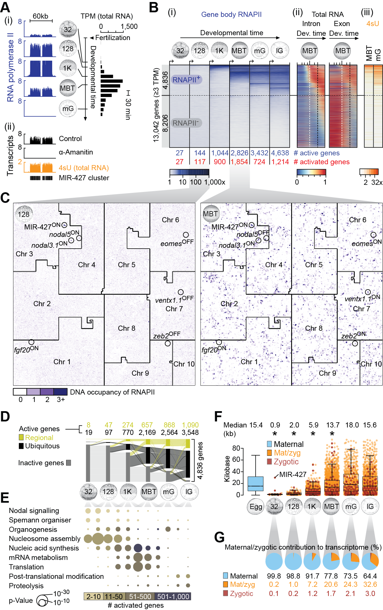
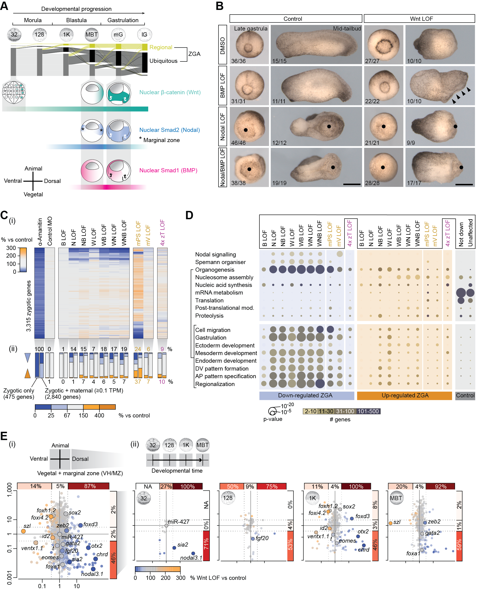
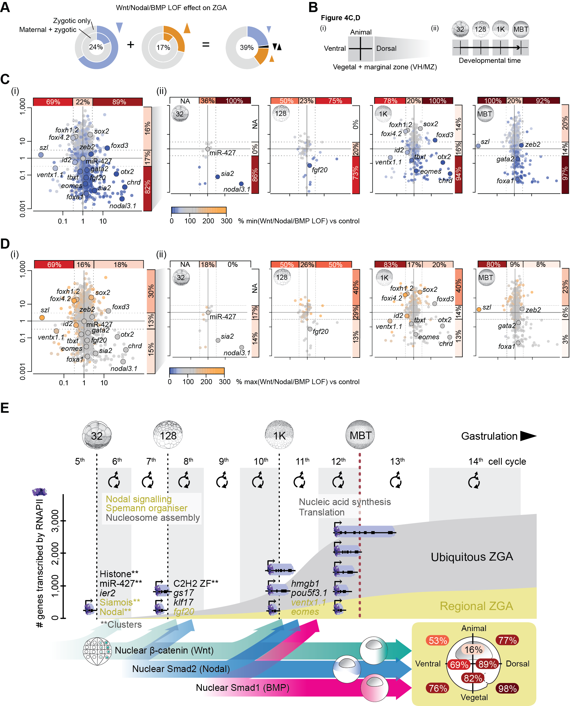
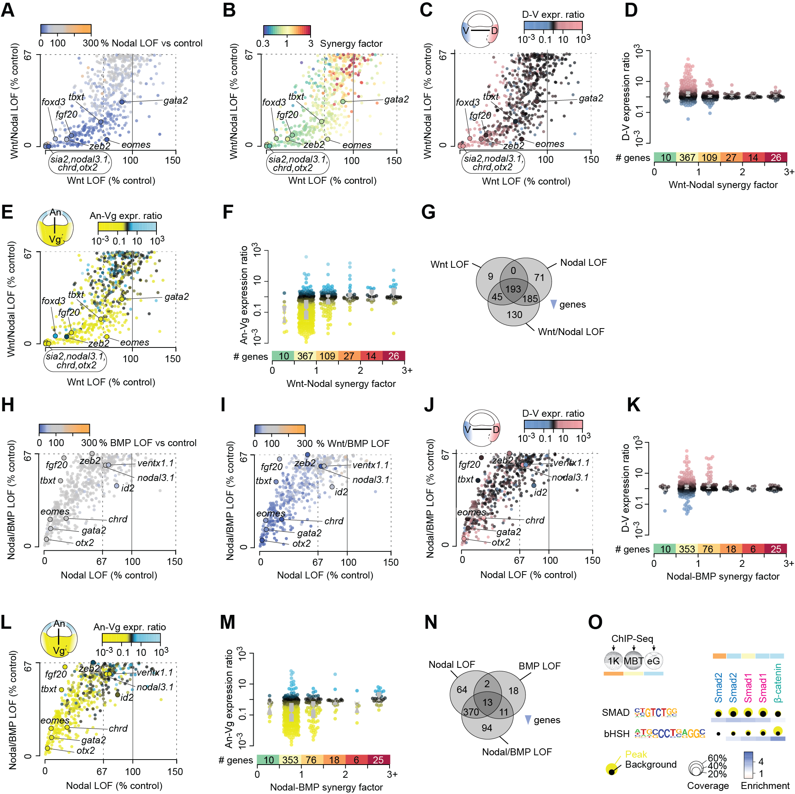

# The Spatio-Temporal Control of Zygotic Genome Activation

<p align="center">


</p>

**DISCLAIMER: This repository is under construction. A final version of it will be available in short order.**

This repository contains the R code used to analyze deep sequencing data shown in:

*Gentsch, G.E., Owens, N.D.L, and Smith, J.C. (2018). The Spatio-Temporal Control of Zygotic Genome Activation. BioRxiv, xxxxxx.*

  * [Data Availability](#data-availability)
  * [Figure Shortcuts](#figure-shortcuts)
  * [Analysis](#analysis)
  * [1. Setup](#1-setup)
  * [2. Profiling Zygotic Genome Activation](#2-profiling-zygotic-genome-activation)
    + [2.1 RNA polymerase II enrichment across gene bodies](#21--rna-polymerase-ii-enrichment-across-gene-bodies)
    + [2.2 H3K4me3 and H3K36me3 densities](#22--h3k4me3-and-h3k36me3-densities)
    + [2.3 High time-resolution of exonic and intronic RNA](#23--high-time-resolution-of-exonic-and-intronic-rna)
    + [2.4 4sU tagging of nascent transcripts](#24--4su-tagging-of-nascent-transcripts)
    + [2.5 Statistics](#25--statistics)
    + [2.6 Correlations](#26--correlations)
    + [2.7 Chromatin and RNA dynamics](#27--chromatin-and-rna-dynamics)
    + [2.8 Hilbert curves](#28--hilbert-curves)
    + [2.9 Gene annotations](#29--gene-annotations)
    + [2.10 Regional gene expression](#210-regional-gene-expression)
    + [2.11 Spatio-temporal dynamics](#211-spatio-temporal-dynamics)
    + [2.12 Gene architecture](#212-gene-architecture)
    + [2.13 Maternal and zygotic contributions to transcriptome](#213-maternal-and-zygotic-contributions-to-transcriptome)
    + [2.14 Functional annotations](#214-functional-annotations)
  * [3. Signal-Mediated Zygotic Genome Activation](#3-signal-mediated-zygotic-genome-activation)
    + [3.1 Differential expression analysis](#31--differential-expression-analysis)
    + [3.2 Hierarchical clustering of transcriptional misregulations](#32--hierarchical-clustering-of-transcriptional-misregulations)
    + [3.3 Functional analysis of misregulated genes](#33--functional-analysis-of-misregulated-genes)
    + [3.4 Transcriptional effects in space and time](#34--transcriptional-effects-in-space-and-time)
    + [3.5 Synergistic effects](#35--synergistic-effects)
    + [3.6 Summary](#36--summary)
  
  
  

## Data Availability

# 

The raw data is or will be available from the GEO archive under the following accession numbers:

  * [GSE113186](https://www.ncbi.nlm.nih.gov/geo/query/acc.cgi?acc=GSE113186): RNAP polymerase II (RNAPII) chromatin profiling (ChIP-Seq)
  * [GSE67974](https://www.ncbi.nlm.nih.gov/geo/query/acc.cgi?acc=GSE67974): H3K4me3 and H3K36me3 ChIP-Seq ([Hontelez *et al.*, 2015](https://www.nature.com/articles/ncomms10148))
  * [GSE65785](https://www.ncbi.nlm.nih.gov/geo/query/acc.cgi?acc=GSE65785): High-time resolution of total and poly(A) RNA (RNA-Seq) ([Owens *et al.*, 2016](https://www.cell.com/cell-reports/fulltext/S2211-1247(15)01491-6))
  * [GSE122551](https://www.ncbi.nlm.nih.gov/geo/query/acc.cgi?acc=GSE122551): 4sU tagging of nascent transcripts (4sU-Seq)
  * [GSE81458](https://www.ncbi.nlm.nih.gov/geo/query/acc.cgi?acc=GSE81458): Regional gene expression (RNA-Seq) ([Blitz *et al.*, 2017](https://www.sciencedirect.com/science/article/pii/S001216061630118X?via%3Dihub))
  * [GSE113186](https://www.ncbi.nlm.nih.gov/geo/query/acc.cgi?acc=GSE113186) and [GSE122551](https://www.ncbi.nlm.nih.gov/geo/query/acc.cgi?acc=GSE122551): Loss-of-function (LOF) of signals and maternal/zygotic transcription factors (RNA-Seq): 

The R script uses intermediate data deposited to the following folders of this repository:

  * [Chromatin profiles](https://github.com/gegentsch/SpatioTemporalControlZGA/tree/master/chromatin)
  * [RNA profiles](https://github.com/gegentsch/SpatioTemporalControlZGA/tree/master/RNA)
  * [*X. tropicalis* genome annotation version 7.1](https://github.com/gegentsch/SpatioTemporalControlZGA/tree/master/xenTro71)
  * [*X. tropicalis* genome annotation version 9.1](https://github.com/gegentsch/SpatioTemporalControlZGA/tree/master/xenTro91)
    

## Figure Shortcuts

# 

|             Figure 1              |             Figure 2          |               Figure 3                |                Figure 4            |
| :-------------------------------: | :---------------------------: | :-----------------------------------: | :--------------------------------: |
|        |    |            |         |        
| [B](#27--chromatin-and-rna-dynamics) [C](#28--hilbert-curves) [D](#211-spatio-temporal-dynamics) [E](#214-functional-annotations) [F](#212-gene-architecture) [G](#213-maternal-and-zygotic-contributions-to-transcriptome) | [C](#32--hierarchical-clustering-of-transcriptional-misregulations) [D](#33--functional-analysis-of-misregulated-genes) [E](#34--transcriptional-effects-in-space-and-time) | [A-H,J,K](#35--synergistic-effects) | [A](#36--summary) [B,C](#34--transcriptional-effects-in-space-and-time)                            |

|             Figure S1             |           Figure S2           |               Figure S3            |
| :-------------------------------: | :---------------------------: | :--------------------------------: | 
|       |   |        |
| [A,B,L](#27--chromatin-and-rna-dynamics) [D](#26--correlations) [F](#211-spatio-temporal-dynamics) [K](#212-gene-architecture) | [C-F](#34--transcriptional-effects-in-space-and-time) | [A-N](#35--synergistic-effects)

## Analysis


To reproduce the analysis, the folders "chromatin", "RNA", "xenTro71" and "xenTro91" must to be downloaded from this repository to same directory as the R script.

### 1. Setup

Installation and loading of R/Bioconductor packages

```{r INSTALLATION, collapse=TRUE, message=FALSE, warning=FALSE, eval=FALSE}
# Install the Bioconductor installation manager and dplyr
required.r.pkg <- c( "dplyr", "gplots", "scales", "beeswarm", "seriation", "extrafont", "ggplot2", "alluvial", "seriation", "BiocManager" )
for (r.pkg in required.r.pkg) {
    if (!requireNamespace(r.pkg, quietly = TRUE)) {
        install.packages(r.pkg, character.only = TRUE)
    }
    library(r.pkg, character.only = TRUE)
}  

# Install required Bioconductor packages
required.bioconductor.pkg <- c( "limma", "DESeq2", "HilbertCurve", "ComplexHeatmap", "GenomicFeatures","rtracklayer", "GSEABase", "GOstats" )
for (bioconductor.pkg in required.bioconductor.pkg) {
    if (bioconductor.pkg %in% rownames(installed.packages()) == FALSE) {
        BiocManager::install(bioconductor.pkg, version="3.8")
    }
    library(bioconductor.pkg, character.only = TRUE)
}

# Attach additional libraries (co-imported, but not automatically loaded)
require(circlize)         # colorRamp2()
require(GenomicRanges)    # GRanges()
require(GO.db)            # GOFrame()
require(RColorBrewer)     # brewer.pal()

# Load Arial font family
font_import(recursive = FALSE, prompt = FALSE, pattern = "Arial")
loadfonts(quiet = TRUE)
```

Auxiliary functions to split and fuse character strings

```{r AUXILIARY FUNCTIONS, eval=FALSE}
splitter.fun <- function(x, symbol = ".", field = 1) {
    y <- strsplit(as.character(x), symbol, fixed=T)
    z <- y[[1]][field]
    return(z)
}

fusion.fun <- function(x) {
    y <- strsplit(as.character(x), "_", fixed = TRUE)
    z <- paste(y[[1]][1], "_", y[[1]][2], sep="")
    return(z)
}
```

Breaks and color selections for generating graphs

```{r BREAKS AND COLORS, eval=FALSE}
# Differential gene expression
brk.rna         <- c( seq(-.001,40,length=30), seq(40.001,66.666,length=30), seq(66.667,100,length=30), seq(100.001,150,length=30), seq(150.001,250,length=30), seq(250.001,2500,length=30) )
col.rna         <- colorRampPalette(c("#3953A4", "#AFBADA", "#EBEBEB", "#EBEBEB", "#FDAE61", "#FAA41A"))(179)
col.rna.alt     <- colorRampPalette(c("#3953A4", "#AFBADA", "#C4C4C4", "#C4C4C4", "#FDAE61", "#FAA41A"))(179)

# Spatial gene expression (ratio across the animal-vegetal axis or dorso-ventral axis)
brk.spatio      <- c( seq(-10, -2.0001, length=20), seq( -2, 2, length=60 ), seq( 2.0001, 10, length=20 ) )
col.spatio.1    <- colorRampPalette( c( "yellow","yellow3","black","deepskyblue3","lightblue" ))(99)  # animal-vegetal axis
col.spatio.2    <- colorRampPalette( c( "#739CD2","#648AB2","black","#C68990","#F6A3A9" ))(99)        # dorso-ventral axis

# Maternal contribution
brk.mat         <- c( -.0001, 10^(-1:4)-.0001 )
col.mat         <- brewer.pal( 7, "YlGnBu" )[2:7]

# Maternal contribution, detection limit ~0.1 t.p.m.
brk.mat.1       <- 10^(-1:4)
col.mat.1       <- brewer.pal(5,"GnBu")

# RNAPII fold enrichment
brk1.1          <- c(seq(0.01,0.8,length=60),seq(0.81,4.8,length=60),seq(4.81,28.8,length=60),seq(28.81,1000,length=60))
col1.1          <- colorRampPalette(c("#EBEBEB","#EBEBEB","#3953A4","#223162","#0D1327"))(239)

# H3K4me3 fold enrichment
brk1.2          <- c(seq(0.01,0.8,length=60),seq(0.81,4.8,length=60),seq(4.81,28.8,length=60),seq(28.81,1000,length=60))
col1.2          <- colorRampPalette(c("#EBEBEB","#EBEBEB","#89a439","#516222","#20270d"))(239)

# H3K36me3 fold enrichment
brk1.3          <- c(seq(0.01,0.8,length=60),seq(0.81,4.8,length=60),seq(4.81,28.8,length=60),seq(28.81,1000,length=60))
col1.3          <- colorRampPalette(c("#EBEBEB","#EBEBEB","#a45539","#623322","#27140d"))(239)

# Normalised RNA levels
brk2            <- seq(0, 1, length=100)
col2            <- colorRampPalette(c("#313695","#4575B4","#74ADD1","#ABD9E9","#E0F3F8","#FFFFBF","#FEE090","#fdae61","#F46d43","#D73027","#A50026"))(99)

# H3K4me3 mark detection
brk4            <- c(0, 0.9, 2)
col4.2          <- c("white", "#516222")

# H3K36me3 mark detection
col4.3          <- c("white", "#623322")

# 4sU RNA / input ratio (4sU dataset, st. 8+ and 10+)
brk.4sU         <- c(2^(0:7), 1000)
col.4sU         <- brewer.pal(8,"Oranges")

# Synergy factor
brk.sf          <- seq(log(0.333), log(3), length=50)
col.sf          <- colorRampPalette(brewer.pal(11,"Spectral"))(49)[49:1]

# Threshold (down-regulated genes)
t66             <- (2/3*100)
```

Color bars

```{r COLOR BARS, eval=FALSE}
# Various colour bars
z5                <- matrix(1:5, nrow=1)
z9                <- matrix(1:9,nrow=1)
z50               <- matrix(1:50, nrow=1)
z100              <- matrix(1:100, nrow=1)
z180              <- matrix(1:180, nrow=1)

pdf("Pol2_colorbar.pdf", width=2, height=5)
  image(1, log10(brk1.1[61:240] ), z180, col=col1.1[61:239], axes=FALSE, xlab="", ylab="fold enrichment")
  axis(2, at=c(0,1,2,3), labels=c(1,10,100,"1,000"))
dev.off()

pdf("H3K4me3_colorbar.pdf", width=2, height=5)
  image(1, log10(brk1.2[61:240]), z180, col=col1.2[61:239], axes=FALSE,xlab="", ylab="fold enrichment")
  axis(2, at=c(0,1,2,3), labels=c(1,10,100,"1,000"))
dev.off()

pdf("H3K36me3_colorbar.pdf", width=2, height=5)
  image(1, log10(brk1.3[61:240]), z180, col=col1.3[61:239], axes=FALSE,xlab="", ylab="fold enrichment")
  axis(2, at=c(0,1,2,3), labels=c(1,10,100,"1,000"))
dev.off()

pdf("RNA_colorbar.pdf", width=2, height=5)
  image(1, brk2, z100, col=col2, axes=FALSE, xlab="", ylab="relative")
  axis(2, at=c(0,.25,.5,.75,1), labels=c(0,"","","",1))
dev.off()

pdf("Mat_colorbar.pdf", width=2, height=5)
  image(1, log10(brk.mat.1), z5, col=col.mat.1, axes=FALSE, xlab="", ylab="TPM")
  axis(2, at=c(-1,0,1,2,3), labels=c(0.1,"",10,"","1,000"))
dev.off()

pdf("4sU_colorbar.pdf", width=2, height=5)
  image(1, log2(brk.4sU), z9, col=col.4sU, axes=FALSE, xlab="", ylab="fold enrichment")
  axis(2, at=c(2,3,4,5,6,7), labels=c(2,4,8,16,32,64))
dev.off()

pdf("DiffExpr_colorbar.pdf", width=2, height=10)
  image(1, brk.rna, z180, col=col.rna, axes=FALSE, ylim=c(0,300), xlab="", ylab="percentage")
  axis(2, at=c(0,100,200,300), labels=c(0,100,200,300))
dev.off()

pdf("DiffExpr_colorbar_alt.pdf", width=2, height=10)
  image(1, brk.rna, z180, col=col.rna.alt, axes=FALSE, ylim=c(0,300), xlab="", ylab="percentage")
  axis(2, at=c(0,100,200,300), labels=c(0,100,200,300))
dev.off()

pdf("SF_colorbar.pdf", width=2, height=10)
  image(1, brk.sf, z50, col=col.sf, axes=F, ylim=c(log(0.333),log(3)), xlab="",ylab="synergy factor")
  axis(2, at=c(log(0.333),log(1),log(3)), labels=c("0.333 (repressive)","1 (additive)","3 (synergistic)"))
dev.off()

pdf("AnVg_colorbar.pdf", width=2, height=10)
  image(1, brk.spatio, z100, col=col.spatio.1, axes=FALSE, ylim=c(-10,10), xlab="",ylab="fold enrichment")
  axis(2, at=log2(c(.001,.1,.25,.333,.5,1,2,3,4,10,1000)), labels=c(.001,.1,.25,"",.5,1,2,"",4,10,"1,000"))
dev.off()

pdf("DV_colorbar.pdf", width=2, height=10)
  image(1, brk.spatio, z100, col=col.spatio.2, axes=FALSE, ylim=c(-10,10), xlab="",ylab="fold enrichment")
  axis(2, at=log2(c(.001,.1,.25,.333,.5,1,2,3,4,10,1000)), labels=c(.001,.1,.25,"",.5,1,2,"",4,10,"1,000"))
dev.off()
```


### 2. Profiling Zygotic Genome Activation

Here we use the continuous occupancy of RNAPII along gene bodies as a method to record Zygotic Genome Activation (ZGA). In contrast to transcript profiling techniques, this method (1) directly determines the activity of every gene; (2) is independent of metabolic labeling or any gene feature such as introns, single nucleotide polymorphisms and transcript half-lives; and (3) circumvents difficulties in detecting nascent transcripts in a large pool of maternal transcripts.

#### 2.1  RNA polymerase II enrichment across gene bodies

Calculate the enrichment of RNAP polymerase II (RNAPII) across gene bodies at the following developmental stages using normalised read density maps of RNAPII and high-complexity input: 

* 32-cell stage (stage 6 after [Nieuwkoop and Faber, 1994](https://www.xenbase.org/anatomy/alldev.do))
* 128-cell stage (stage 7)
* 1,024-cell stage (stage 8)
* Mid-blastula transition (MBT) (stage 8.5)
* Mid-gastrula stage (stage 11)
* Late gastrula stage (stage 12.5) 
* Early neurula stage (stage 13.5) 

ChIP-Seq reads of maximal 50 bases were processed using [trim_galore](https://www.bioinformatics.babraham.ac.uk/projects/trim_galore) to trim off low-quality bases (default Phred score of 20, i.e. error probability was 0.01) and adapter contamination from the 3’ end. Processed reads were aligned to the X. tropicalis genome assembly v7.1 and v9.1 (for Hilbert curves) running [Bowtie2](http://bowtie-bio.sourceforge.net/bowtie2) with default settings. Alignments were converted to the [HOMER](http://homer.ucsd.edu/homer) tag density format with redundant reads being removed:

*makeTagDirectory -single -tbp 1 -unique -mapq 10 -fragLength 175 -totalReads all*

Only uniquely aligned reads (i.e. MAPQ ≥10) were processed. We pooled all input alignments from various developmental stages ([Gentsch *et al.*, 2018](https://www.biorxiv.org/content/early/2018/04/23/306803)). This created a comprehensive mappability profile or high-complexity input that covered ~400 million unique base pair positions.

Normalized RNAPII and input tag densities were calculated across the gene body in 10 bins of equal size. Gene annotations v7.1 were altered based on a few known zygotic isoforms and some corrections obtained from assembling total and poly(A) RNA ([Owens *et al.*, 2016](https://www.cell.com/cell-reports/fulltext/S2211-1247(15)01491-6)) from stage 6 to stage 12.5 *de novo* ([Pertea *et al.*, 2016](https://www.ncbi.nlm.nih.gov/pmc/articles/PMC5032908/)). A few genes had previously been annotated as gene clusters due to assembly uncertainties. We reduced the annotation of polycistronic MIR-427 to the minus arm (scaffold_3b:3516900-3523400) and only monitored nodal3.5 and nodal5.3 within their respective gene clusters.

The threshold of mappability per bin was set at 10% of the input read density averaged across all gene bodies in use. Gene bodies with <40% mappability were removed. Subsequently, enrichment values were only obtained for all mappable bins by dividing read densities of RNAPII by those of the input.

```{r RNAPII DENSITY MAP UPLOAD, eval=FALSE}
pol2.genebody.bins <- read.table( "./chromatin/pol2_st6to13_input_xt71_genebody_10bins.txt.gz", header=TRUE, row.names="Gene" )
pol2.text <- c("pol2.st6","pol2.st7","pol2.st8","pol2.st8p","pol2.st11","pol2.st12p","pol2.st13p","input")
colnames(pol2.genebody.bins) <- paste( pol2.text[ rep( 1:8, each=10 ) ], rep( 1:10, times=8 ), sep="." )

# Only measure enrichment within mappable regions (<1/10th of the mean input). High-complexity input used to enquire mappability.
mean.input <- mean( unlist( list( pol2.genebody.bins[ , 71:80] ) ) )
pol2.genebody.bins[ ,71:80 ][ pol2.genebody.bins[ ,71:80 ] <= ( mean.input / 10 ) ] <- NA

# Remove genes with less than 40% mappability
pol2.genebody.bins <- pol2.genebody.bins[ which( apply( pol2.genebody.bins[,71:80], 1, function(x) sum(!is.na(x)) >= 4 )), ]

# calculate enrichment (ChIP/Input) for each bin
pol2.genebody.bins.e.st6to13 <- pol2.genebody.bins[ ,1:70 ] / pol2.genebody.bins[ , rep.int( 71:80, 7 ) ]
```

#### 2.2  H3K4me3 and H3K36me3 densities

Calculate the enrichment of H3K4me3 and H3K36me3 (Hontelez *et al.*, 2015) across gene bodies at the following developmental stages using normalised read density maps:

* 1,024-cell stage (H3K4me3 only)
* Mid-blastula transition (MBT) (H3K4me3 and H3K36me3)
* Early gastrula stage (stage 10.5, H3K4me3 and H3K36me3)
* Late gastrula stage (stage 12, H3K4me3 and H3K36me3)

```{r HISTONE MARK DENSITY MAP UPLOAD, eval=FALSE}
h3k4me3.genebody.bins <- read.table( "./chromatin/h3k4me3_st8to12_input_xt71_genebody_10bins.txt.gz", header=TRUE, row.names="Gene" )
h3k4me3.text <- c( "h3k4me3.st8","h3k4me3.st9","h3k4me3.st10p","h3k4me3.st12","h3k4me3.st8to12","input" )
colnames(h3k4me3.genebody.bins) <- paste (h3k4me3.text[ rep(1:6,each=10) ], rep( 1:10, times=6 ),sep="." )

mean.input <- mean(unlist(list(h3k4me3.genebody.bins[,51:60])))
h3k4me3.genebody.bins[,51:60][h3k4me3.genebody.bins[,51:60] <= (mean.input/10)] <- NA

h3k4me3.genebody.bins.e.st8to12 <- h3k4me3.genebody.bins[ ,1:50] / h3k4me3.genebody.bins[ ,rep.int( 51:60, 5 ) ]

h3k36me3.genebody.bins <- read.table( "./chromatin/h3k36me3_st9to12_input_xt71_genebody_10bins.txt.gz", header=TRUE, row.names="Gene" )
h3k36me3.text <- c( "h3k36me3.st9","h3k36me3.st10p","h3k36me3.st12","h3k36me3.st9to12","input" )
colnames(h3k36me3.genebody.bins) <- paste(h3k36me3.text[rep(1:5,each=10)],rep(1:10,times=5),sep=".")

mean.input <- mean(unlist(list(h3k36me3.genebody.bins[,41:50])))
h3k36me3.genebody.bins[,41:50][h3k36me3.genebody.bins[,41:50] <= (mean.input/10)] <- NA

h3k36me3.genebody.bins.e.st9to12 <- h3k36me3.genebody.bins[,1:40]/h3k36me3.genebody.bins[,rep.int(41:50,4)]

# Merge density maps
h3k <- merge( h3k4me3.genebody.bins.e.st8to12[,1:50], h3k36me3.genebody.bins.e.st9to12[,1:40], by="row.names", all=TRUE )
row.names(h3k) <- h3k$Row.names; h3k <- h3k[-1]

rh <- merge( pol2.genebody.bins.e.st6to13, h3k, by="row.names", all=FALSE )
row.names(rh) <- rh$Row.names; rh <- rh[-1]
```


#### 2.3  High time-resolution of exonic and intronic RNA

Calculate transcript per million (TPM) from fragments per kilobase and million mapped reads (FPKM) from total (riboZero) RNA (exon count) profile.

```{r CALCULATE TPM, eval=FALSE}
# FPKM table of gene expression (including isoforms)
rzRNA <- read.table( "./RNA/rzRNA_fpkm_xt71.txt.gz", header=TRUE )

# Aggregate all gene isoforms and calculate FPKM sum per gene
rzRNAbyGene <- aggregate( rzRNA[3:ncol(rzRNA)], by=rzRNA["Gene"], FUN=sum )
row.names(rzRNAbyGene) <- rzRNAbyGene$Gene; rzRNAbyGene <- rzRNAbyGene[-1]

# Re-order according to hpf and relabel columns
rzRNAbyGene <- rzRNAbyGene[, order( as.numeric( substr( names( rzRNAbyGene ), 2, nchar( names( rzRNAbyGene )))))]
colnames(rzRNAbyGene) <- paste("rzRNA_",substr(colnames(rzRNAbyGene),2,nchar(colnames(rzRNAbyGene))),"hpf.fpkm",sep="")

# Convert FPKM into TPM
rzRNA_sum <- colSums(rzRNAbyGene)
rzRNAbyGene.tpm <- t( t(rzRNAbyGene) / rzRNA_sum) * 1e6
colnames(rzRNAbyGene.tpm) <- paste(substr(colnames(rzRNAbyGene.tpm),1,nchar(colnames(rzRNAbyGene.tpm))-4), "tpm", sep="")
rzRNA.tpm <- as.data.frame(rzRNAbyGene.tpm)
```

Intronic (riboZero) RNA profile corrected by spike-derived normalization factors (Owens *et al.*, 2016).

```{r INTRONIC RNA, eval=FALSE}
rzRNAi <- read.table("./RNA/rzRNA_intron_norm_xt71.txt.gz", header=TRUE, row.names="Gene")
colnames(rzRNAi) <- paste("rzRNAi_",substr(colnames(rzRNAi),2,nchar(colnames(rzRNAi))),"hpf.norm",sep="")

# Normalized to the mean gene expression level
rzRNAi <- rzRNAi / rowMeans(rzRNAi)
rzRNAi[is.na(rzRNAi)] <- 0
```

Intronic poly(A) RNA profile corrected by spike-derived normalization factors (Owens *et al.*, 2016).

```{r intron_paRNA, eval=FALSE}
paRNAi <- read.table( "./RNA/paRNA_intron_norm_xt71.txt.gz", header=TRUE, row.names="Gene" )[,1:48]
colnames(paRNAi) <- paste("paRNAi_",substr(colnames(paRNAi),2,nchar(colnames(paRNAi))),"hpf.norm",sep="")

# Normalized to the mean gene expression level
paRNAi <- paRNAi / rowMeans( paRNAi )
paRNAi[ is.na(paRNAi) ] <- 0
```


#### 2.4  4sU tagging of nascent transcripts

Paired-end reads were aligned to the *Xenopus tropicalis* transcriptome assembly v7.1 running Bowtie2 with the following constraints: 

*bowtie2 -k 200 -X 800 --rdg 6,5 --rfg 6,5 --score-main L,-.6,-.4 --no-discordant --no-mixed*

Only read pairs that uniquely align to one gene were counted. Raw read counts were normalized with DESeq2 and then scaled to the input.

```{r 4sU TAGGING, eval=FALSE}
tu <- read.table("./RNA/rzRNA_4sU_xt71.txt.gz", header=TRUE)
col.tu <- read.csv("./RNA/rzRNA_4sU_colData.csv", header=TRUE)

# Generate DESeqDataSet object
dds.tu <- DESeqDataSetFromMatrix(countData = tu, colData = col.tu, design = ~ stage + condition )

colData(dds.tu)$stage <- factor(colData(dds.tu)$stage, levels=c("8.5","10.5"))
colData(dds.tu)$condition <- factor(colData(dds.tu)$condition, levels=c("input","tu"))
colData(dds.tu)$replicate <- factor(colData(dds.tu)$replicate, levels=c("frogB"))
dds.tu$stage <- relevel(dds.tu$stage,"8.5")
dds.tu$condition <- relevel(dds.tu$condition, "input")

# Estimates the size factors using the "median ratio method" described by Equation 5 in Anders and Huber (2010)
# Obtains dispersion estimates for Negative Binomial (NB) distributed data
dds.tu <- estimateSizeFactors(dds.tu)
dds.tu <- estimateDispersions(dds.tu)

# Likelihood ratio test (chi-squared test): LRT p-value calculated as
# 'changes between conditions (input versus 4sU-tagged) and over time'
#                               vs
# 'changes between conditions only' (full vs reduced model formula)
# Tests for significance of change in deviance between a full and reduced model as provided by formula.

dds.tu <- nbinomLRT(dds.tu, reduced = ~ stage)

# Enrichment of zygotically expressed genes
norm.dds.tu <- as.data.frame(counts(dds.tu, normalized=TRUE))
colnames(norm.dds.tu) <- paste(colnames(tu), "_ddsNorm", sep="")

# Percentage relative to input
tu.st8p.toInput <- norm.dds.tu$tu_rzRNA_st8p_ddsNorm / norm.dds.tu$input_tu_rzRNA_st8p_ddsNorm
tu.st10p.toInput <- norm.dds.tu$tu_rzRNA_st10p_ddsNorm / norm.dds.tu$input_tu_rzRNA_st10p_ddsNorm

# Assemble normalized counts and percentage of 4sU-mediated enrichment
norm.dds.tu <- cbind( norm.dds.tu, tu.st8p.toInput, tu.st10p.toInput )

# Introduce NA where normalized input read count is <10
norm.dds.tu[,"tu.st8p.toInput"][norm.dds.tu[,"input_tu_rzRNA_st8p_ddsNorm"] < 10] <- NA
norm.dds.tu[,"tu.st10p.toInput"][norm.dds.tu[,"input_tu_rzRNA_st10p_ddsNorm"] < 10] <- NA
```

Merge chromatin and RNA profiles: RNAPII, H3K4me3, H3K36me3, total RNA (TPM), intron counts from total RNA and poly(A) RNA, and nascent RNA.

```{r MERGE CHROMATIN AND RNA PROFILES, eval=FALSE}
rh$gene <- row.names(rh)
rzRNA.tpm$gene <- row.names(rzRNA.tpm)
rzRNAi$gene <- row.names(rzRNAi)
paRNAi$gene <- row.names(paRNAi)
norm.dds.tu$gene <- row.names(norm.dds.tu)
profiles <- list( rh, rzRNA.tpm, rzRNAi, paRNAi, norm.dds.tu )
rh.rna <- plyr::join_all( profiles, by="gene", type="left" )
row.names(rh.rna) <- row.names(rh)

# Add gene body coordinates to table
gb <- read.table( "./xenTro71/xt71_gene.bed.gz", header=FALSE )
colnames(gb) <- c( "scaffold","start","end","gene.id","score","strand" )
row.names(gb) <- gb$gene.id
gb <- gb[ ,c(1:3,6) ]
gb$gene.length <- gb$end - gb$start + 1

# FEW CORRECTIONS to gene length concerns mir427, nodal3 and nodal5
gb$gene.length[ grep ("mir427", row.names(gb)) ] <- 69 # http://mirbase.org/cgi-bin/mirna_summary.pl?fam=MIPF0000441
gb$gene.length[ grep ("nodal3.1", row.names(gb))] <- 2268 # average (bp) of nodal3.1 (1927), nodal3.2 (2023), nodal3.3 (2297), nodal3.4 (2206), nodal3.5 (2887)
gb$gene.length[ grep ("nodal5", row.names(gb)) ] <- 1906 # average (bp) of nodal5.1 (1583), nodal5.2 (1964), nodal5.3 (2104), nodal5.4 (1972)
gb$gene.length[ grep ("bix1.1", row.names(gb)) ] <- 2037 # average (bp) of bix1.1.1 (1862), bix1.1.2 (2069), bix1.1.3 (1831), bix1.1.4 (2385)

rh.rna.gb <- merge( rh.rna, gb, by="row.names", all=FALSE )
row.names(rh.rna.gb) <- rh.rna.gb$Row.names; rh.rna.gb <- rh.rna.gb[-1]
```

We restricted the analysis to genes for which ≥3 transcripts per million (TPM) could be detected on average over three consecutive time points (i.e. over the developmental time of 1 h) of a high-resolution profile of total RNA (Owens *et al.*, 2016) from fertilization to after gastrulation (stage 13).

```{r TPM, eval=FALSE}
t1 <- grep( "_0.0hpf.tpm", colnames(rh.rna.gb) )       
t2 <- grep( "_12.0hpf.tpm", colnames(rh.rna.gb) ) 
tpm3 <- which( apply( rh.rna.gb[ ,t1:t2], 1, function(x) any(stats::filter(x,rep(1,3))/3 >= 3)) )
zga <- rh.rna.gb[tpm3,]
```

Calculating the level of maternally deposited mRNA transcripts (TPM, transcripts per million). 

```{r MATERNAL, eval=FALSE}
# Calculate mean from 3 time points from 0-1 hpf (TPM)
t2                      <- grep( "_1.0hpf.tpm", colnames(rh.rna.gb) ) 
zga$maternal.tpm        <- apply( zga[, t1:t2], 1, function(x) mean(x))
```

Calculating the average RNAPII enrichment across gene bodies.

```{r RNAPII MEAN ENRICHMENT, eval=FALSE}
# Calculate mean RNAPII enrichment across gene body
zga$pol2.6.mean         <- apply( zga[, grep("pol2.st6.", colnames(zga)) ], 1, function(x) mean(na.omit(x)) )
zga$pol2.7.mean         <- apply( zga[, grep("pol2.st7.", colnames(zga)) ], 1, function(x) mean(na.omit(x)) )
zga$pol2.8.mean         <- apply( zga[, grep("pol2.st8.[123456789]", colnames(zga)) ], 1, function(x) mean(na.omit(x)) )
zga$pol2.8p.mean        <- apply( zga[, grep("pol2.st8p.", colnames(zga)) ], 1, function(x) mean(na.omit(x)) )
zga$pol2.11.mean        <- apply( zga[, grep("pol2.st11.", colnames(zga)) ], 1, function(x) mean(na.omit(x)) )
zga$pol2.12p.mean       <- apply( zga[, grep("pol2.st12p.", colnames(zga)) ], 1, function(x) mean(na.omit(x)) )
zga$pol2.13p.mean       <- apply( zga[, grep("pol2.st13p.", colnames(zga)) ], 1, function(x) mean(na.omit(x)) )
```

Detection of histone modifications within gene bodies using HOMER:  
1. *findPeaks [ChIP_tag_density] -style histone -i [input_tag_density] -fragLength 175 -inputFragLength 175 -fdr 0.001 -gsize 1.435e9 -F 2 -C 1 -region -size 350 -minDist 500 > [peak_list.txt]*  
2. *pos2bed.pl [peak_list.txt] -float | intersectBed -a stdin -b [blacklist.bed] -v -f 0.5 > [ChIP_peaks.bed]*  
3. *intersectBed -wa -u -a [xenTro71_genes.gff3] -b [ChIP_peaks.bed] | gzip -c > [ChIP_genebody.gff3]*

```{r DETECTION OF HISTONE MODIFICATIONS, eval=FALSE}
#Gene bodies with H3K4me3
h3k4me3.mark            <- read.table( "./chromatin/h3k4me3_st8to12_xt71_genebody.gff3", header=FALSE )
h3k4me3.mark            <- h3k4me3.mark[-c(2,3,6,8)]
colnames(h3k4me3.mark)  <- c( "scaffold","start","end","strand","gene.id" )
zga$h3k4me3             <- ifelse( row.names(zga) %in% h3k4me3.mark$gene.id, 1, 0 )

# Gene bodies with H3K36me3
h3k36me3.mark           <- read.table( "./chromatin/h3k36me3_st9to12_xt71_genebody.gff3", header=FALSE )
h3k36me3.mark           <- h3k36me3.mark[-c(2,3,6,8)]
colnames(h3k36me3.mark) <- c("scaffold","start","end","strand","gene.id")
zga$h3k36me3            <- ifelse(row.names(zga) %in% h3k36me3.mark$gene.id, 1, 0)
```


#### 2.5  Statistics

Genes were considered active when RNAPII enrichments along their full length (see thresholds below) and corresponding transcripts (≥0.1 TPM) were simultaneously detected. Transcript levels were calculated over three consecutive time points +/- 1 h from the developmental stage of RNAPII profiling. RNAPII enrichment covered ≥80% of the mappable gene body and reached at least one of the following thresholds: (1) 2.6-fold, (2) 1.8-fold and 1.4-fold at the next or previous stage, (3) 1.4-fold and 1.8-fold at the next or previous stage, or (4) 1.4-fold over three consecutive stages.

```{r ZGA STATISTICS, eval=FALSE}
# FUNCTION: Transcript level: min. 0.1 TPM on average over 3 consecutive time points (1 hour window)
tpm.filter <- function(x) which(apply(x, 1, function(y) any( stats::filter(y,rep(1,3)) / 3 >= 0.1 )))

# FUNCTION: RNAPII enrichment
pol2.three.fold <- function(x) apply(x, 1, function(y) {len <- sum(!is.na(y)); sum(y[!is.na(y)] > 2.6) >= 0.8*len} )
pol2.two.fold <- function(x) apply(x, 1, function(y) {len <- sum(!is.na(y)); sum(y[!is.na(y)] > 1.8) >= 0.8*len} )
pol2.onehalf.fold <- function(x) apply(x, 1, function(y) {len <- sum(!is.na(y)); sum(y[!is.na(y)] > 1.4) >= 0.8*len} )
pol2.neutral <- function(x) apply(x, 1, function(y) {len <- sum(!is.na(y)); sum(y[!is.na(y)] > 0) >= 0.8*len} )

comment <- c("## ACTIVE GENE SELECTION CRITERIA based on... \n# (1) riboZero RNA can be detected reliably for differential expression analysis \n## i.e. min. average of 3 t.p.m. over 3 consecutive time points (~30 min intervals) UP TO STAGE 13 (~12 hpf) \n# (2) RNAPII ChIP enrichment conditions (covering at least 80% of the genebody): \n## 2.6-fold at this stage OR \n## 1.8-fold at this stage AND 1.4-fold at next or previous stage OR \n## 1.4-fold at this stage and 1.8-fold at next or previous stage OR \n## 1.4-fold at this stage and 1.4-fold at next two stages \n# (3) optional: H3K4me3 mark within genebody \n\n## rzRNA data selection for RNAPII ChIP: \n## +/- 1h from ChIP time point, min. average of 0.1 t.p.m. (=detection limit) over 3 consecutive time points")

col <- c("scaffold","start","end","gene.length","pol2.6.mean","pol2.7.mean","pol2.8.mean","pol2.8p.mean","pol2.11.mean","pol2.12p.mean",
  "tu.st8p.toInput","tu.st10p.toInput","maternal.tpm","h3k4me3","h3k36me3")

t6                      <- grep( "pol2.st6.", colnames(zga) )
t7                      <- grep( "pol2.st7.", colnames(zga) )
t8                      <- grep( "pol2.st8.[123456789]", colnames(zga) )
t8p                     <- grep( "pol2.st8p.", colnames(zga) )
t11                     <- grep( "pol2.st11.", colnames(zga) )
t12p                    <- grep( "pol2.st12p.", colnames(zga) )
t13p                    <- grep( "pol2.st13p.", colnames(zga) )

# @ stage 6 (32-cell stage) ~ 2.5 hpf
# min. average 0.1 t.p.m. (=detection limit) from 3 consecutive time points (1.5-3.5 hpf)
t1                      <- grep( "_1.5hpf.tpm", colnames(zga) )       
t2                      <- grep( "_3.5hpf.tpm", colnames(zga) ) 
zga.6.total             <- zga[ tpm.filter( zga[ , t1:t2 ] ), ]
zga.6.zyg               <- zga.6.total[ which(

        pol2.three.fold( zga.6.total[, t6]) |
        pol2.two.fold(zga.6.total[,t6]) & pol2.onehalf.fold(zga.6.total[,t7]) |
        pol2.onehalf.fold(zga.6.total[,t6]) & pol2.two.fold(zga.6.total[,t7]) |
        pol2.onehalf.fold(zga.6.total[,t6]) & pol2.onehalf.fold(zga.6.total[,t7]) & pol2.onehalf.fold(zga.6.total[,t8])
), ]

zga.6.zyg               <- zga.6.zyg[order(zga.6.zyg$pol2.6.mean, decreasing=TRUE),]

# Remove known false positives
zga.6.zyg               <- zga.6.zyg[ -which(row.names(zga.6.zyg)=="Xetro.F00430|"),]
zga.6.zyg               <- zga.6.zyg[ -which(row.names(zga.6.zyg)=="Xetro.K01887|"),]

n.6.zyg                 <- nrow(zga.6.zyg)
n.6.total               <- nrow(zga.6.total)
p.6.zyg                 <- 100/n.6.total*n.6.zyg

# Print RNAPII+ genes
f1                      <- file("pol2_st6_rzRNA_av3tpm.txt", open="w")
f2                      <- file("pol2_st6_rzRNA_av3tpm.bed", open="w")
writeLines( sprintf("%s \n\n## ZYGOTIC GENOME ACTIVATION: \n# Total number of genes: %s \n# Number of activated genes: %s \n# Percentage of genes with zygotic contribution: %s \n", comment, n.6.total, n.6.zyg, p.6.zyg), f1 )
write.table( zga.6.zyg[col], f1, sep = "\t", quote=FALSE, row.names=TRUE )
write.table( paste(zga.6.zyg$scaffold, zga.6.zyg$start, zga.6.zyg$end, row.names(zga.6.zyg),".", zga.6.zyg$strand, sep="\t"), 
             f2, sep = "\t", quote=FALSE, col.names=FALSE, row.names=FALSE )
close(f1)
close(f2)


# @ stage 7 (128-cell stage) ~ 3 hpf
# min. average 0.1 t.p.m. (=detection limit) 3 consecutive time points (2-4 hpf)
t1                      <- grep( "_2.0hpf.tpm", colnames(zga) )       
t2                      <- grep( "_4.0hpf.tpm", colnames(zga) ) 
zga.7.total             <- zga[ tpm.filter(zga[ ,t1:t2 ]), ]
zga.7.zyg               <- zga.7.total[ which(

        pol2.three.fold(zga.7.total[,t7]) |
        pol2.two.fold(zga.7.total[,t7]) & ( pol2.onehalf.fold(zga.7.total[,t6]) | pol2.onehalf.fold(zga.7.total[,t8]) ) |
        pol2.onehalf.fold(zga.7.total[,t7]) & ( pol2.two.fold(zga.7.total[,t6]) | pol2.two.fold(zga.7.total[,t8]) ) |
        pol2.onehalf.fold(zga.7.total[,t7]) & pol2.onehalf.fold(zga.7.total[,t8]) & pol2.onehalf.fold(zga.7.total[,t8p])

), ]

zga.7.zyg               <- zga.7.zyg[ order(zga.7.zyg$pol2.7.mean, decreasing=TRUE), ]

# Remove known false positives
zga.7.zyg               <- zga.7.zyg[ -which(row.names(zga.7.zyg)=="Xetro.F00430|"), ]

n.7.zyg                 <- nrow(zga.7.zyg)
n.7.total               <- nrow(zga.7.total)
p.7.zyg                 <- 100/n.7.total*n.7.zyg

# Print RNAPII+ genes
f1                      <- file("pol2_st7_rzRNA_av3tpm.txt", open="w")
f2                      <- file("pol2_st7_rzRNA_av3tpm.bed", open="w")
writeLines( sprintf("%s \n\n## ZYGOTIC GENOME ACTIVATION: \n# Total number of genes: %s \n# Number of activated genes: %s \n# Percentage of genes with zygotic contribution: %s \n", comment, n.7.total, n.7.zyg, p.7.zyg), f1)
write.table( zga.7.zyg[col], f1, sep = "\t", quote=FALSE, row.names=TRUE )
write.table( paste(zga.7.zyg$scaffold, zga.7.zyg$start, zga.7.zyg$end, row.names(zga.7.zyg),".", zga.7.zyg$strand, sep="\t"), 
             f2, sep = "\t", quote=FALSE, col.names=FALSE, row.names=FALSE )
close(f1)
close(f2)


# @ stage 8 (1000-cell stage) ~ 4 hpf
# min. average 0.1 t.p.m. (=detection limit) 3 consecutive time points (3-5 hpf)
t1                      <- grep( "_3.0hpf.tpm", colnames(zga) )       
t2                      <- grep( "_5.0hpf.tpm", colnames(zga) ) 
zga.8.total             <- zga[ tpm.filter(zga[ ,t1:t2 ]), ]
zga.8.zyg               <- zga.8.total[ which(

        pol2.three.fold(zga.8.total[,t8]) |
        pol2.two.fold(zga.8.total[,t8]) & ( pol2.onehalf.fold(zga.8.total[,t7]) | pol2.onehalf.fold(zga.8.total[,t8p]) ) |
        pol2.onehalf.fold(zga.8.total[,t8]) & ( pol2.two.fold(zga.8.total[,t7]) | pol2.two.fold(zga.8.total[,t8p]) ) |
        pol2.onehalf.fold(zga.8.total[,t8]) & pol2.onehalf.fold(zga.8.total[,t8p]) & pol2.onehalf.fold(zga.8.total[,t11])

), ]

zga.8.zyg               <- zga.8.zyg[order(zga.8.zyg$pol2.8.mean, decreasing=T),]

# Remove known false positives
zga.8.zyg               <- zga.8.zyg[-which(row.names(zga.8.zyg)=="Xetro.K02918|sik1"),]
zga.8.zyg               <- zga.8.zyg[-which(row.names(zga.8.zyg)=="Xetro.A00226|ppwd1"),]

n.8.zyg                 <- nrow(zga.8.zyg)
n.8.total               <- nrow(zga.8.total)
p.8.zyg                 <- 100/n.8.total*n.8.zyg

# Print RNAPII+ genes (second table with IDs only)
f1                      <- file("pol2_st8_rzRNA_av3tpm.txt", open="w")
f2                      <- file("pol2_st8_rzRNA_av3tpm.bed", open="w")
writeLines( sprintf("%s \n\n## ZYGOTIC GENOME ACTIVATION: \n# Total number of genes: %s \n# Number of activated genes: %s \n# Percentage of genes with zygotic contribution: %s \n", comment, n.8.total, n.8.zyg, p.8.zyg), f1)
write.table( zga.8.zyg[col], f1, sep = "\t", quote=FALSE, row.names=TRUE )
write.table( paste( zga.8.zyg$scaffold, zga.8.zyg$start, zga.8.zyg$end, row.names(zga.8.zyg),".", zga.8.zyg$strand, sep="\t"), f2, sep = "\t", quote=FALSE, col.names=FALSE, row.names=FALSE )
close(f1)
close(f2)


## @ stage 8.5 (MBT) ~ 5 hpf
# min. average 0.1 t.p.m. (=detection limit) 3 consecutive time points (4-6 hpf)
t1                      <- grep( "_4.0hpf.tpm", colnames(zga) )       
t2                      <- grep( "_6.0hpf.tpm", colnames(zga) ) 
zga.8p.total            <- zga[ tpm.filter(zga[,t1:t2]), ]
zga.8p.zyg              <- zga.8p.total[ which(

        pol2.three.fold(zga.8p.total[,t8p]) |
        pol2.two.fold(zga.8p.total[,t8p]) & ( pol2.onehalf.fold(zga.8p.total[,t8]) | pol2.onehalf.fold(zga.8p.total[,t11]) ) |
        pol2.onehalf.fold(zga.8p.total[,t8p]) & ( pol2.two.fold(zga.8p.total[,t8]) | pol2.two.fold(zga.8p.total[,t11]) ) |
        pol2.onehalf.fold(zga.8p.total[,t8p]) & pol2.onehalf.fold(zga.8p.total[,t11]) & pol2.onehalf.fold(zga.8p.total[,t12p])

), ]

zga.8p.zyg              <- zga.8p.zyg[order(zga.8p.zyg$pol2.8p.mean, decreasing=TRUE),]
n.8p.zyg                <- nrow(zga.8p.zyg)
n.8p.total              <- nrow(zga.8p.total)
p.8p.zyg                <- 100/n.8p.total*n.8p.zyg

# print RNAPII+ genes
f1                      <- file("pol2_st8p_rzRNA_av3tpm.txt", open="w")
f2                      <- file("pol2_st8p_rzRNA_av3tpm.bed", open="w")
writeLines( sprintf("%s \n\n## ZYGOTIC GENOME ACTIVATION: \n# Total number of genes: %s \n# Number of activated genes: %s \n# Percentage of genes with zygotic contribution: %s \n", comment, n.8p.total, n.8p.zyg, p.8p.zyg), f1)
write.table( zga.8p.zyg[col], f1, sep = "\t", quote=FALSE, row.names=TRUE )
write.table( paste(zga.8p.zyg$scaffold, zga.8p.zyg$start, zga.8p.zyg$end, row.names(zga.8p.zyg),".", zga.8p.zyg$strand, sep="\t"), f2, sep = "\t", quote=FALSE, col.names=FALSE, row.names=FALSE )
close(f1)
close(f2)


# @ stage 10-11 (early to mid gastrula) ~ 8 hpf
# min. average 0.1 t.p.m. (=detection limit) 3 consecutive time points (7-9 hpf)
t1                      <- grep( "_7.0hpf.tpm", colnames(zga) )       
t2                      <- grep( "_9.0hpf.tpm", colnames(zga) ) 
zga.11.total            <- zga[ tpm.filter(zga[ ,t1:t2 ]), ]
zga.11.zyg              <- zga.11.total[ which(

        pol2.three.fold(zga.11.total[,t11]) |
        pol2.two.fold(zga.11.total[,t11]) & ( pol2.onehalf.fold(zga.11.total[,t8p]) | pol2.onehalf.fold(zga.11.total[,t12p]) ) |
        pol2.onehalf.fold(zga.11.total[,t11]) & ( pol2.two.fold(zga.11.total[,t8p]) | pol2.two.fold(zga.11.total[,t12p]) ) |
        pol2.onehalf.fold(zga.11.total[,t11]) & pol2.onehalf.fold(zga.11.total[,t12p]) & pol2.onehalf.fold(zga.11.total[,t13p])

), ]

zga.11.zyg              <- zga.11.zyg[ order(zga.11.zyg$pol2.11.mean, decreasing=TRUE), ]
n.11.zyg                <- nrow(zga.11.zyg)
n.11.total              <- nrow(zga.11.total)
p.11.zyg                <- 100/n.11.total*n.11.zyg

# Print RNAPII+ genes
f1                      <- file("pol2_st11_rzRNA_av3tpm.txt", open="w")
f2                      <- file("pol2_st11_rzRNA_av3tpm.bed", open="w")
writeLines( sprintf("%s \n\n## ZYGOTIC GENOME ACTIVATION: \n# Total number of genes: %s \n# Number of activated genes: %s \n# Percentage of genes with zygotic contribution: %s \n", comment, n.11.total, n.11.zyg, p.11.zyg), f1)
write.table( zga.11.zyg[col], f1, sep = "\t", quote=FALSE, row.names=TRUE )
write.table( paste(zga.11.zyg$scaffold, zga.11.zyg$start, zga.11.zyg$end, row.names(zga.11.zyg),".", zga.11.zyg$strand, sep="\t"), f2, sep = "\t", quote=FALSE, col.names=FALSE, row.names=FALSE )
close(f1)
close(f2)


# @ stage 12.5 (late gastrula) ~ 9-11 hpf
# min. average 0.1 t.p.m. (=detection limit) 3 consecutive time points (8-12 hpf)
t1                      <- grep( "_8.0hpf.tpm", colnames(zga) )       
t2                      <- grep( "_12.0hpf.tpm", colnames(zga) ) 
zga.12p.total           <- zga[ tpm.filter(zga[ ,t1:t2 ]), ]
zga.12p.zyg             <- zga.12p.total[ which(

        pol2.three.fold(zga.12p.total[,t12p]) |
        pol2.two.fold(zga.12p.total[,t12p]) & ( pol2.onehalf.fold(zga.12p.total[,t11]) | pol2.onehalf.fold(zga.12p.total[,t13p]) ) |
        pol2.onehalf.fold(zga.12p.total[,t12p]) & ( pol2.two.fold(zga.12p.total[,t11]) | pol2.two.fold(zga.12p.total[,t13p]) ) |
        pol2.onehalf.fold(zga.12p.total[,t12p]) & pol2.onehalf.fold(zga.12p.total[,t13p])

), ]

zga.12p.zyg              <- zga.12p.zyg[order(zga.12p.zyg$pol2.12p.mean, decreasing=TRUE),]
n.12p.zyg                <- nrow(zga.12p.zyg)
n.12p.total              <- nrow(zga.12p.total)
p.12p.zyg                <- 100/n.12p.total*n.12p.zyg

# Print RNAPII+ genes
f1                      <- file("pol2_st12p_rzRNA_av3tpm.txt", open="w")
f2                      <- file("pol2_st12p_rzRNA_av3tpm.bed", open="w")
writeLines( sprintf("%s \n\n## ZYGOTIC GENOME ACTIVATION: \n# Total number of genes: %s \n# Number of activated genes: %s \n# Percentage of genes with zygotic contribution: %s \n", comment, n.12p.total, n.12p.zyg, p.12p.zyg), f1)
write.table( zga.12p.zyg[col], f1, sep = "\t", quote=F, row.names=TRUE )
write.table( paste(zga.12p.zyg$scaffold, zga.12p.zyg$start, zga.12p.zyg$end, row.names(zga.12p.zyg),".", zga.12p.zyg$strand, sep="\t"), f2, sep = "\t", quote=FALSE, col.names=FALSE, row.names=FALSE )
close(f1)
close(f2)


# @ stage 13 (early neurula) ~ 11-13 hpf
# min. average 0.1 t.p.m. (=detection limit) 3 consecutive time points (0-12 hpf)
t1                      <- grep( "_0.0hpf.tpm", colnames(zga) )       
t2                      <- grep( "_12.0hpf.tpm", colnames(zga) ) 
zga.13p.total           <- zga[ tpm.filter(zga[,t1:t2]), ]
zga.13p.total           <- zga.13p.total[order(zga.13p.total$pol2.13p.mean, decreasing=TRUE),]


# Genes activated by stage 7, 8, 8+, 11 and 12+
zga.6to7.zyg            <- unique(rbind(zga.6.zyg, zga.7.zyg))
zga.6to8.zyg            <- unique(rbind(zga.6to7.zyg, zga.8.zyg))
zga.6to8p.zyg           <- unique(rbind(zga.6to8.zyg, zga.8p.zyg))
zga.6to11.zyg           <- unique(rbind(zga.6to8p.zyg, zga.11.zyg))
zga.6to12p.zyg          <- unique(rbind(zga.6to11.zyg, zga.12p.zyg))

n.total                 <- nrow(zga)
n.6to12p.zyg            <- nrow(zga.6to12p.zyg)
p.6to12p.zyg            <- 100/n.total*n.6to12p.zyg


# Print RNAPII+ genes
f1                      <- file("pol2_st6to12p_rzRNA_av3tpm.txt", open="w")
f2                      <- file("pol2_st6to12p_rzRNA_av3tpm.bed", open="w")
writeLines( sprintf("%s \n\n## ZYGOTIC GENOME ACTIVATION: \n# Total number of genes: %s \n# Number of activated genes: %s \n# Percentage of genes with zygotic contribution: %s \n", comment, n.total, n.6to12p.zyg, p.6to12p.zyg), f1)
write.table( zga.6to12p.zyg[col], f1, sep = "\t", quote=FALSE, row.names=TRUE )
write.table( paste(zga.6to12p.zyg$scaffold, zga.6to12p.zyg$start, zga.6to12p.zyg$end, row.names(zga.6to12p.zyg),".", zga.6to12p.zyg$strand, sep="\t"), f2, sep = "\t", quote=FALSE, col.names=FALSE, row.names=FALSE )
close(f1)
close(f2)
```

Download TXT/BED files containing genes active at the following developmental stages:  
* 32-cell (<a href="./suppl_files/pol2_st6_rzRNA_av3tpm.txt">TXT</a>|<a href="./suppl_files/pol2_st6_rzRNA_av3tpm.bed">BED</a>)   
* 128-cell (<a href="./suppl_files/pol2_st7_rzRNA_av3tpm.txt">TXT</a>|<a href="./suppl_files/pol2_st7_rzRNA_av3tpm.bed">BED</a>)   
* 1,024-cell (<a href="./suppl_files/pol2_st8_rzRNA_av3tpm.txt">TXT</a>|<a href="./suppl_files/pol2_st8_rzRNA_av3tpm.bed">BED</a>)  
* MBT (<a href="./suppl_files/pol2_st8p_rzRNA_av3tpm.txt">TXT</a>|<a href="./suppl_files/pol2_st8p_rzRNA_av3tpm.bed">BED</a>)  
* Mid-gastrula (<a href="./suppl_files/pol2_st11_rzRNA_av3tpm.txt">TXT</a>|<a href="./suppl_files/pol2_st11_rzRNA_av3tpm.bed">BED</a>) 
* Late gastrula (<a href="./suppl_files/pol2_st12p_rzRNA_av3tpm.txt">TXT</a>|<a href="./suppl_files/pol2_st12p_rzRNA_av3tpm.bed"> BED</a>)  
* All stages (<a href="./suppl_files/pol2_st6to12p_rzRNA_av3tpm.txt">TXT</a>|<a href="./suppl_files/pol2_st6to12p_rzRNA_av3tpm.bed">BED</a>)  

```{r TRANSCRIPTIONAL INITIATION, eval=FALSE}
# Earliest activation as detected by RNAPII enrichment
zga.6.earliest          <- zga.6.zyg
zga.6.earliest$stage    <- 6

zga.7.earliest          <- zga.7.zyg[is.element(rownames(zga.7.zyg), rownames(zga.6.zyg)) == FALSE,]
zga.7.earliest$stage    <- 7

zga.8.earliest          <- zga.8.zyg[is.element(rownames(zga.8.zyg), rownames(zga.6to7.zyg)) == FALSE,]
zga.8.earliest$stage    <- 8

zga.8p.earliest         <- zga.8p.zyg[is.element(rownames(zga.8p.zyg), rownames(zga.6to8.zyg)) == FALSE,]
zga.8p.earliest$stage   <- 8.5

zga.11.earliest         <- zga.11.zyg[is.element(rownames(zga.11.zyg), rownames(zga.6to8p.zyg)) == FALSE,]
zga.11.earliest$stage   <- 11

zga.12p.earliest        <- zga.12p.zyg[is.element(rownames(zga.12p.zyg), rownames(zga.6to11.zyg)) == FALSE,]
zga.12p.earliest$stage  <- 12.5

zga.12p.mat             <- zga.13p.total[is.element(rownames(zga.13p.total), rownames(zga.6to12p.zyg)) == FALSE,]
zga.12p.mat$stage       <- 0

zga.earliest            <- rbind(zga.6.earliest,zga.7.earliest,zga.8.earliest,zga.8p.earliest,zga.11.earliest,zga.12p.earliest)

zga.6to12p <- rbind(zga.earliest,zga.12p.mat)

# Print newly activated RNAPII+ genes
f1                      <- file("pol2_st6_actGenes.txt", open="w")
f2                      <- file("pol2_st7_actGenes.txt", open="w")
f3                      <- file("pol2_st8_actGenes.txt", open="w")
f4                      <- file("pol2_st8p_actGenes.txt", open="w")
f5                      <- file("pol2_st11_actGenes.txt", open="w")
f6                      <- file("pol2_st12p_actGenes.txt", open="w")

writeLines(sprintf("%s \n\n## ZYGOTIC GENOME ACTIVATION: \n# Total number of genes with transcripts: %s \n# Number of activated genes at this stage: %s \n# Percentage of genes that activated at this stage: %s \n", comment, n.6.total, nrow(zga.6.earliest), 100/n.6.total*nrow(zga.6.earliest)), f1)
writeLines(sprintf("%s \n\n## ZYGOTIC GENOME ACTIVATION: \n# Total number of genes with transcripts: %s \n# Number of activated genes at this stage: %s \n# Percentage of genes that activated at this stage: %s \n", comment, n.7.total, nrow(zga.7.earliest), 100/n.7.total*nrow(zga.7.earliest)), f2)
writeLines(sprintf("%s \n\n## ZYGOTIC GENOME ACTIVATION: \n# Total number of genes with transcripts: %s \n# Number of activated genes at this stage: %s \n# Percentage of genes that activated at this stage: %s \n", comment, n.8.total, nrow(zga.8.earliest), 100/n.8.total*nrow(zga.8.earliest)), f3)
writeLines(sprintf("%s \n\n## ZYGOTIC GENOME ACTIVATION: \n# Total number of genes with transcripts: %s \n# Number of activated genes at this stage: %s \n# Percentage of genes that activated at this stage: %s \n", comment, n.8p.total, nrow(zga.8p.earliest), 100/n.8p.total*nrow(zga.8p.earliest)), f4)
writeLines(sprintf("%s \n\n## ZYGOTIC GENOME ACTIVATION: \n# Total number of genes with transcripts: %s \n# Number of activated genes at this stage: %s \n# Percentage of genes that activated at this stage: %s \n", comment, n.11.total, nrow(zga.11.earliest), 100/n.11.total*nrow(zga.11.earliest)), f5)
writeLines(sprintf("%s \n\n## ZYGOTIC GENOME ACTIVATION: \n# Total number of genes with transcripts: %s \n# Number of activated genes at this stage: %s \n# Percentage of genes that activated at this stage: %s \n", comment, n.12p.total, nrow(zga.12p.earliest), 100/n.12p.total*nrow(zga.12p.earliest)), f6)

write.table( zga.6.earliest[col], f1, sep = "\t", quote=F, row.names=T )
write.table( zga.7.earliest[col], f2, sep = "\t", quote=F, row.names=T )
write.table( zga.8.earliest[col], f3, sep = "\t", quote=F, row.names=T )
write.table( zga.8p.earliest[col], f4, sep = "\t", quote=F, row.names=T )
write.table( zga.11.earliest[col], f5, sep = "\t", quote=F, row.names=T )
write.table( zga.12p.earliest[col], f6, sep = "\t", quote=F, row.names=T )

close(f1)
close(f2)
close(f3)
close(f4)
close(f5)
close(f6)
```

Download TXT files containing active gene first detected by the following developmental stages: 
<a href="./suppl_files/pol2_st6_actGenes.txt">32-cell</a>,<a href="./suppl_files/pol2_st7_actGenes.txt"> 128-cell</a>,<a href="./suppl_files/pol2_st8_actGenes.txt"> 1,024-cell</a>,<a href="./suppl_files/pol2_st8p_actGenes.txt"> MBT</a>,<a href="./suppl_files/pol2_st11_actGenes.txt"> mid-gastrula</a> and <a href="./suppl_files/pol2_st12p_actGenes.txt">late gastrula</a>.

#### 2.6  Correlations

Spearman correlation between RNAPII and 4sU data (Figure S1C).

```{r ZGA DYNAMICS, warning=FALSE, eval=FALSE}
# Spearman Correlation RNAPII (fold enrichment) and 4sU data (fold enrichment normalised to transcript length which is proportional to the likelihood to 4sU incorporation)
t.pol2      <- grep( ".mean$", colnames( zga.6to12p ) )[ 1:6 ]
t.tu        <- grep( ".toInput$", colnames( zga.6to12p ) )
t.gl        <- grep( "gene.length", colnames( zga.6to12p ) )

spr.cor     <- cor( zga.6to12p[ , t.pol2 ], zga.6to12p[ , t.tu ]/zga.6to12p[ , t.gl ], use="pairwise.complete.obs", method="spearman" )

bre.r.val   <- c(seq(-1.1,1.1,length.out=20))
col.r.val   <- colorpanel(19,"red","grey97","black")

pdf("FigS1D_pol2vs4sU_sprCor.pdf", width=5, height=5)
    heatmap.2( spr.cor,Rowv=F,Colv=F,dendrogram="none",breaks=bre.r.val,col=col.r.val,key=T,symkey=T,density.info="none",trace="none",cellnote=round(spr.cor,2),notecol="black",notecex=2, cexRow=1, cexCol=1, margin=c(10,10))
dev.off()
```

<p align="center">

</p>
Download Spearman correlation heatmap:\ <a href="./suppl_files/FigS1D_pol2vs4sU_sprCor.pdf">PDF</a>

#### 2.7  Chromatin and RNA dynamics

```{r CHROMATIN AND RNA DYNAMICS, eval=FALSE}
t.tpm <- grep( "hpf.tpm$", colnames( zga.6to12p ) )
t.inorm <- grep( "^rzRNAi_", colnames( zga.6to12p ) )
t.pa.inorm <- grep( "^paRNAi_", colnames( zga.6to12p ) )

tpm.pol2 <- zga.6to12p[ , t.tpm ]
inorm.pol2 <- zga.6to12p[ , t.inorm ]
pa.inorm.pol2 <- zga.6to12p[ , t.pa.inorm ]

inorm.pol2[is.na(inorm.pol2)] <- 0
pa.inorm.pol2[is.na(pa.inorm.pol2)] <- 0
n_predict           <- seq(1,48,0.1)

# Compute spline smoothed values
smooth.spline.fun <- function(rna) {
    rna.spline <- apply(rna, 1, function(x) smooth.spline(1:48, x, spar=0.6))
    rna.spline.predict <- sapply(rna.spline, function(x) predict(x, n_predict)$y)
    rna.spline.predict <- t(rna.spline.predict)
    max.rna.spline.predict <- apply(rna.spline.predict, 1, function(x) max(x))
    rna.spline.predict.norm <- rna.spline.predict/max.rna.spline.predict
    rna.spline.predict.norm[rna.spline.predict.norm < 0] <- 0
    return(data.matrix(rna.spline.predict.norm))
}

tpm.pol2.smooth.predict.norm.matrix <- smooth.spline.fun(tpm.pol2)
inorm.pol2.smooth.predict.norm.matrix <- smooth.spline.fun(inorm.pol2)
pa.inorm.pol2.smooth.predict.norm.matrix <- smooth.spline.fun(pa.inorm.pol2)

# Convert data frame into matrix for HEATMAP
mrc               <- data.matrix(zga.6to12p)
mrc[is.na(mrc)]   <- 0

t.pol2.bin        <- grep("^pol2.st", colnames(mrc))
t.h3k4me3.bin     <- grep("^h3k4me3.st", colnames(mrc))
t.h3k36me3.bin    <- grep("^h3k36me3.st", colnames(mrc))

# Heatmaps (including histone marks)
png(filename="Fig1B_S1A_pol2_st6to12_h3x_rzpaRNAei_4sU_mat.png", width=1500, height=nrow(mrc))
    layout(matrix( c( rep(1,24), rep(2,16), rep(3,3), rep(4,12), rep(5,3), rep(6,12), rep(7,12), rep(8,12),
      rep(9,6), rep(10,3) ), 1, 103, byrow = TRUE))
    par(mar=c(0,0,0,0) + .5)
    image( t(mrc[,t.pol2.bin[1:60]]), breaks = brk1.1, col = col1.1, axes=FALSE )
    image( t(mrc[,t.h3k4me3.bin[1:40]]), breaks = brk1.2, col = col1.2, axes=FALSE )
    image( t(mrc[,c("h3k4me3")]), breaks = brk4, col = col4.2, axes=FALSE )
    image( t(mrc[,t.h3k36me3.bin[1:30]]), breaks = brk1.3, col = col1.3, axes=FALSE )
    image( t(mrc[,c("h3k36me3")]), breaks = brk4, col = col4.3, axes=FALSE )
    image( t(tpm.pol2.smooth.predict.norm.matrix[,1:250]), breaks = brk2, col = col2, axes=FALSE )
    image( t(inorm.pol2.smooth.predict.norm.matrix[,1:250]), breaks = brk2, col = col2, axes=FALSE )
    image( t(pa.inorm.pol2.smooth.predict.norm.matrix[,1:250]), breaks = brk2, col = col2, axes=FALSE )
    image( t(mrc[,c("tu.st8p.toInput","tu.st10p.toInput")]), breaks = brk.4sU, col = col.4sU, axes=FALSE )
    image( t(mrc[,c("maternal.tpm")]), breaks = brk.mat, col = col.mat, axes=FALSE )
dev.off()
## IMPORTANT: crop and resize .png image in Photoshop to 5% height, 100% width (bicubic smoother, best for enlargements)
```

Chromatin and RNA dynamics (Figure 1B and S1A)

<p align="center">

</p>
Download heatmap:\ <a href="./suppl_files/Fig1B_S1A_pol2_st6to12_h3x_rzpaRNAei_4sU_mat.png">PNG</a>

This image contains the following chromatin or RNA profiles from left to right:

Feature       | Scale
------------- | -----------------------------------------------------------------------------------------------------------
RNAPII        | Enrichment against input across gene bodies (32-cell --- late gastrula stage, six developmental stages)
H3K4me3       | Enrichment against input across gene bodies (1,024-cell --- late gastrula stage, four developmental stages)
H3K4me3       | Detection summary within gene bodies (1,024-cell --- late gastrula stage, four developmental stages)
H3K36me3      | Enrichment against input across gene bodies (MBT --- late gastrula stage, three developmental stages)
H3K36me3      | Detection summary within gene bodies (MBT --- late gastrula stage, three developmental stages)
total RNA     | Normalized exonic levels of total RNA from fertilization to the early neurula stage
total RNA     | Normalized intronic levels of total RNA from fertilization to the early neurula stage
poly(A) RNA   | Normalized intronic levels of poly(A) RNA levels from fertilization to the early neurula stage
4sU RNA       | Enrichment against input RNA at the MBT and early/mid-gastrula stage
total RNA     | Maternal contribution (average TPM from 0 to 1 hpf)

Scale bars for ZGA heatmap. Press link for download:

<p align="left">


</p>
<a href="./suppl_files/Pol2_colorbar.pdf">RNAPII (fold enrichment)</a>\ \ |\ \ 
<a href="./suppl_files/H3K4me3_colorbar.pdf">H3K4me3 (fold enrichment)</a>\ \ |\ \ 
<a href="./suppl_files/H3K36me3_colorbar.pdf">H3K36me3 (fold enrichment)

<p align="left">


</p>
<a href="./suppl_files/RNA_colorbar.pdf">Relative RNA level</a>\ \ |\ \ 
<a href="./suppl_files/4sU_colorbar.pdf">4sU (fold enrichment)</a>\ \ |\ \ 
<a href="./suppl_files/Mat_colorbar.pdf">Maternal contribution (TPM)</a>


```{r TRANSCRIPT EXON & INTRON LEVELS, eval=FALSE}
tpm.pol2.smooth.predict[tpm.pol2.smooth.predict < 0]            <- 0
inorm.pol2.smooth.predict[inorm.pol2.smooth.predict < 0]        <- 0
pa.inorm.pol2.smooth.predict[pa.inorm.pol2.smooth.predict < 0]  <- 0

plotMetaSD <- function (df, col.tf) {
  sd <- apply(log10(df+0.1),2,function(x) sd(x, na.rm=T)) # /sqrt(length(x))
  dist <- seq(0,23.5,by=0.05)
  mean <- colMeans(log(df+0.1),na.rm=T)
  plot(dist, mean, xlim=c(0,15),ylim=c(-2,5),type="n", axes=F, ann=F)
  polygon(c(dist,rev(dist)),c(mean+sd,rev(mean-sd)),col=alpha(col.tf,0.3), border = F)
  lines(dist, mean, col=col.tf,lwd=1)
  axis(1, at=c(0,2.2,3,4,4.5,7,10,15), labels=c("Egg","32c","128c","1000c","MBT","midG","lateG","midN"))
  axis(2, at=seq(-2,5,by=1), labels=c("-2","-1","0","1","2","3","4","5"))
}

t.m         <- nrow(zga.6to12p.zyg) + 1
t.total     <- nrow(tpm.pol2.smooth.predict)

pdf("FigS1B_meta_matRNA_smooth_log.pdf", width=2, height=2)
par(mfrow=c(1,1),mar=c(2,2,2,2))
par(mfg=c(1,1))
plotMetaSD(tpm.pol2.smooth.predict[t.m:t.total,],"#FF0000")
par(mfg=c(1,1))
plotMetaSD(inorm.pol2.smooth.predict[t.m:t.total,],"#4C62A4")
par(mfg=c(1,1))
plotMetaSD(pa.inorm.pol2.smooth.predict[t.m:t.total,],"#C4D82D")
abline(v=4.5,col="black",lty=1)
dev.off()

pdf("FigS1B_meta_zyg_matRNA_smooth_log.pdf", width=2, height=2)
par(mfrow=c(1,1),mar=c(2,2,2,2))
par(mfg=c(1,1))
plotMetaSD(tpm.pol2.smooth.predict[1:(t.m-1),],"#FF0000")
par(mfg=c(1,1))
plotMetaSD(inorm.pol2.smooth.predict[1:(t.m-1),],"#4C62A4")
par(mfg=c(1,1))
plotMetaSD(pa.inorm.pol2.smooth.predict[1:(t.m-1),],"#C4D82D")
abline(v=4.5,col="black",lty=1)
dev.off()
```

Transcript feature levels (mean +/- SD) during ZGA (Figure S1B): red, exonic (total RNA), blue, intronic (total RNA), and yellow, intronic (poly(A) RNA).

<p align="left">


</p>

Download transcript meta-profile (log~10~ scale): <a href="./suppl_files/FigS1B_meta_zyg_matRNA_smooth_log.pdf">RNAPII+ genes</a>\ |\ <a href="./suppl_files/FigS1B_meta_matRNA_smooth_log.pdf">RNAPII- genes</a>


Venn diagram of temporal ZGA

```{r ZGA VENN DIAGRAM, eval=FALSE}
pol2.positive <- matrix( 0, nrow = nrow( zga.6to12p.zyg ), ncol = 5)
colnames(pol2.positive) <- c( "pol2.st6to7", "pol2.st8", "pol2.st8p", "pol2.st11", "pol2.st12p" )

for (i in 1:nrow( pol2.positive ))
{
  pol2.positive[i,1] <- rownames(zga.6to12p.zyg)[i] %in% rownames(zga.6to7.zyg)
  pol2.positive[i,2] <- rownames(zga.6to12p.zyg)[i] %in% rownames(zga.8.zyg)
  pol2.positive[i,3] <- rownames(zga.6to12p.zyg)[i] %in% rownames(zga.8p.zyg)
  pol2.positive[i,4] <- rownames(zga.6to12p.zyg)[i] %in% rownames(zga.11.zyg)
  pol2.positive[i,5] <- rownames(zga.6to12p.zyg)[i] %in% rownames(zga.12p.zyg)
}

pdf("zga_venn_diagram.pdf")
vennDiagram( vennCounts( pol2.positive ))
dev.off()
```

<p align="left">

</p>

Download\ <a href="./suppl_files/zga_venn_diagram.pdf">Venn diagram</a>\ showing overlap of genes active at the 32/128-cell stage, the 1,024-cell stage, the MBT, the mid-gastrula and late gastrula stage.


```{r RNAPII META-PROFILES, eval=FALSE}

p6.1 <- read.table("./chromatin/pol2_st6_xt71_5kbTSS2kb.txt.gz", header=TRUE, row.names="Gene")
p6.2 <- read.table("./chromatin/pol2_st6_xt71_2kbTTS5kb.txt.gz", header=TRUE, row.names="Gene")
p7.1 <- read.table("./chromatin/pol2_st7_xt71_5kbTSS2kb.txt.gz", header=TRUE, row.names="Gene")
p7.2 <- read.table("./chromatin/pol2_st7_xt71_2kbTTS5kb.txt.gz", header=TRUE, row.names="Gene")
p8.1 <- read.table("./chromatin/pol2_st8_xt71_5kbTSS2kb.txt.gz", header=TRUE, row.names="Gene")
p8.2 <- read.table("./chromatin/pol2_st8_xt71_2kbTTS5kb.txt.gz", header=TRUE, row.names="Gene")
p8p.1 <- read.table("./chromatin/pol2_st8p_xt71_5kbTSS2kb.txt.gz", header=TRUE, row.names="Gene")
p8p.2 <- read.table("./chromatin/pol2_st8p_xt71_2kbTTS5kb.txt.gz", header=TRUE, row.names="Gene")
p11.1 <- read.table("./chromatin/pol2_st11_xt71_5kbTSS2kb.txt.gz", header=TRUE, row.names="Gene")
p11.2 <- read.table("./chromatin/pol2_st11_xt71_2kbTTS5kb.txt.gz", header=TRUE, row.names="Gene")
p12p.1 <- read.table("./chromatin/pol2_st12p_xt71_5kbTSS2kb.txt.gz", header=TRUE, row.names="Gene")
p12p.2 <- read.table("./chromatin/pol2_st12p_xt71_2kbTTS5kb.txt.gz", header=TRUE, row.names="Gene")
pi.1 <- read.table("./chromatin/input_xt71_5kbTSS2kb.txt.gz", header=TRUE, row.names="Gene")
pi.2 <- read.table("./chromatin/input_xt71_2kbTTS5kb.txt.gz", header=TRUE, row.names="Gene")

plotMetaGeneSD <- function ( df1, df2, col.tf, total.nr=7, nr=1, tle ) {
  
  sd <- apply( log10(df1+0.1),2,function(x) sd(x,na.rm=T) )
  dist <- seq( -5000,2000,by=100 )
  mean <- colMeans( log(df1+0.1),na.rm=T )
  
  par( mfrow=c(total.nr,2),mar=c(2,2,2,0),mfg=c(nr,1) )
  
  plot( dist, mean, xlim=c(-5000,2000),ylim=c(-1,4),type="n", axes=F, ann=F )
  polygon( c(dist,rev(dist)),c(mean+sd,rev(mean-sd)),col=alpha(col.tf,0.3), border = F )
  lines( dist, mean, col=col.tf,lwd=1 )
  axis( 1, at=c(-5000,0,2000), labels=c("-5","TSS","") )
  axis( 2, at=seq(-1,4,by=1), labels=c("-1","0","1","2","3","4") )
  
  sd <- apply(log10(df2+0.1),2,function(x) sd(x,na.rm=T))
  dist <- seq(-2000,5000,by=100)
  mean <- colMeans(log(df2+0.1),na.rm=T)
  
  par(mar=c(2,0,2,2),mfg=c(nr,2))
  
  plot(dist, mean, xlim=c(-2000,5000),ylim=c(-1,4),type="n", axes=F, ann=F)
  polygon(c(dist,rev(dist)),c(mean+sd,rev(mean-sd)),col=alpha(col.tf,0.3), border = F)
  lines(dist, mean, col=col.tf,lwd=1)
  title(main=tle)
  axis(1, at=c(-2000,0,5000), labels=c("","TTS","+5kb"))
}

pdf("FigS1L_meta_pol2_zygRNA_st6to12p_log", width=3, height=8)
  plotMetaGeneSD(p6.1,p6.2,"#223162",7,1,"32-cell")
  plotMetaGeneSD(p7.1,p7.2,"#223162",7,2,"128-cell")
  plotMetaGeneSD(p8.1,p8.2,"#223162",7,3,"1,024-cell")
  plotMetaGeneSD(p8p.1,p8p.2,"#223162",7,4,"MBT")
  plotMetaGeneSD(p11.1,p11.2,"#223162",7,5,"Mid-gastrula")
  plotMetaGeneSD(p12p.1,p12p.2,"#223162",7,6,"Late gastrula")
  plotMetaGeneSD(pi.1,pi.2,"black",7,7,"Input")
dev.off()
```

Metaprofile (mean +/- SD) for RNAPII and input (negative control) at zygotic genes (Figure S1L): RNAPII shows log normal distribution. Thus, log norm metrics were used.

<p align="left">

</p>
Download RNAPII meta-profile:\ <a href="./suppl_files/FigS1L_meta_pol2_zygRNA_st6to12p_log.pdf">PDF</a>\


#### 2.8  Hilbert curves

*X. tropicalis* genome annotation version 9.1

```{r GENOME ANNOTATION, eval=FALSE}
xt        <- read.table(pipe("grep \"Chr\" ./xenTro91/xt91.fa.fai"), header=FALSE)
cs        <- cumsum(xt[[2]])
ir        <- IRanges(start = c(1, cs[1:9]+1), end = cs)
chrom     <- c(paste0("Chr0",1:9),"Chr10")
bg        <- GRanges( seqnames = chrom, ranges = ir )
col.fun   <- colorRamp2(c(0, 30), c("white", "navyblue"))
```

ZGA examples: expanded gene regions to visualize genes on Hilbert curves

```{r ZGA examples, warning=FALSE, eval=FALSE}
nodal3.1  <- GRanges(seqnames = "Chr03", ranges = IRanges(start = cs[2]+121701817, end = cs[2]+121790736))
nodal5    <- GRanges(seqnames = "Chr03", ranges = IRanges(start = cs[2]+120460543, end = cs[2]+120505002))
mir427    <- GRanges(seqnames = "Chr03", ranges = IRanges(start = cs[2]+133128639, end = cs[2]+133388111))
fgf20     <- GRanges(seqnames = "Chr01", ranges = IRanges(start = 32768057, end = 33020610))
ventx1.1  <- GRanges(seqnames = "Chr07", ranges = IRanges(start = cs[6]+18567867, end = cs[6]+18719733))
eomes     <- GRanges(seqnames = "Chr06", ranges = IRanges(start = cs[5]+75849368, end = cs[5]+75936936))
zeb2      <- GRanges(seqnames = "Chr09", ranges = IRanges(start = cs[8]+73344417, end = cs[8]+73502866))
zga.expl  <- c(nodal3.1, nodal5, mir427, fgf20, ventx1.1, eomes, zeb2)
zga.labl  <- c("nodal3.1", "nodal5", "mir427", "fgf20", "ventx1.1", "eomes", "zeb2")
```

Color mapping for RNAPII deposition

```{r HILBERT, eval=FALSE}
cm        <- ColorMapping(col_fun = col.fun)
lgd       <- color_mapping_legend(cm, title = "RNAPII", plot = FALSE)
```

Hilbert curves: RNAPII deposition at the 128-cell stage and at the MBT (Figure 1C)

```{r HILBERT CURVES, eval=FALSE}
files     <- c( "pol2_st7_xt91.bed.gz", "pol2_st8p_xt91.bed.gz" )

for (fi in files) {

    bed        <- read.table( paste0( "./chromatin/", fi ), header=FALSE, stringsAsFactors=FALSE )
    bed        <- bed[ grep("Chr", bed[[1]]), ]
    cs_        <- c(0, cs[1:9])
    cs_i       <- sapply( bed[[1]], function(x) as.numeric( substr(x, 4, 5) ) )
    bed[[2]]   <- bed[[2]] + cs_[cs_i]
    bed[[3]]   <- bed[[3]] + cs_[cs_i] - 1
    hc         <- GenomicHilbertCurve(background=bg, level=9, mode="pixel", legend=list(lgd))
    hc_layer(hc, bed, col=col.fun(bed[[4]]))
    hc_map(hc, fill = NA, border = "black", show_labels=FALSE, add = TRUE )
    hc_png(hc, file=paste0("Fig1C_", splitter.fun(fi,".",1), "_hilbert.png"))
}
png(filename="Fig1C_chrom_xt91_hilbert.png", width=512, height=512)
    hc  <- GenomicHilbertCurve(background=bg, level=9)
    hc_segments(hc, zga.expl, gp = gpar(col = rand_color(length(zga.expl), transparency = 0.1)))
    hc_text(hc, zga.expl, labels=zga.labl)
    hc_map(hc, fill = NA, border = "black", add = TRUE )
dev.off()
```

<p align="left">


</p>
Download RNAPII Hilbert curves:\ <a href="./suppl_files/Fig1C_pol2_st7_xt91_hilbert.png">128-cell</a>\ |\ <a href="./suppl_files/Fig1C_pol2_st8p_xt91_hilbert.png">MBT</a>\ |\ <a href="./suppl_files/Fig1C_chrom_xt91_hilbert.png">gene examples</a>

#### 2.9  Gene annotations

Extract gene features from gff3 table.

```{r GENE FEATURES, eval=FALSE}
gff3                        <- import.gff3( "./xenTro71/xenTro71.gff3.gz" )
txdb                        <- makeTxDbFromGRanges( gff3, drop.stop.codons=FALSE, metadata=NULL )

# Create index for genes, exons, protein-coding sequences (CDS), 5'UTR and 3'UTR
gene_index                  <- which( elementMetadata(gff3)[,"type"] == "gene" )
exon_index                  <- which( elementMetadata(gff3)[,"type"] == "exon" )
cds_index                   <- which( elementMetadata(gff3)[,"type"] == "CDS" )
utr5_index                  <- which( elementMetadata(gff3)[,"type"] == "five_prime_UTR" )
utr3_index                  <- which( elementMetadata(gff3)[,"type"] == "three_prime_UTR" )
gff3_gene                   <- gff3[gene_index,]
gff3_exon                   <- gff3[exon_index,]
gff3_cds                    <- gff3[cds_index,]
gff3_utr5                   <- gff3[utr5_index,]
gff3_utr3                   <- gff3[utr3_index,]

# Retrieve exon, CDS, 5'UTR and 3'UTR lengths
exon_lengths                <- width(gff3_exon)
cds_lengths                 <- width(gff3_cds)
utr5_lengths                <- width(gff3_utr5)
utr3_lengths                <- width(gff3_utr3)
names(exon_lengths)         <- elementMetadata(gff3_exon)$Parent
names(cds_lengths)          <- elementMetadata(gff3_cds)$Parent
names(utr5_lengths)         <- elementMetadata(gff3_utr5)$Parent
names(utr3_lengths)         <- elementMetadata(gff3_utr3)$Parent

# Calculate length of transcript (composed of exons), CDS, 5'UTR, 3'UTR and number of exons
exon_lengths_by_gene        <- split( exon_lengths, names(exon_lengths) )
gene_lengths                <- sapply( exon_lengths_by_gene, sum )
cds_lengths_by_gene         <- split( cds_lengths, names(cds_lengths) )
cds_lengths                 <- sapply( cds_lengths_by_gene, sum )
utr5_lengths_by_gene        <- split( utr5_lengths, names(utr5_lengths) )
utr5_lengths                <- sapply( utr5_lengths_by_gene, sum )
utr3_lengths_by_gene        <- split( utr3_lengths, names(utr3_lengths) )
utr3_lengths                <- sapply( utr3_lengths_by_gene, sum )
gene_exon_counts            <- sapply( exon_lengths_by_gene, length )

# Gene_length contains all gene isoforms, remove post-fix that identifies isoforms, collapse list with longest isoform remaining
gene_lengths_exon_counts    <- cbind( gene_lengths, gene_exon_counts )
cds_lengths                 <- data.frame( cds_lengths )
utr5_lengths                <- data.frame( utr5_lengths )
utr3_lengths                <- data.frame( utr3_lengths )

gene_exon_cds               <- merge( gene_lengths_exon_counts, cds_lengths, by="row.names", all.x=TRUE )
row.names(gene_exon_cds)    <- gene_exon_cds$Row.names
gene_exon_cds               <- gene_exon_cds[-1]
gene_utr                    <- merge( utr5_lengths, utr3_lengths, by="row.names", all=TRUE )
row.names(gene_utr)         <- gene_utr$Row.names
gene_utr                    <- gene_utr[-1]
gene_features               <- merge( gene_exon_cds, gene_utr, by="row.names", all.x=TRUE )
gene_features$Row.names     <- substr( gene_features$Row.names, 1, nchar(gene_features$Row.names)-2 )
gene_features_longest       <- aggregate( gene_features, by=list(gene_features$Row.names), max )
row.names(gene_features_longest) <- gene_features_longest$Row.names
gene_features_longest       <- gene_features_longest[-c(1,2)]
colnames(gene_features_longest) <- c( "longest.tx.bp", "exon.counts", "cds.bp", "utr5.bp", "utr3.bp" )

# Retrieve ID and Name from gene list as data frame
gene_id_name                <- data.frame( elementMetadata(gff3_gene)$ID, elementMetadata(gff3_gene)$Name )
colnames(gene_id_name)      <- c("ID","Name")
gene_features_longest       <- merge(gene_features_longest, gene_id_name, by.x="row.names", by.y="ID", all=FALSE)
gene_features_longest$Row.names <- ifelse(gene_features_longest$Row.names %in% gene_features_longest$Name, paste(gene_features_longest$Row.names,"|", sep=""), paste(gene_features_longest$Row.names,gene_features_longest$Name, sep="|"))
row.names(gene_features_longest) <- gene_features_longest$Row.names

# Drop "Row.names" and "Name" column from data frame
gene.features               <- gene_features_longest[-c(1,7)]

gene.features[ grep ("mir427", row.names(gene.features)), ] <- c(69,1,NA,NA,NA)
zga.earliest.gene.features              <- merge( zga.earliest, gene.features, by="row.names", all=FALSE )
row.names(zga.earliest.gene.features)   <- zga.earliest.gene.features$Row.names
zga.earliest.gene.features              <- zga.earliest.gene.features[-1]
zga.earliest.gene.features$mean.intron.length <- ifelse((zga.earliest.gene.features$exon.counts-1)==0,0,(zga.earliest.gene.features$gene.length-zga.earliest.gene.features$longest.tx.bp)/(zga.earliest.gene.features$exon.counts-1))

zga.6to12p.zyg.mat.features             <- merge( zga.6to12p, gene.features, by="row.names", all=F)
row.names(zga.6to12p.zyg.mat.features)  <- zga.6to12p.zyg.mat.features$Row.names
zga.6to12p.zyg.mat.features             <- zga.6to12p.zyg.mat.features[-1]
zga.6to12p.zyg.mat.features$mean.intron.length <- ifelse(
    
    (zga.6to12p.zyg.mat.features$exon.counts-1)==0, 
    0, 
    (zga.6to12p.zyg.mat.features$gene.length-zga.6to12p.zyg.mat.features$longest.tx.bp)/(zga.6to12p.zyg.mat.features$exon.counts-1)
)
```


#### 2.10 Regional gene expression

Add spatial gene expression data (Blitz *et al.*, 2017) using both exonic and intronic read counts. Paired-end reads were aligned to the *X. tropicalis* genome assembly v7.1 using [STAR](https://github.com/alexdobin/STAR) with default settings and a revised version of gene models v7.2 to improve mapping accuracy across splice junctions. The alignments were sorted by read name using the sort function of [samtools](http://www.htslib.org). EXON and INTRON counts (-t 'exon;intron') were extracted from unstranded (-s 0) alignment files using [VERSE](https://github.com/qinzhu/VERSE) in featureCounts (default) mode (-z 0). Intron coordinates were adjusted to exclude any overlap with exon annotation.

```{r SPATIAL INFORMATION, eval=FALSE}
id.name             <- data.frame( elementMetadata( gff3_gene )$ID, elementMetadata( gff3_gene )$Name )
colnames(id.name)   <- c("ID","Name")
id.name$label       <- ifelse( id.name$ID %in% id.name$Name, paste( id.name$ID,"|", sep=""), paste( id.name$ID, id.name$Name, sep="|") )

# Extract gene ID from first EXON/INTRON count tables to add gene name (if available)
exon.1              <- read.table( "./RNA/regional/ac_st10_frogA_SRR3509723_xt7.exon.txt", header=F, col.names=c( "ID", "counts" ) )
intron.1            <- read.table( "./RNA/regional/ac_st10_frogA_SRR3509723_xt7.intron.txt", header=F, col.names=c( "ID","counts" ) )

# Keep order of read count list by using plyr::join
id.exon             <- plyr::join(exon.1,id.name,by="ID")[,c(1,4)]
id.intron           <- plyr::join(intron.1,id.name,by="ID")[,c(1,4)]


# Differential expression analysis using DESeq2
# Enter read counts (separate for EXON [e] and INTRON [i] counts) per experiment and set factors
directory                   <- "./RNA/regional"
sampleExon                  <- grep( "exon",list.files(directory), value=TRUE )
sampleIntron                <- grep( "intron",list.files(directory), value=TRUE )
cond                        <- sapply( sampleExon, splitter.fun, symbol="_", field=1 )
st                          <- sapply( sampleExon, splitter.fun, symbol="_", field=2 )
frog                        <- sapply( sampleExon, splitter.fun, symbol="_", field=3 )
exonTable                   <- data.frame( sampleName=sampleExon, filename=sampleExon, condition=cond, stage=st, replicate=frog )
intronTable                 <- data.frame( sampleName=sampleIntron, filename=sampleIntron, condition=cond, stage=st, replicate=frog )
dds.e.spatio                <- DESeqDataSetFromHTSeqCount( sampleTable=exonTable, directory=directory, design = ~ condition )
dds.i.spatio                <- DESeqDataSetFromHTSeqCount( sampleTable=intronTable, directory=directory, design = ~ condition )
rownames( dds.e.spatio )    <- id.exon$label
rownames( dds.i.spatio )    <- id.intron$label

colData( dds.e.spatio )$stage <- factor( colData( dds.e.spatio )$stage, levels=c("st10"))
colData( dds.e.spatio )$condition <- factor( colData( dds.e.spatio )$condition, levels=c("we","ac","vg","dmz","vmz"))
colData( dds.e.spatio )$replicate <- factor( colData( dds.e.spatio )$replicate, levels=c("frogA","frogB"))
dds.e.spatio$stage          <- relevel( dds.e.spatio$stage, "st10" )
dds.e.spatio$condition      <- relevel( dds.e.spatio$condition, "we" )
colData( dds.i.spatio )$stage <- factor( colData( dds.i.spatio )$stage, levels=c( "st10" ) )
colData( dds.i.spatio )$condition <- factor( colData(dds.i.spatio )$condition, levels=c( "we", "ac", "vg", "dmz", "vmz" ) )
colData( dds.i.spatio )$replicate <- factor( colData(dds.i.spatio )$replicate, levels=c( "frogA", "frogB" ) )
dds.i.spatio$stage          <- relevel( dds.i.spatio$stage, "st10" )
dds.i.spatio$condition      <- relevel( dds.i.spatio$condition, "we" )

# Estimates the size factors using the "median ratio method" described by Equation 5 in Anders and Huber (2010)
# Reference: Anders and Huber (2010) Differential expression analysis for sequence count data
dds.e.spatio                <- estimateSizeFactors( dds.e.spatio )

# INTRON count size estimation: use size factor from EXON counts
sizeFactors( dds.i.spatio ) <- sizeFactors( dds.e.spatio )

# Obtain dispersion estimates for Negative Binomial (NB) distributed data
# :EXON
dds.e.spatio                <- estimateDispersions( dds.e.spatio )
# :INTRON
dds.i.spatio                <- estimateDispersions( dds.i.spatio )

# Subset data for LIKELIHOOD RATIO TEST
# :EXON
dds.e.av.spatio             <- dds.e.spatio[ , which( dds.e.spatio$condition == "ac" | dds.e.spatio$condition == "vg" ) ]
dds.e.av.spatio$condition   <- relevel( dds.e.av.spatio$condition,"vg" )
dds.e.av.spatio$condition   <- droplevels( dds.e.av.spatio$condition )
dds.e.dv.spatio             <- dds.e.spatio[ , which( dds.e.spatio$condition == "dmz" | dds.e.spatio$condition == "vmz" ) ]
dds.e.dv.spatio$condition   <- relevel( dds.e.dv.spatio$condition, "vmz" )
dds.e.dv.spatio$condition   <- droplevels( dds.e.dv.spatio$condition )
# :INTRON
dds.i.av.spatio             <- dds.i.spatio[ , which( dds.i.spatio$condition == "ac" | dds.i.spatio$condition == "vg" ) ]
dds.i.av.spatio$condition   <- relevel( dds.i.av.spatio$condition, "vg" )
dds.i.av.spatio$condition   <- droplevels( dds.i.av.spatio$condition )
dds.i.dv.spatio             <- dds.i.spatio[ , which( dds.i.spatio$condition == "dmz" | dds.i.spatio$condition == "vmz" ) ]
dds.i.dv.spatio$condition   <- relevel( dds.i.dv.spatio$condition,"vmz")
dds.i.dv.spatio$condition   <- droplevels( dds.i.dv.spatio$condition )

# LIKELIHOOD RATIO TEST (LRT)
# :EXON
dds.e.av.spatio             <- nbinomLRT( dds.e.av.spatio, reduced = ~ 1 )
dds.e.dv.spatio             <- nbinomLRT( dds.e.dv.spatio, reduced = ~ 1 )
# :INTRON
dds.i.av.spatio             <- nbinomLRT( dds.i.av.spatio, reduced = ~ 1 )
dds.i.dv.spatio             <- nbinomLRT( dds.i.dv.spatio, reduced = ~ 1 )

# :EXON
res.dds.e.av.spatio         <- results( dds.e.av.spatio, cooksCutoff=FALSE, independentFiltering=FALSE )
res.dds.e.dv.spatio         <- results( dds.e.dv.spatio, cooksCutoff=FALSE, independentFiltering=FALSE )
# :INTRON
res.dds.i.av.spatio         <- results( dds.i.av.spatio, cooksCutoff=FALSE, independentFiltering=FALSE )
res.dds.i.dv.spatio         <- results( dds.i.dv.spatio, cooksCutoff=FALSE, independentFiltering=FALSE )


# Animal-vegetal (av) and dorso-ventral (dv) axes
# :EXON
spatio.e                    <- cbind(
                                    res.dds.e.av.spatio$baseMean,
                                    res.dds.e.av.spatio$log2FoldChange,
                                    res.dds.e.av.spatio$padj,
                                    res.dds.e.dv.spatio$log2FoldChange,
                                    res.dds.e.dv.spatio$padj
)

row.names(spatio.e)         <- row.names(res.dds.e.av.spatio)
colnames(spatio.e)          <- c("baseMean.e","av.log2FC.e","av.padj.e","dv.log2FC.e","dv.padj.e")

# :INTRON
spatio.i                    <- cbind(
                                    res.dds.i.av.spatio$baseMean,
                                    res.dds.i.av.spatio$log2FoldChange,
                                    res.dds.i.av.spatio$padj,
                                    res.dds.i.dv.spatio$log2FoldChange,
                                    res.dds.i.dv.spatio$padj
)

row.names(spatio.i)         <- row.names(res.dds.i.av.spatio)
colnames(spatio.i)          <- c("baseMean.i","av.log2FC.i","av.padj.i","dv.log2FC.i","dv.padj.i")

zga.temp              <- merge( zga.6to12p.zyg.mat.features, spatio.e, by="row.names", all.x=T )
row.names(zga.temp)   <- zga.temp$Row.names
zga.temp              <- zga.temp[-1]

zga.table             <- merge( zga.temp, spatio.i, by="row.names", all.x=T )
row.names(zga.table)  <- zga.table$Row.names
zga.table             <- zga.table[-1]

# default fold change from exon counts
zga.table$av.pattern.G <- with( zga.table, ifelse( av.padj.e <= 0.1, av.log2FC.e, av.log2FC.e))
zga.table$dv.pattern.G <- with( zga.table, ifelse( dv.padj.e <= 0.1, dv.log2FC.e, dv.log2FC.e))

index.i.av            <- with( zga.table, which( abs(av.log2FC.i) >= log2(2) & av.padj.i <= 0.1 ) )
index.i.dv            <- with( zga.table, which( abs(dv.log2FC.i) >= log2(2) & dv.padj.i <= 0.1 ) )

zga.table$av.pattern.G[index.i.av] <- with( zga.table[index.i.av,], ifelse( abs(av.log2FC.i) > abs(av.log2FC.e) & av.padj.i <= 0.1, av.log2FC.i, ifelse( av.padj.e <= 0.1, av.log2FC.e, av.log2FC.e )))
zga.table$dv.pattern.G[index.i.dv] <- with( zga.table[index.i.dv,], ifelse( abs(dv.log2FC.i) > abs(dv.log2FC.e) & dv.padj.i <= 0.1, dv.log2FC.i, ifelse( dv.padj.e <= 0.1, dv.log2FC.e, dv.log2FC.e )))
```

#### 2.11 Spatio-temporal dynamics

```{r ZGA ALLUVIAL, eval=FALSE}
# Specific and uniform expression pattern along DV and AnVg embryonic axis
total           <- matrix( 0, nrow = nrow( zga.table ), ncol = 7)
colnames(total) <- c( "st6.active", "st7.active", "st8.active", "st8p.active", "st11.active", "st12p.active", "pattern" )

for (i in 1:nrow( total ))
{
  total[i,1]    <- rownames(zga.table)[i] %in% rownames(zga.6.zyg)
  total[i,2]    <- rownames(zga.table)[i] %in% rownames(zga.7.zyg)
  total[i,3]    <- rownames(zga.table)[i] %in% rownames(zga.8.zyg)
  total[i,4]    <- rownames(zga.table)[i] %in% rownames(zga.8p.zyg)
  total[i,5]    <- rownames(zga.table)[i] %in% rownames(zga.11.zyg)
  total[i,6]    <- rownames(zga.table)[i] %in% rownames(zga.12p.zyg)
  # spatial expression code: 2, differential expression; 1, uniform expression along Dorso-Ventral and Animal-Vegetal axis
  total[i,7] <- ifelse( apply( abs(zga.table[i,c("av.pattern.G","dv.pattern.G")]), 1, function(x) any( x >= log2(3) ) ), 2, 1 )
}

total.count     <- plyr::count( as.data.frame(total), c("st6.active", "st7.active", "st8.active", "st8p.active", "st11.active", "st12p.active", "pattern"))

total.count[is.na(total.count)] <- 1
total.count[,1:6] <- total.count[,1:6] * total.count$pattern

pdf("Fig1D_alluvial_regional_FC3.pdf", width=4, height=4)
alluvial( total.count[,1:6], freq=total.count$freq, border=NA, col=ifelse( apply(total.count[,1:6],1,function(x) any(x==2)), "yellow3", ifelse( apply(total.count[,1:6],1,function(x) any(x==1)),"black", "#EBEBEB" ) ) )
dev.off()

n.uniform     <- rep(0,6)
n.specific    <- rep(0,6)

for(i in 1:6) {
  n.uniform[i] <- sum(total.count[which(total.count[,i]==1),"freq"])
  n.specific[i] <- sum(total.count[which(total.count[,i]==2),"freq"])
}

sink(file="Fig1D_zga_uni_vs_spatial_stats.txt")
cat( "# Spatially restricted gene expression across the animal-vegetal or dorso-ventral axis\n")
cat( "32c", "128c", "1,000c", "MBT", "midG", "lateG\n", sep="\t" )
cat( n.specific, "\n", sep="\t")
cat( "# Uniform gene expression across the animal-vegetal or dorso-ventral axis\n")
cat( "32c", "128c", "1,000c", "MBT", "midG", "lateG\n", sep="\t" )
cat( n.uniform, sep="\t")
sink()
```

Alluvial plots (Figure 1D and S1F):
<p align="left">

</p>
Download Alluvial plot and metrics:\ <a href="./suppl_files/Fig1D_alluvial_regional_FC3.pdf">PDF</a>\ |\ <a href="./suppl_files/Fig1D_zga_uni_vs_spatial_stats.txt">TXT</a>\


#### 2.12 Gene architecture

Gene architecture during ZGA including Wilcoxon rank-sum test (alternative hypothesis y\<x) and effect size calculations (Figure 1F and S1K)

```{r GENE ARCHITECTURE, eval=FALSE}
stages.l          <- c("32-cell","128-cell","1000-cell","MBT","mid-gastrula","late gastrula")
stages.csv        <- c("egg","32c","128c","1000c","MBT","mid-gastrula","late gastrula")
stat.csv          <- c("lower extreme","25th percentile","median","75th percentile","upper extreme")

# Split features according to developmental stage (after Niewkoop and Faber)
stage.f           <- factor( zga.table$stage, levels=c(6,7,8,8.5,11,12.5) )

mat.f             <- split( zga.table$maternal.tpm, stage.f )
gene.len.f        <- split( zga.table$gene.length, stage.f )
avg.intron.len.f  <- split( zga.table$mean.intron.length, stage.f )
cds.len.f         <- split( zga.table$cds.bp, stage.f )
exon.count.f      <- split( zga.table$exon.counts, stage.f )
tx.len.f          <- split( zga.table$longest.tx.bp, stage.f )
utr5.len.f        <- split( zga.table$utr5.bp, stage.f )
utr3.len.f        <- split( zga.table$utr3.bp, stage.f )
av.pattern.G.f    <- split( zga.table$av.pattern.G, stage.f )
dv.pattern.G.f    <- split( zga.table$dv.pattern.G, stage.f )

# Maternal gene architectures
mat.index         <- which(zga.table$maternal.tpm >= 0.1)
mat.gene.len      <- zga.table[mat.index,"gene.length"]
mat.avg.intron.len <- zga.table[mat.index,"mean.intron.length"]
mat.cds.len       <- zga.table[mat.index,"cds.bp"]
mat.intron.count  <- zga.table[mat.index,"exon.counts"] - 1
mat.tx.len        <- zga.table[mat.index,"longest.tx.bp"]
mat.utr5.len      <- zga.table[mat.index,"utr5.bp"]
mat.utr3.len      <- zga.table[mat.index,"utr3.bp"]
mat.av.pattern.G  <- zga.table[mat.index,"av.pattern.G"]
mat.dv.pattern.G  <- zga.table[mat.index,"dv.pattern.G"]


df.zga            <- zga.table[ , c("stage","maternal.tpm","av.pattern.G","dv.pattern.G","gene.length","longest.tx.bp","exon.counts","cds.bp","mean.intron.length","utr3.bp","utr5.bp") ]

# Maternal contribution >=0.1 TPM
s.zyg             <- df.zga$maternal.tpm < 0.1 & df.zga$stage > 0
s.devSt           <- df.zga$stage > 0
```

```{r GENE LENGTH, eval=FALSE}

# GENE LENGTH
boxplt <- list( whisklty="solid", staplelty="solid", medcol="black", medlwd=3, boxwex=.8 )

pdf("Fig1F_mat_zyg_geneLen_pol2_st6to12p.pdf", height=2.5, width=7, useDingbats=FALSE, family="Arial" )
    layout(matrix(c(1,2), 1, 2, byrow=T), widths=c(1,2))
    par(mar=c(4,4,1,1))
    mat.gene.bp <- boxplot( mat.gene.len, col="#8CCCF0", ylim=c(0,8e4), names=F, outline=F, notch=T, ylab = "gene length (bp)", xlab="maternal", pars=boxplt )
    beeswarm(gene.length~stage, data=df.zga[s.devSt,], pch = 20, col=alpha("#F7941E",.5), method="swarm", corral="wrap", priority="density", labels=stages.l, ylim=c(0,8e4), ylab = NA, xlab="developmental stage")
    beeswarm(gene.length~stage, data=df.zga[s.zyg,], pch = 20, col=alpha("#A72D25",.8), method="swarm", corral="wrap", priority="density", labels=stages.l, ylim=c(0,8e4), ylab = NA, xlab=NA, add=T)
    # outline=F prevents visualising outlier twice
    zyg.gene.bp <- boxplot(gene.length~stage, data=df.zga[s.devSt,], ylim=c(0,8e4), names=F, outline=F, notch=T, pars=boxplt, add=T)
dev.off()

# $stat: a vector of length 5, containing the extreme of the lower whisker, the lower ‘hinge’, the median, the upper ‘hinge’ and the extreme of the upper whisker
gene.f                  <- file( "Fig1F_mat_zyg_geneLen_pol2_st6to12p.csv", open="w" )
gene.mat.zyg            <- round(cbind(mat.gene.bp$stat,zyg.gene.bp$stat),0)
colnames(gene.mat.zyg)  <- stages.csv
row.names(gene.mat.zyg) <- stat.csv
writeLines( sprintf("## gene length (bp) ##\n"), gene.f)
write.csv(gene.mat.zyg, gene.f, quote=F, row.names=T)
close(gene.f)


# Wilcoxon rank-sum test (alternative hypothesis y<x) + effect size
mww.g.6m      <- wilcox.test( gene.len.f$`6`, mat.gene.len, alternative="less" )
r.mww.g.6m    <- abs(qnorm(mww.g.6m$p.value))/sqrt(length(c(gene.len.f$`6`,mat.gene.len)))
mww.g.7m      <- wilcox.test( gene.len.f$`7`, mat.gene.len, alternative="less" )
r.mww.g.7m    <- abs(qnorm(mww.g.7m$p.value))/sqrt(length(c(gene.len.f$`7`,mat.gene.len)))
mww.g.8m      <- wilcox.test( gene.len.f$`8`, mat.gene.len, alternative="less" )
r.mww.g.8m    <- abs(qnorm(mww.g.8m$p.value))/sqrt(length(c(gene.len.f$`8`,mat.gene.len)))
mww.g.8p_m    <- wilcox.test( gene.len.f$`8.5`, mat.gene.len, alternative="less" )
r.mww.g.8p_m  <- abs(qnorm(mww.g.8p_m$p.value))/sqrt(length(c(gene.len.f$`8.5`,mat.gene.len)))
mww.g.11m     <- wilcox.test( gene.len.f$`11`, mat.gene.len, alternative="less" )
r.mww.g.11m   <- abs(qnorm(mww.g.11m$p.value))/sqrt(length(c(gene.len.f$`11`,mat.gene.len)))
mww.g.12p_m   <- wilcox.test( gene.len.f$`12.5`, mat.gene.len, alternative="less" )
r.mww.g.12p_m <- abs(qnorm(mww.g.12p_m$p.value))/sqrt(length(c(gene.len.f$`12.5`,mat.gene.len)))
mww.g.6_11    <- wilcox.test( gene.len.f$`6`, gene.len.f$`11`, alternative="less" )
r.mww.g.6_11  <- abs(qnorm(mww.g.6_11$p.value))/sqrt(length(c(gene.len.f$`6`, gene.len.f$`11`)))
mww.g.7_11    <- wilcox.test( gene.len.f$`7`, gene.len.f$`11`, alternative="less" )
r.mww.g.7_11  <- abs(qnorm(mww.g.7_11$p.value))/sqrt(length(c(gene.len.f$`7`, gene.len.f$`11`)))
mww.g.8_11    <- wilcox.test( gene.len.f$`8`, gene.len.f$`11`, alternative="less" )
r.mww.g.8_11  <- abs(qnorm(mww.g.8_11$p.value))/sqrt(length(c(gene.len.f$`8`, gene.len.f$`11`)))
mww.g.8p_11   <- wilcox.test( gene.len.f$`8.5`, gene.len.f$`11`, alternative="less" )
r.mww.g.8p_11 <- abs(qnorm(mww.g.8p_11$p.value))/sqrt(length(c(gene.len.f$`8.5`, gene.len.f$`11`)))
mww.g.12p_11  <- wilcox.test( gene.len.f$`12.5`, gene.len.f$`11`, alternative="less" )
r.mww.g.12p_11 <- abs(qnorm(mww.g.12p_11$p.value))/sqrt(length(c(gene.len.f$`12.5`, gene.len.f$`11`)))
mww.g.6_12p   <- wilcox.test( gene.len.f$`6`, gene.len.f$`12.5`, alternative="less" )
r.mww.g.6_12p <- abs(qnorm(mww.g.6_12p$p.value))/sqrt(length(c(gene.len.f$`6`, gene.len.f$`12.5`)))
mww.g.7_12p   <- wilcox.test( gene.len.f$`7`, gene.len.f$`12.5`, alternative="less" )
r.mww.g.7_12p <- abs(qnorm(mww.g.7_12p$p.value))/sqrt(length(c(gene.len.f$`7`, gene.len.f$`12.5`)))
mww.g.8_12p   <- wilcox.test( gene.len.f$`8`, gene.len.f$`12.5`, alternative="less" )
r.mww.g.8_12p <- abs(qnorm(mww.g.8_12p$p.value))/sqrt(length(c(gene.len.f$`8`, gene.len.f$`12.5`)))
mww.g.8p_12p  <- wilcox.test( gene.len.f$`8.5`, gene.len.f$`12.5`, alternative="less" )
r.mww.g.8p_12p <- abs(qnorm(mww.g.8p_12p$p.value))/sqrt(length(c(gene.len.f$`8.5`, gene.len.f$`12.5`)))
mww.g.11_12p   <- wilcox.test( gene.len.f$`11`, gene.len.f$`12.5`, alternative="less" )
r.mww.g.11_12p <- abs(qnorm(mww.g.11_12p$p.value))/sqrt(length(c(gene.len.f$`11`, gene.len.f$`12.5`)))


sink(file="Fig1F_mat_zyg_geneLen_pol2_st6to12p_MWW_p_effectSize.txt")
cat("## Wilcoxon rank-sum test (alternative hypothesis: genes of control group shorter than those of experimental group y<x) ##\n\n")
cat("## Cohen criteria of effect size (r): 0.1 small effect, 0.3 medium effect, and 0.5 large effect ##\n\n")
cat("## zygotic genes (32c) versus maternal genes (0-1 h.p.f.)\n")
cat("p[exact]=",mww.g.6m$p.value,"\n","Z=",qnorm(mww.g.6m$p.value),"\n","r[effect size]=",r.mww.g.6m,"\n\n", sep="")
cat("## zygotic genes (128c) versus maternal genes (0-1 h.p.f.)\n")
cat("p[exact]=",mww.g.7m$p.value,"\n","Z=",qnorm(mww.g.7m$p.value),"\n","r[effect size]=",r.mww.g.7m,"\n\n", sep="")
cat("## zygotic genes (1000c) versus maternal genes (0-1 h.p.f.)\n")
cat("p[exact]=",mww.g.8m$p.value,"\n","Z=",qnorm(mww.g.8m$p.value),"\n","r[effect size]=",r.mww.g.8m,"\n\n", sep="")
cat("## zygotic genes (MBT) versus maternal genes (0-1 h.p.f.)\n")
cat("p[exact]=",mww.g.8p_m$p.value,"\n","Z=",qnorm(mww.g.8p_m$p.value),"\n","r[effect size]=",r.mww.g.8p_m,"\n\n", sep="")
cat("## zygotic genes (mid-gastrula) versus maternal genes (0-1 h.p.f.)\n")
cat("p[exact]=",mww.g.11m$p.value,"\n","Z=",qnorm(mww.g.11m$p.value),"\n","r[effect size]=",r.mww.g.11m,"\n\n", sep="")
cat("## zygotic genes (late gastrula) versus maternal genes (0-1 h.p.f.)\n")
cat("p[exact]=",mww.g.12p_m$p.value,"\n","Z=",qnorm(mww.g.12p_m$p.value),"\n","r[effect size]=",r.mww.g.12p_m,"\n\n", sep="")
cat("## zygotic genes (32c) versus zygotic genes (mid-gastrula)\n")
cat("p[exact]=",mww.g.6_11$p.value,"\n","Z=",qnorm(mww.g.6_11$p.value),"\n","r[effect size]=",r.mww.g.6_11,"\n\n", sep="")
cat("## zygotic genes (128c) versus zygotic genes (mid-gastrula)\n")
cat("p[exact]=",mww.g.7_11$p.value,"\n","Z=",qnorm(mww.g.7_11$p.value),"\n","r[effect size]=",r.mww.g.7_11,"\n\n", sep="")
cat("## zygotic genes (1000c) versus zygotic genes (mid-gastrula)\n")
cat("p[exact]=",mww.g.8_11$p.value,"\n","Z=",qnorm(mww.g.8_11$p.value),"\n","r[effect size]=",r.mww.g.8_11,"\n\n", sep="")
cat("## zygotic genes (MBT) versus zygotic genes (mid-gastrula)\n")
cat("p[exact]=",mww.g.8p_11$p.value,"\n","Z=",qnorm(mww.g.8p_11$p.value),"\n","r[effect size]=",r.mww.g.8p_11,"\n\n", sep="")
cat("## zygotic genes (late gastrula) versus zygotic genes (mid-gastrula)\n")
cat("p[exact]=",mww.g.12p_11$p.value,"\n","Z=",qnorm(mww.g.12p_11$p.value),"\n","r[effect size]=",r.mww.g.12p_11,"\n\n", sep="")
cat("## zygotic genes (32c) versus zygotic genes (late gastrula)\n")
cat("p[exact]=",mww.g.6_12p$p.value,"\n","Z=",qnorm(mww.g.6_12p$p.value),"\n","r[effect size]=",r.mww.g.6_12p,"\n\n", sep="")
cat("## zygotic genes (128c) versus zygotic genes (late gastrula)\n")
cat("p[exact]=",mww.g.7_12p$p.value,"\n","Z=",qnorm(mww.g.7_12p$p.value),"\n","r[effect size]=",r.mww.g.7_12p,"\n\n", sep="")
cat("## zygotic genes (1000c) versus zygotic genes (late gastrula)\n")
cat("p[exact]=",mww.g.8_12p$p.value,"\n","Z=",qnorm(mww.g.8_12p$p.value),"\n","r[effect size]=",r.mww.g.8_12p,"\n\n", sep="")
cat("## zygotic genes (MBT) versus zygotic genes (late gastrula)\n")
cat("p[exact]=",mww.g.8p_12p$p.value,"\n","Z=",qnorm(mww.g.8p_12p$p.value),"\n","r[effect size]=",r.mww.g.8p_12p,"\n\n", sep="")
cat("## zygotic genes (mid-gastrula) versus zygotic genes (late gastrula)\n")
cat("p[exact]=",mww.g.11_12p$p.value,"\n","Z=",qnorm(mww.g.11_12p$p.value),"\n","r[effect size]=",r.mww.g.11_12p, sep="")
sink()
```

Beeswarm plot showing distribution of gene lengths (Figure 1F):
<p align="left">

</p>
Download beeswarm plot, metrics and Wilcoxon rank-sum test results:\ <a href="./suppl_files/Fig1F_mat_zyg_geneLen_pol2_st6to12p.pdf">PDF</a>\ |\ <a href="./suppl_files/Fig1F_mat_zyg_geneLen_pol2_st6to12p.csv">CSV</a>\ |\ <a href="./suppl_files/Fig1F_mat_zyg_geneLen_pol2_st6to12p_MWW_p_effectSize.txt">Wilcoxon</a>


```{r mRNA LENGTH, eval=FALSE}

# mRNA LENGTH

pdf("FigS1K_mat_zyg_txLen_pol2_st6to12p.pdf", height=2.5, width=7, useDingbats=FALSE, family="Arial" )
    layout(matrix(c(1,2), 1, 2, byrow=T), widths=c(1,2))
    par(mar=c(4,4,1,1))
    mat.tx.bp <- boxplot( mat.tx.len, col="#8CCCF0", ylim=c(0,1e4), names=F, outline=F, notch=T, ylab = "mRNA length (bp)", xlab="maternal", pars=boxplt )
    beeswarm(longest.tx.bp~stage, data=df.zga[s.devSt,], pch = 20, col=alpha("#F7941E",.5), method="swarm", corral="wrap", priority="density", labels=stages.l, ylim=c(0,1e4), ylab = NA, xlab="developmental stage")
    beeswarm(longest.tx.bp~stage, data=df.zga[s.zyg,], pch = 20, col=alpha("#A72D25",.8), method="swarm", corral="wrap", priority="density", labels=stages.l, ylim=c(0,1e4), ylab = NA, xlab=NA, add=T)
    # outline=F prevents visualising outlier twice
    zyg.tx.bp <- boxplot(longest.tx.bp~stage, data=df.zga[s.devSt,], ylim=c(0,1e4), names=F, outline=F, notch=T, pars=boxplt, add=T)
dev.off()

# $stat: a vector of length 5, containing the extreme of the lower whisker, the lower ‘hinge’, the median, the upper ‘hinge’ and the extreme of the upper whisker
tx.f                  <- file("FigS1K_mat_zyg_txLen_pol2_st6to12p.csv", open="w")
tx.mat.zyg            <- round(cbind(mat.tx.bp$stat,zyg.tx.bp$stat),0)
colnames(tx.mat.zyg)  <- stages.csv
row.names(tx.mat.zyg) <- stat.csv
writeLines( sprintf("## mRNA length (bp) ##\n"), tx.f)
write.csv(tx.mat.zyg, tx.f, quote=F, row.names=T)
close(tx.f)

# Wilcoxon rank-sum test (alternative hypothesis y<x) + effect size
mww.t.6m      <- wilcox.test( tx.len.f$`6`, mat.tx.len, alternative="less" )
r.mww.t.6m    <- abs(qnorm(mww.t.6m$p.value))/sqrt(length(c(tx.len.f$`6`,mat.tx.len)))
mww.t.7m      <- wilcox.test( tx.len.f$`7`, mat.tx.len, alternative="less" )
r.mww.t.7m    <- abs(qnorm(mww.t.7m$p.value))/sqrt(length(c(tx.len.f$`7`,mat.tx.len)))
mww.t.8m      <- wilcox.test( tx.len.f$`8`, mat.tx.len, alternative="less" )
r.mww.t.8m    <- abs(qnorm(mww.t.8m$p.value))/sqrt(length(c(tx.len.f$`8`,mat.tx.len)))
mww.t.8p_m    <- wilcox.test( tx.len.f$`8.5`, mat.tx.len, alternative="less" )
r.mww.t.8p_m  <- abs(qnorm(mww.t.8p_m$p.value))/sqrt(length(c(tx.len.f$`8.5`,mat.tx.len)))
mww.t.11m     <- wilcox.test( tx.len.f$`11`, mat.tx.len, alternative="less" )
r.mww.t.11m   <- abs(qnorm(mww.t.11m$p.value))/sqrt(length(c(tx.len.f$`11`,mat.tx.len)))
mww.t.12p_m   <- wilcox.test( tx.len.f$`12.5`, mat.tx.len, alternative="less" )
r.mww.t.12p_m <- abs(qnorm(mww.t.12p_m$p.value))/sqrt(length(c(tx.len.f$`12.5`,mat.tx.len)))
mww.t.6_11    <- wilcox.test( tx.len.f$`6`, tx.len.f$`11`, alternative="less" )
r.mww.t.6_11  <- abs(qnorm(mww.t.6_11$p.value))/sqrt(length(c(tx.len.f$`6`, tx.len.f$`11`)))
mww.t.7_11    <- wilcox.test( tx.len.f$`7`, tx.len.f$`11`, alternative="less" )
r.mww.t.7_11  <- abs(qnorm(mww.t.7_11$p.value))/sqrt(length(c(tx.len.f$`7`, tx.len.f$`11`)))
mww.t.8_11    <- wilcox.test( tx.len.f$`8`, tx.len.f$`11`, alternative="less" )
r.mww.t.8_11  <- abs(qnorm(mww.t.8_11$p.value))/sqrt(length(c(tx.len.f$`8`, tx.len.f$`11`)))
mww.t.8p_11   <- wilcox.test( tx.len.f$`8.5`, tx.len.f$`11`, alternative="less" )
r.mww.t.8p_11 <- abs(qnorm(mww.t.8p_11$p.value))/sqrt(length(c(tx.len.f$`8.5`, tx.len.f$`11`)))
mww.t.12p_11  <- wilcox.test( tx.len.f$`12.5`, tx.len.f$`11`, alternative="less" )
r.mww.t.12p_11 <- abs(qnorm(mww.t.12p_11$p.value))/sqrt(length(c(tx.len.f$`12.5`, tx.len.f$`11`)))
mww.t.6_12p   <- wilcox.test( tx.len.f$`6`, tx.len.f$`12.5`, alternative="less" )
r.mww.t.6_12p <- abs(qnorm(mww.t.6_12p$p.value))/sqrt(length(c(tx.len.f$`6`, tx.len.f$`12.5`)))
mww.t.7_12p   <- wilcox.test( tx.len.f$`7`, tx.len.f$`12.5`, alternative="less" )
r.mww.t.7_12p <- abs(qnorm(mww.t.7_12p$p.value))/sqrt(length(c(tx.len.f$`7`, tx.len.f$`12.5`)))
mww.t.8_12p   <- wilcox.test( tx.len.f$`8`, tx.len.f$`12.5`, alternative="less" )
r.mww.t.8_12p <- abs(qnorm(mww.t.8_12p$p.value))/sqrt(length(c(tx.len.f$`8`, tx.len.f$`12.5`)))
mww.t.8p_12p  <- wilcox.test( tx.len.f$`8.5`, tx.len.f$`12.5`, alternative="less" )
r.mww.t.8p_12p <- abs(qnorm(mww.t.8p_12p$p.value))/sqrt(length(c(tx.len.f$`8.5`, tx.len.f$`12.5`)))
mww.t.11_12p  <- wilcox.test( tx.len.f$`11`, tx.len.f$`12.5`, alternative="less" )
r.mww.t.11_12p <- abs(qnorm(mww.t.11_12p$p.value))/sqrt(length(c(tx.len.f$`11`, tx.len.f$`12.5`)))


sink(file="FigS1K_mat_zyg_txLen_pol2_st6to12p_MWW_p_effectSize.txt")
cat("## Wilcoxon rank-sum test (alternative hypothesis: transcript of control group shorter than those of experimental group y<x) ##\n\n")
cat("## Cohen criteria of effect size (r): 0.1 small effect, 0.3 medium effect, and 0.5 large effect ##\n\n")
cat("## zygotic genes (32c) versus maternal genes (0-1 h.p.f.)\n")
cat("p[exact]=",mww.t.6m$p.value,"\n","Z=",qnorm(mww.t.6m$p.value),"\n","r[effect size]=",r.mww.t.6m,"\n\n", sep="")
cat("## zygotic genes (128c) versus maternal genes (0-1 h.p.f.)\n")
cat("p[exact]=",mww.t.7m$p.value,"\n","Z=",qnorm(mww.t.7m$p.value),"\n","r[effect size]=",r.mww.t.7m,"\n\n", sep="")
cat("## zygotic genes (1000c) versus maternal genes (0-1 h.p.f.)\n")
cat("p[exact]=",mww.t.8m$p.value,"\n","Z=",qnorm(mww.t.8m$p.value),"\n","r[effect size]=",r.mww.t.8m,"\n\n", sep="")
cat("## zygotic genes (MBT) versus maternal genes (0-1 h.p.f.)\n")
cat("p[exact]=",mww.t.8p_m$p.value,"\n","Z=",qnorm(mww.t.8p_m$p.value),"\n","r[effect size]=",r.mww.t.8p_m,"\n\n", sep="")
cat("## zygotic genes (mid-gastrula) versus maternal genes (0-1 h.p.f.)\n")
cat("p[exact]=",mww.t.11m$p.value,"\n","Z=",qnorm(mww.t.11m$p.value),"\n","r[effect size]=",r.mww.t.11m,"\n\n", sep="")
cat("## zygotic genes (late gastrula) versus maternal genes (0-1 h.p.f.)\n")
cat("p[exact]=",mww.t.12p_m$p.value,"\n","Z=",qnorm(mww.t.12p_m$p.value),"\n","r[effect size]=",r.mww.t.12p_m,"\n\n", sep="")
cat("## zygotic genes (32c) versus zygotic genes (mid-gastrula)\n")
cat("p[exact]=",mww.t.6_11$p.value,"\n","Z=",qnorm(mww.t.6_11$p.value),"\n","r[effect size]=",r.mww.t.6_11,"\n\n", sep="")
cat("## zygotic genes (128c) versus zygotic genes (mid-gastrula)\n")
cat("p[exact]=",mww.t.7_11$p.value,"\n","Z=",qnorm(mww.t.7_11$p.value),"\n","r[effect size]=",r.mww.t.7_11,"\n\n", sep="")
cat("## zygotic genes (1000c) versus zygotic genes (mid-gastrula)\n")
cat("p[exact]=",mww.t.8_11$p.value,"\n","Z=",qnorm(mww.t.8_11$p.value),"\n","r[effect size]=",r.mww.t.8_11,"\n\n", sep="")
cat("## zygotic genes (MBT) versus zygotic genes (mid-gastrula)\n")
cat("p[exact]=",mww.t.8p_11$p.value,"\n","Z=",qnorm(mww.t.8p_11$p.value),"\n","r[effect size]=",r.mww.t.8p_11,"\n\n", sep="")
cat("## zygotic genes (late gastrula) versus zygotic genes (mid-gastrula)\n")
cat("p[exact]=",mww.t.12p_11$p.value,"\n","Z=",qnorm(mww.t.12p_11$p.value),"\n","r[effect size]=",r.mww.t.12p_11,"\n\n", sep="")
cat("## zygotic genes (32c) versus zygotic genes (late gastrula)\n")
cat("p[exact]=",mww.t.6_12p$p.value,"\n","Z=",qnorm(mww.t.6_12p$p.value),"\n","r[effect size]=",r.mww.t.6_12p,"\n\n", sep="")
cat("## zygotic genes (128c) versus zygotic genes (late gastrula)\n")
cat("p[exact]=",mww.t.7_12p$p.value,"\n","Z=",qnorm(mww.t.7_12p$p.value),"\n","r[effect size]=",r.mww.t.7_12p,"\n\n", sep="")
cat("## zygotic genes (1000c) versus zygotic genes (late gastrula)\n")
cat("p[exact]=",mww.t.8_12p$p.value,"\n","Z=",qnorm(mww.t.8_12p$p.value),"\n","r[effect size]=",r.mww.t.8_12p,"\n\n", sep="")
cat("## zygotic genes (MBT) versus zygotic genes (late gastrula)\n")
cat("p[exact]=",mww.t.8p_12p$p.value,"\n","Z=",qnorm(mww.t.8p_12p$p.value),"\n","r[effect size]=",r.mww.t.8p_12p,"\n\n", sep="")
cat("## zygotic genes (mid-gastrula) versus zygotic genes (late gastrula)\n")
cat("p[exact]=",mww.t.11_12p$p.value,"\n","Z=",qnorm(mww.t.11_12p$p.value),"\n","r[effect size]=",r.mww.t.11_12p, sep="")
sink()
```

Beeswarm plot showing distribution of mRNA lengths (Figure S1K):
<p align="left">

</p>
Download beeswarm plot, metrics and Wilcoxon rank-sum test results:\ <a href="./suppl_files/FigS1K_mat_zyg_txLen_pol2_st6to12p.pdf">PDF</a>\ |\ <a href="./suppl_files/FigS1K_mat_zyg_txLen_pol2_st6to12p.csv">CSV</a>\ |\ <a href="./suppl_files/FigS1K_mat_zyg_txLen_pol2_st6to12p_MWW_p_effectSize.txt">Wilcoxon</a>

```{r INTRON COUNT, eval=FALSE}
# INTRON COUNT

pdf("FigS1K_mat_zyg_intronCount_pol2_st6to12p.pdf", height=2.5, width=7, useDingbats=FALSE, family="Arial" )
    layout(matrix(c(1,2), 1, 2, byrow=T), widths=c(1,2))
    par(mar=c(4,4,1,1))
    mat.intron.count.bp <- boxplot( mat.intron.count, col="#8CCCF0", ylim=c(0,35), names=F, outline=F, notch=T, ylab = "intron count", xlab="maternal", pars=boxplt )
    beeswarm((exon.counts-1)~stage, data=df.zga[s.devSt,], pch = 20, col=alpha("#F7941E",.5), method="swarm", corral="wrap", priority="density", labels=stages.l, ylim=c(0,35), ylab = NA, xlab="developmental stage")
    beeswarm((exon.counts-1)~stage, data=df.zga[s.zyg,], pch = 20, col=alpha("#A72D25",.8), method="swarm", corral="wrap", priority="density", labels=stages.l, ylim=c(0,35), ylab = NA, xlab=NA, add=T)
    # outline=F prevents visualising outlier twice
    zyg.intron.count.bp <- boxplot((exon.counts-1)~stage, data=df.zga[s.devSt,], ylim=c(0,35), names=F, outline=F, notch=T, pars=boxplt, add=T)
dev.off()

# $stat: a vector of length 5, containing the extreme of the lower whisker, the lower ‘hinge’, the median, the upper ‘hinge’ and the extreme of the upper whisker
intronCount.f       <- file("FigS1K_mat_zyg_intronCount_pol2_st6to12p.csv", open="w")
intronCount.mat.zyg <- round(cbind(mat.intron.count.bp$stat,zyg.intron.count.bp$stat),0)
colnames(intronCount.mat.zyg) <- stages.csv
row.names(intronCount.mat.zyg) <- stat.csv
writeLines( sprintf("## intron count ##\n"), intronCount.f )
write.csv( intronCount.mat.zyg, intronCount.f, quote=F, row.names=T )
close( intronCount.f )

# Wilcoxon rank-sum test (alternative hypothesis y<x) + effect size
mww.ic.6m     <- wilcox.test( exon.count.f$`6`-1, mat.intron.count, alternative="less" )
r.mww.ic.6m   <- abs(qnorm(mww.ic.6m$p.value))/sqrt(length(c(exon.count.f$`6`-1,mat.intron.count)))
mww.ic.7m     <- wilcox.test( exon.count.f$`7`-1, mat.intron.count, alternative="less" )
r.mww.ic.7m   <- abs(qnorm(mww.ic.7m$p.value))/sqrt(length(c(exon.count.f$`7`-1,mat.intron.count)))
mww.ic.8m     <- wilcox.test( exon.count.f$`8`-1, mat.intron.count, alternative="less" )
r.mww.ic.8m   <- abs(qnorm(mww.ic.8m$p.value))/sqrt(length(c(exon.count.f$`8`-1,mat.intron.count)))
mww.ic.8p_m   <- wilcox.test( exon.count.f$`8.5`-1, mat.intron.count, alternative="less" )
r.mww.ic.8p_m <- abs(qnorm(mww.ic.8m$p.value))/sqrt(length(c(exon.count.f$`8.5`-1,mat.intron.count)))
mww.ic.11m    <- wilcox.test( exon.count.f$`11`-1, mat.intron.count, alternative="less" )
r.mww.ic.11m  <- abs(qnorm(mww.ic.11m$p.value))/sqrt(length(c(exon.count.f$`11`-1,mat.intron.count)))
mww.ic.12p_m  <- wilcox.test( exon.count.f$`12.5`-1, mat.intron.count, alternative="less" )
r.mww.ic.12p_m <- abs(qnorm(mww.ic.12p_m$p.value))/sqrt(length(c(exon.count.f$`12.5`-1,mat.intron.count)))
mww.ic.6_11   <- wilcox.test( exon.count.f$`6`-1, exon.count.f$`11`-1, alternative="less" )
r.mww.ic.6_11 <- abs(qnorm(mww.ic.6_11$p.value))/sqrt(length(c(exon.count.f$`6`-1, exon.count.f$`11`-1)))
mww.ic.7_11   <- wilcox.test( exon.count.f$`7`-1, exon.count.f$`11`-1, alternative="less" )
r.mww.ic.7_11 <- abs(qnorm(mww.ic.7_11$p.value))/sqrt(length(c(exon.count.f$`7`-1, exon.count.f$`11`-1)))
mww.ic.8_11   <- wilcox.test( exon.count.f$`8`-1, exon.count.f$`11`-1, alternative="less" )
r.mww.ic.8_11 <- abs(qnorm(mww.ic.8_11$p.value))/sqrt(length(c(exon.count.f$`8`-1, exon.count.f$`11`-1)))
mww.ic.8p_11  <- wilcox.test( exon.count.f$`8.5`-1, exon.count.f$`11`-1, alternative="less" )
r.mww.ic.8p_11 <- abs(qnorm(mww.ic.8p_11$p.value))/sqrt(length(c(exon.count.f$`8.5`-1, exon.count.f$`11`-1)))
mww.ic.12p_11 <- wilcox.test( exon.count.f$`12.5`-1, exon.count.f$`11`-1, alternative="less" )
r.mww.ic.12p_11 <- abs(qnorm(mww.ic.12p_11$p.value))/sqrt(length(c(exon.count.f$`12.5`-1, exon.count.f$`11`-1)))
mww.ic.6_12p  <- wilcox.test( exon.count.f$`6`-1, exon.count.f$`12.5`-1, alternative="less" )
r.mww.ic.6_12p <- abs(qnorm(mww.ic.6_12p$p.value))/sqrt(length(c(exon.count.f$`6`-1, exon.count.f$`12.5`-1)))
mww.ic.7_12p  <- wilcox.test( exon.count.f$`7`-1, exon.count.f$`12.5`-1, alternative="less" )
r.mww.ic.7_12p <- abs(qnorm(mww.ic.7_12p$p.value))/sqrt(length(c(exon.count.f$`7`-1, exon.count.f$`12.5`-1)))
mww.ic.8_12p  <- wilcox.test( exon.count.f$`8`-1, exon.count.f$`12.5`-1, alternative="less" )
r.mww.ic.8_12p <- abs(qnorm(mww.ic.8_12p$p.value))/sqrt(length(c(exon.count.f$`8`-1, exon.count.f$`12.5`-1)))
mww.ic.8p_12p <- wilcox.test( exon.count.f$`8.5`-1, exon.count.f$`12.5`-1, alternative="less" )
r.mww.ic.8p_12p <- abs(qnorm(mww.ic.8p_12p$p.value))/sqrt(length(c(exon.count.f$`8.5`-1, exon.count.f$`12.5`-1)))
mww.ic.11_12p <- wilcox.test( exon.count.f$`11`-1, exon.count.f$`12.5`-1, alternative="less" )
r.mww.ic.11_12p <- abs(qnorm(mww.ic.11_12p$p.value))/sqrt(length(c(exon.count.f$`11`-1, exon.count.f$`12.5`-1)))


sink(file="FigS1K_mat_zyg_intronCount_pol2_st6to12p_MWW_p_effectSize.txt")
cat("## Wilcoxon rank-sum test (alternative hypothesis: intron count of control group smaller than those of experimental group y<x) ##\n\n")
cat("## Cohen criteria of effect size (r): 0.1 small effect, 0.3 medium effect, and 0.5 large effect ##\n\n")
cat("## zygotic genes (32c) versus maternal genes (0-1 h.p.f.)\n")
cat("p[exact]=",mww.ic.6m$p.value,"\n","Z=",qnorm(mww.ic.6m$p.value),"\n","r[effect size]=",r.mww.ic.6m,"\n\n", sep="")
cat("## zygotic genes (128c) versus maternal genes (0-1 h.p.f.)\n")
cat("p[exact]=",mww.ic.7m$p.value,"\n","Z=",qnorm(mww.ic.7m$p.value),"\n","r[effect size]=",r.mww.ic.7m,"\n\n", sep="")
cat("## zygotic genes (1000c) versus maternal genes (0-1 h.p.f.)\n")
cat("p[exact]=",mww.ic.8m$p.value,"\n","Z=",qnorm(mww.ic.8m$p.value),"\n","r[effect size]=",r.mww.ic.8m,"\n\n", sep="")
cat("## zygotic genes (MBT) versus maternal genes (0-1 h.p.f.)\n")
cat("p[exact]=",mww.ic.8p_m$p.value,"\n","Z=",qnorm(mww.ic.8p_m$p.value),"\n","r[effect size]=",r.mww.ic.8p_m,"\n\n", sep="")
cat("## zygotic genes (mid-gastrula) versus maternal genes (0-1 h.p.f.)\n")
cat("p[exact]=",mww.ic.11m$p.value,"\n","Z=",qnorm(mww.ic.11m$p.value),"\n","r[effect size]=",r.mww.ic.11m,"\n\n", sep="")
cat("## zygotic genes (late gastrula) versus maternal genes (0-1 h.p.f.)\n")
cat("p[exact]=",mww.ic.12p_m$p.value,"\n","Z=",qnorm(mww.ic.12p_m$p.value),"\n","r[effect size]=",r.mww.ic.12p_m,"\n\n", sep="")
cat("## zygotic genes (32c) versus zygotic genes (mid-gastrula)\n")
cat("p[exact]=",mww.ic.6_11$p.value,"\n","Z=",qnorm(mww.ic.6_11$p.value),"\n","r[effect size]=",r.mww.ic.6_11,"\n\n", sep="")
cat("## zygotic genes (128c) versus zygotic genes (mid-gastrula)\n")
cat("p[exact]=",mww.ic.7_11$p.value,"\n","Z=",qnorm(mww.ic.7_11$p.value),"\n","r[effect size]=",r.mww.ic.7_11,"\n\n", sep="")
cat("## zygotic genes (1000c) versus zygotic genes (mid-gastrula)\n")
cat("p[exact]=",mww.ic.8_11$p.value,"\n","Z=",qnorm(mww.ic.8_11$p.value),"\n","r[effect size]=",r.mww.ic.8_11,"\n\n", sep="")
cat("## zygotic genes (MBT) versus zygotic genes (mid-gastrula)\n")
cat("p[exact]=",mww.ic.8p_11$p.value,"\n","Z=",qnorm(mww.ic.8p_11$p.value),"\n","r[effect size]=",r.mww.ic.8p_11,"\n\n", sep="")
cat("## zygotic genes (late gastrula) versus zygotic genes (mid-gastrula)\n")
cat("p[exact]=",mww.ic.12p_11$p.value,"\n","Z=",qnorm(mww.ic.12p_11$p.value),"\n","r[effect size]=",r.mww.ic.12p_11,"\n\n", sep="")
cat("## zygotic genes (32c) versus zygotic genes (late gastrula)\n")
cat("p[exact]=",mww.ic.6_12p$p.value,"\n","Z=",qnorm(mww.ic.6_12p$p.value),"\n","r[effect size]=",r.mww.ic.6_12p,"\n\n", sep="")
cat("## zygotic genes (128c) versus zygotic genes (late gastrula)\n")
cat("p[exact]=",mww.ic.7_12p$p.value,"\n","Z=",qnorm(mww.ic.7_12p$p.value),"\n","r[effect size]=",r.mww.ic.7_12p,"\n\n", sep="")
cat("## zygotic genes (1000c) versus zygotic genes (late gastrula)\n")
cat("p[exact]=",mww.ic.8_12p$p.value,"\n","Z=",qnorm(mww.ic.8_12p$p.value),"\n","r[effect size]=",r.mww.ic.8_12p,"\n\n", sep="")
cat("## zygotic genes (MBT) versus zygotic genes (late gastrula)\n")
cat("p[exact]=",mww.ic.8p_12p$p.value,"\n","Z=",qnorm(mww.ic.8p_12p$p.value),"\n","r[effect size]=",r.mww.ic.8p_12p,"\n\n", sep="")
cat("## zygotic genes (mid-gastrula) versus zygotic genes (late gastrula)\n")
cat("p[exact]=",mww.ic.11_12p$p.value,"\n","Z=",qnorm(mww.ic.11_12p$p.value),"\n","r[effect size]=",r.mww.ic.11_12p, sep="")
sink()
```

Beeswarm plot showing distribution of intron counts (Figure S1K):
<p align="left">

</p>
Download beeswarm plot, metrics and Wilcoxon rank-sum test results:\ <a href="./suppl_files/FigS1K_mat_zyg_intronCount_pol2_st6to12p.pdf">PDF</a>\ |\ <a href="./suppl_files/FigS1K_mat_zyg_intronCount_pol2_st6to12p.csv">CSV</a>\ |\ <a href="./suppl_files/FigS1K_mat_zyg_intronCount_pol2_st6to12p_MWW_p_effectSize.txt">Wilcoxon</a>

```{r CDS LENGTH, eval=FALSE}
# CDS LENGTH

pdf("FigS1K_mat_zyg_cdsLen_pol2_st6to12p.pdf", height=2.5, width=7, useDingbats=FALSE, family="Arial" )
    layout(matrix(c(1,2), 1, 2, byrow=T), widths=c(1,2))
    par(mar=c(4,4,1,1))
    mat.cds.bp <- boxplot( mat.cds.len, col="#8CCCF0", ylim=c(0,5e3), names=F, outline=F, notch=T, ylab = "CDS length (bp)", xlab="maternal", pars=boxplt )
    beeswarm(cds.bp~stage, data=df.zga[s.devSt,], pch = 20, col=alpha("#F7941E",.5), method="swarm", corral="wrap", priority="density", labels=stages.l, ylim=c(0,5e3), ylab = NA, xlab="developmental stage")
    beeswarm(cds.bp~stage, data=df.zga[s.zyg,], pch = 20, col=alpha("#A72D25",.8), method="swarm", corral="wrap", priority="density", labels=stages.l, ylim=c(0,5e3), ylab = NA, xlab=NA, add=T)
    # outline=F prevents visualising outlier twice
    zyg.cds.bp <- boxplot(cds.bp~stage, data=df.zga[s.devSt,], ylim=c(0,5e3), names=F, outline=F, notch=T, pars=boxplt, add=T)
dev.off()

# $stat: a vector of length 5, containing the extreme of the lower whisker, the lower ‘hinge’, the median, the upper ‘hinge’ and the extreme of the upper whisker
cds.f         <- file("FigS1K_mat_zyg_cdsLen_pol2_st6to12p.csv", open="w")
cds.mat.zyg   <- round(cbind(mat.cds.bp$stat,zyg.cds.bp$stat),0)
colnames(cds.mat.zyg) <- stages.csv
row.names(cds.mat.zyg) <- stat.csv
writeLines( sprintf("## CDS length (bp) ##\n"), cds.f )
write.csv( cds.mat.zyg, cds.f, quote=F, row.names=T )
close( cds.f )

# Wilcoxon rank-sum test (alternative hypothesis y<x) + effect size
mww.cds.6m      <- wilcox.test( cds.len.f$`6`, mat.cds.len, alternative="less" )
r.mww.cds.6m    <- abs(qnorm(mww.cds.6m$p.value))/sqrt(length(c(cds.len.f$`6`,mat.cds.len)))
mww.cds.7m      <- wilcox.test( cds.len.f$`7`, mat.cds.len, alternative="less" )
r.mww.cds.7m    <- abs(qnorm(mww.cds.7m$p.value))/sqrt(length(c(cds.len.f$`7`,mat.cds.len)))
mww.cds.8m      <- wilcox.test( cds.len.f$`8`, mat.cds.len, alternative="less" )
r.mww.cds.8m    <- abs(qnorm(mww.cds.8m$p.value))/sqrt(length(c(cds.len.f$`8`,mat.cds.len)))
mww.cds.8p_m    <- wilcox.test( cds.len.f$`8.5`, mat.cds.len, alternative="less" )
r.mww.cds.8p_m  <- abs(qnorm(mww.cds.8m$p.value))/sqrt(length(c(cds.len.f$`8.5`,mat.cds.len)))
mww.cds.11m     <- wilcox.test( cds.len.f$`11`, mat.cds.len, alternative="less" )
r.mww.cds.11m   <- abs(qnorm(mww.cds.11m$p.value))/sqrt(length(c(cds.len.f$`11`,mat.cds.len)))
mww.cds.12p_m   <- wilcox.test( cds.len.f$`12.5`, mat.cds.len, alternative="less" )
r.mww.cds.12p_m <- abs(qnorm(mww.cds.12p_m$p.value))/sqrt(length(c(cds.len.f$`12.5`,mat.cds.len)))
mww.cds.6_11    <- wilcox.test( cds.len.f$`6`, cds.len.f$`11`, alternative="less" )
r.mww.cds.6_11  <- abs(qnorm(mww.cds.6_11$p.value))/sqrt(length(c(cds.len.f$`6`, cds.len.f$`11`)))
mww.cds.7_11    <- wilcox.test( cds.len.f$`7`, cds.len.f$`11`, alternative="less" )
r.mww.cds.7_11  <- abs(qnorm(mww.cds.7_11$p.value))/sqrt(length(c(cds.len.f$`7`, cds.len.f$`11`)))
mww.cds.8_11    <- wilcox.test( cds.len.f$`8`, cds.len.f$`11`, alternative="less" )
r.mww.cds.8_11  <- abs(qnorm(mww.cds.8_11$p.value))/sqrt(length(c(cds.len.f$`8`, cds.len.f$`11`)))
mww.cds.8p_11   <- wilcox.test( cds.len.f$`8.5`, cds.len.f$`11`, alternative="less" )
r.mww.cds.8p_11 <- abs(qnorm(mww.cds.8p_11$p.value))/sqrt(length(c(cds.len.f$`8.5`, cds.len.f$`11`)))
mww.cds.12p_11  <- wilcox.test( cds.len.f$`12.5`, cds.len.f$`11`, alternative="less" )
r.mww.cds.12p_11 <- abs(qnorm(mww.cds.12p_11$p.value))/sqrt(length(c(cds.len.f$`12.5`, cds.len.f$`11`)))
mww.cds.6_12p   <- wilcox.test( cds.len.f$`6`, cds.len.f$`12.5`, alternative="less" )
r.mww.cds.6_12p <- abs(qnorm(mww.cds.6_12p$p.value))/sqrt(length(c(cds.len.f$`6`, cds.len.f$`12.5`)))
mww.cds.7_12p   <- wilcox.test( cds.len.f$`7`, cds.len.f$`12.5`, alternative="less" )
r.mww.cds.7_12p <- abs(qnorm(mww.cds.7_12p$p.value))/sqrt(length(c(cds.len.f$`7`, cds.len.f$`12.5`)))
mww.cds.8_12p   <- wilcox.test( cds.len.f$`8`, cds.len.f$`12.5`, alternative="less" )
r.mww.cds.8_12p <- abs(qnorm(mww.cds.8_12p$p.value))/sqrt(length(c(cds.len.f$`8`, cds.len.f$`12.5`)))
mww.cds.8p_12p  <- wilcox.test( cds.len.f$`8.5`, cds.len.f$`12.5`, alternative="less" )
r.mww.cds.8p_12p <- abs(qnorm(mww.cds.8p_12p$p.value))/sqrt(length(c(cds.len.f$`8.5`, cds.len.f$`12.5`)))
mww.cds.11_12p  <- wilcox.test( cds.len.f$`11`, cds.len.f$`12.5`, alternative="less" )
r.mww.cds.11_12p <- abs(qnorm(mww.cds.11_12p$p.value))/sqrt(length(c(cds.len.f$`11`, cds.len.f$`12.5`)))


sink(file="FigS1K_mat_zyg_cdsLen_pol2_st6to12p_MWW_p_effectSize.txt")
cat("## Wilcoxon rank-sum test (alternative hypothesis: CDS of control group shorter than those of experimental group y<x) ##\n\n")
cat("## Cohen criteria of effect size (r): 0.1 small effect, 0.3 medium effect, and 0.5 large effect ##\n\n")
cat("## zygotic genes (32c) versus maternal genes (0-1 h.p.f.)\n")
cat("p[exact]=",mww.cds.6m$p.value,"\n","Z=",qnorm(mww.cds.6m$p.value),"\n","r[effect size]=",r.mww.cds.6m,"\n\n", sep="")
cat("## zygotic genes (128c) versus maternal genes (0-1 h.p.f.)\n")
cat("p[exact]=",mww.cds.7m$p.value,"\n","Z=",qnorm(mww.cds.7m$p.value),"\n","r[effect size]=",r.mww.cds.7m,"\n\n", sep="")
cat("## zygotic genes (1000c) versus maternal genes (0-1 h.p.f.)\n")
cat("p[exact]=",mww.cds.8m$p.value,"\n","Z=",qnorm(mww.cds.8m$p.value),"\n","r[effect size]=",r.mww.cds.8m,"\n\n", sep="")
cat("## zygotic genes (MBT) versus maternal genes (0-1 h.p.f.)\n")
cat("p[exact]=",mww.cds.8p_m$p.value,"\n","Z=",qnorm(mww.cds.8p_m$p.value),"\n","r[effect size]=",r.mww.cds.8p_m,"\n\n", sep="")
cat("## zygotic genes (mid-gastrula) versus maternal genes (0-1 h.p.f.)\n")
cat("p[exact]=",mww.cds.11m$p.value,"\n","Z=",qnorm(mww.cds.11m$p.value),"\n","r[effect size]=",r.mww.cds.11m,"\n\n", sep="")
cat("## zygotic genes (late gastrula) versus maternal genes (0-1 h.p.f.)\n")
cat("p[exact]=",mww.cds.12p_m$p.value,"\n","Z=",qnorm(mww.cds.12p_m$p.value),"\n","r[effect size]=",r.mww.cds.12p_m,"\n\n", sep="")
cat("## zygotic genes (32c) versus zygotic genes (mid-gastrula)\n")
cat("p[exact]=",mww.cds.6_11$p.value,"\n","Z=",qnorm(mww.cds.6_11$p.value),"\n","r[effect size]=",r.mww.cds.6_11,"\n\n", sep="")
cat("## zygotic genes (128c) versus zygotic genes (mid-gastrula)\n")
cat("p[exact]=",mww.cds.7_11$p.value,"\n","Z=",qnorm(mww.cds.7_11$p.value),"\n","r[effect size]=",r.mww.cds.7_11,"\n\n", sep="")
cat("## zygotic genes (1000c) versus zygotic genes (mid-gastrula)\n")
cat("p[exact]=",mww.cds.8_11$p.value,"\n","Z=",qnorm(mww.cds.8_11$p.value),"\n","r[effect size]=",r.mww.cds.8_11,"\n\n", sep="")
cat("## zygotic genes (MBT) versus zygotic genes (mid-gastrula)\n")
cat("p[exact]=",mww.cds.8p_11$p.value,"\n","Z=",qnorm(mww.cds.8p_11$p.value),"\n","r[effect size]=",r.mww.cds.8p_11,"\n\n", sep="")
cat("## zygotic genes (late gastrula) versus zygotic genes (mid-gastrula)\n")
cat("p[exact]=",mww.cds.12p_11$p.value,"\n","Z=",qnorm(mww.cds.12p_11$p.value),"\n","r[effect size]=",r.mww.cds.12p_11,"\n\n", sep="")
cat("## zygotic genes (32c) versus zygotic genes (late gastrula)\n")
cat("p[exact]=",mww.cds.6_12p$p.value,"\n","Z=",qnorm(mww.cds.6_12p$p.value),"\n","r[effect size]=",r.mww.cds.6_12p,"\n\n", sep="")
cat("## zygotic genes (128c) versus zygotic genes (late gastrula)\n")
cat("p[exact]=",mww.cds.7_12p$p.value,"\n","Z=",qnorm(mww.cds.7_12p$p.value),"\n","r[effect size]=",r.mww.cds.7_12p,"\n\n", sep="")
cat("## zygotic genes (1000c) versus zygotic genes (late gastrula)\n")
cat("p[exact]=",mww.cds.8_12p$p.value,"\n","Z=",qnorm(mww.cds.8_12p$p.value),"\n","r[effect size]=",r.mww.cds.8_12p,"\n\n", sep="")
cat("## zygotic genes (MBT) versus zygotic genes (late gastrula)\n")
cat("p[exact]=",mww.cds.8p_12p$p.value,"\n","Z=",qnorm(mww.cds.8p_12p$p.value),"\n","r[effect size]=",r.mww.cds.8p_12p,"\n\n", sep="")
cat("## zygotic genes (mid-gastrula) versus zygotic genes (late gastrula)\n")
cat("p[exact]=",mww.cds.11_12p$p.value,"\n","Z=",qnorm(mww.cds.11_12p$p.value),"\n","r[effect size]=",r.mww.cds.11_12p, sep="")
sink()
```

Beeswarm plot showing distribution of CDS length (Figure S1K):
<p align="left">

</p>
Download beeswarm plot, metrics and Wilcoxon rank-sum test results:\ <a href="./suppl_files/FigS1K_mat_zyg_cdsLen_pol2_st6to12p.pdf">PDF</a>\ |\ <a href="./suppl_files/FigS1K_mat_zyg_cdsLen_pol2_st6to12p.csv">CSV</a>\ |\ <a href="./suppl_files/FigS1K_mat_zyg_cdsLen_pol2_st6to12p_MWW_p_effectSize.txt">Wilcoxon</a>

```{r AVERAGE INTRON LENGTH, eval=FALSE}
# AVERAGE INTRON LENGTH

pdf("FigS1K_mat_zyg_avIntronLen_pol2_st6to12p.pdf", height=2.5, width=7, useDingbats=FALSE, family="Arial" )
    layout(matrix(c(1,2), 1, 2, byrow=T), widths=c(1,2))
    par(mar=c(4,4,1,1))
    mat.avIntron.bp <- boxplot( mat.avg.intron.len, col="#8CCCF0", ylim=c(0,7.5e3), names=F, outline=F, notch=T, ylab = "mean intron length (bp)", xlab="maternal", pars=boxplt )
    beeswarm(mean.intron.length~stage, data=df.zga[s.devSt,], pch = 20, col=alpha("#F7941E",.5), method="swarm", corral="wrap", priority="density", labels=stages.l, ylim=c(0,7.5e3), ylab = NA, xlab="developmental stage")
    beeswarm(mean.intron.length~stage, data=df.zga[s.zyg,], pch = 20, col=alpha("#A72D25",.8), method="swarm", corral="wrap", priority="density", labels=stages.l, ylim=c(0,7.5e3), ylab = NA, xlab=NA, add=T)
    # outline=F prevents visualising outlier twice
    zyg.avIntron.bp <- boxplot(mean.intron.length~stage, data=df.zga[s.devSt,], ylim=c(0,7.5e3), names=F, outline=F, notch=T, pars=boxplt, add=T)
dev.off()

# $stat: a vector of length 5, containing the extreme of the lower whisker, the lower ‘hinge’, the median, the upper ‘hinge’ and the extreme of the upper whisker
avIntron.f          <- file("FigS1K_mat_zyg_avIntronLen_pol2_st6to12p.csv", open="w")
avIntron.mat.zyg    <- round(cbind(mat.avIntron.bp$stat,zyg.avIntron.bp$stat),0)
colnames(avIntron.mat.zyg) <- stages.csv
row.names(avIntron.mat.zyg) <- stat.csv
writeLines( sprintf("## mean intron length (bp) ##\n"), avIntron.f)
write.csv(avIntron.mat.zyg, avIntron.f, quote=F, row.names=T)
close(avIntron.f)

# Wilcoxon rank-sum test (alternative hypothesis y<x) + effect size
mww.ai.6m     <- wilcox.test( avg.intron.len.f$`6`, mat.avg.intron.len, alternative="less" )
r.mww.ai.6m   <- abs(qnorm(mww.ai.6m$p.value))/sqrt(length(c(avg.intron.len.f$`6`,mat.avg.intron.len)))
mww.ai.7m     <- wilcox.test( avg.intron.len.f$`7`, mat.avg.intron.len, alternative="less" )
r.mww.ai.7m   <- abs(qnorm(mww.ai.7m$p.value))/sqrt(length(c(avg.intron.len.f$`7`,mat.avg.intron.len)))
mww.ai.8m     <- wilcox.test( avg.intron.len.f$`8`, mat.avg.intron.len, alternative="less" )
r.mww.ai.8m   <- abs(qnorm(mww.ai.8m$p.value))/sqrt(length(c(avg.intron.len.f$`8`,mat.avg.intron.len)))
mww.ai.8p_m   <- wilcox.test( avg.intron.len.f$`8.5`, mat.avg.intron.len, alternative="less" )
r.mww.ai.8p_m <- abs(qnorm(mww.ai.8m$p.value))/sqrt(length(c(avg.intron.len.f$`8.5`,mat.avg.intron.len)))
mww.ai.11m    <- wilcox.test( avg.intron.len.f$`11`, mat.avg.intron.len, alternative="less" )
r.mww.ai.11m  <- abs(qnorm(mww.ai.11m$p.value))/sqrt(length(c(avg.intron.len.f$`11`,mat.avg.intron.len)))
mww.ai.12p_m  <- wilcox.test( avg.intron.len.f$`12.5`, mat.avg.intron.len, alternative="less" )
r.mww.ai.12p_m <- abs(qnorm(mww.ai.12p_m$p.value))/sqrt(length(c(avg.intron.len.f$`12.5`,mat.avg.intron.len)))
mww.ai.6_11   <- wilcox.test( avg.intron.len.f$`6`, avg.intron.len.f$`11`, alternative="less" )
r.mww.ai.6_11 <- abs(qnorm(mww.ai.6_11$p.value))/sqrt(length(c(avg.intron.len.f$`6`, avg.intron.len.f$`11`)))
mww.ai.7_11   <- wilcox.test( avg.intron.len.f$`7`, avg.intron.len.f$`11`, alternative="less" )
r.mww.ai.7_11 <- abs(qnorm(mww.ai.7_11$p.value))/sqrt(length(c(avg.intron.len.f$`7`, avg.intron.len.f$`11`)))
mww.ai.8_11   <- wilcox.test( avg.intron.len.f$`8`, avg.intron.len.f$`11`, alternative="less" )
r.mww.ai.8_11 <- abs(qnorm(mww.ai.8_11$p.value))/sqrt(length(c(avg.intron.len.f$`8`, avg.intron.len.f$`11`)))
mww.ai.8p_11  <- wilcox.test( avg.intron.len.f$`8.5`, avg.intron.len.f$`11`, alternative="less" )
r.mww.ai.8p_11 <- abs(qnorm(mww.ai.8p_11$p.value))/sqrt(length(c(avg.intron.len.f$`8.5`, avg.intron.len.f$`11`)))
mww.ai.12p_11 <- wilcox.test( avg.intron.len.f$`12.5`, avg.intron.len.f$`11`, alternative="less" )
r.mww.ai.12p_11 <- abs(qnorm(mww.ai.12p_11$p.value))/sqrt(length(c(avg.intron.len.f$`12.5`, avg.intron.len.f$`11`)))
mww.ai.6_12p  <- wilcox.test( avg.intron.len.f$`6`, avg.intron.len.f$`12.5`, alternative="less" )
r.mww.ai.6_12p <- abs(qnorm(mww.ai.6_12p$p.value))/sqrt(length(c(avg.intron.len.f$`6`, avg.intron.len.f$`12.5`)))
mww.ai.7_12p  <- wilcox.test( avg.intron.len.f$`7`, avg.intron.len.f$`12.5`, alternative="less" )
r.mww.ai.7_12p <- abs(qnorm(mww.ai.7_12p$p.value))/sqrt(length(c(avg.intron.len.f$`7`, avg.intron.len.f$`12.5`)))
mww.ai.8_12p  <- wilcox.test( avg.intron.len.f$`8`, avg.intron.len.f$`12.5`, alternative="less" )
r.mww.ai.8_12p <- abs(qnorm(mww.ai.8_12p$p.value))/sqrt(length(c(avg.intron.len.f$`8`, avg.intron.len.f$`12.5`)))
mww.ai.8p_12p <- wilcox.test( avg.intron.len.f$`8.5`, avg.intron.len.f$`12.5`, alternative="less" )
r.mww.ai.8p_12p <- abs(qnorm(mww.ai.8p_12p$p.value))/sqrt(length(c(avg.intron.len.f$`8.5`, avg.intron.len.f$`12.5`)))
mww.ai.11_12p <- wilcox.test( avg.intron.len.f$`11`, avg.intron.len.f$`12.5`, alternative="less" )
r.mww.ai.11_12p <- abs(qnorm(mww.ai.11_12p$p.value))/sqrt(length(c(avg.intron.len.f$`11`, avg.intron.len.f$`12.5`)))


sink(file="FigS1K_mat_zyg_avIntronLen_pol2_st6to12p_MWW_p_effectSize.txt")
cat("## Wilcoxon rank-sum test (alternative hypothesis: average intron length of control group shorter than those of experimental group y<x) ##\n\n")
cat("## Cohen criteria of effect size (r): 0.1 small effect, 0.3 medium effect, and 0.5 large effect ##\n\n")
cat("## zygotic genes (32c) versus maternal genes (0-1 h.p.f.)\n")
cat("p[exact]=",mww.ai.6m$p.value,"\n","Z=",qnorm(mww.ai.6m$p.value),"\n","r[effect size]=",r.mww.ai.6m,"\n\n", sep="")
cat("## zygotic genes (128c) versus maternal genes (0-1 h.p.f.)\n")
cat("p[exact]=",mww.ai.7m$p.value,"\n","Z=",qnorm(mww.ai.7m$p.value),"\n","r[effect size]=",r.mww.ai.7m,"\n\n", sep="")
cat("## zygotic genes (1000c) versus maternal genes (0-1 h.p.f.)\n")
cat("p[exact]=",mww.ai.8m$p.value,"\n","Z=",qnorm(mww.ai.8m$p.value),"\n","r[effect size]=",r.mww.ai.8m,"\n\n", sep="")
cat("## zygotic genes (MBT) versus maternal genes (0-1 h.p.f.)\n")
cat("p[exact]=",mww.ai.8p_m$p.value,"\n","Z=",qnorm(mww.ai.8p_m$p.value),"\n","r[effect size]=",r.mww.ai.8p_m,"\n\n", sep="")
cat("## zygotic genes (mid-gastrula) versus maternal genes (0-1 h.p.f.)\n")
cat("p[exact]=",mww.ai.11m$p.value,"\n","Z=",qnorm(mww.ai.11m$p.value),"\n","r[effect size]=",r.mww.ai.11m,"\n\n", sep="")
cat("## zygotic genes (late gastrula) versus maternal genes (0-1 h.p.f.)\n")
cat("p[exact]=",mww.ai.12p_m$p.value,"\n","Z=",qnorm(mww.ai.12p_m$p.value),"\n","r[effect size]=",r.mww.ai.12p_m,"\n\n", sep="")
cat("## zygotic genes (32c) versus zygotic genes (mid-gastrula)\n")
cat("p[exact]=",mww.ai.6_11$p.value,"\n","Z=",qnorm(mww.ai.6_11$p.value),"\n","r[effect size]=",r.mww.ai.6_11,"\n\n", sep="")
cat("## zygotic genes (128c) versus zygotic genes (mid-gastrula)\n")
cat("p[exact]=",mww.ai.7_11$p.value,"\n","Z=",qnorm(mww.ai.7_11$p.value),"\n","r[effect size]=",r.mww.ai.7_11,"\n\n", sep="")
cat("## zygotic genes (1000c) versus zygotic genes (mid-gastrula)\n")
cat("p[exact]=",mww.ai.8_11$p.value,"\n","Z=",qnorm(mww.ai.8_11$p.value),"\n","r[effect size]=",r.mww.ai.8_11,"\n\n", sep="")
cat("## zygotic genes (MBT) versus zygotic genes (mid-gastrula)\n")
cat("p[exact]=",mww.ai.8p_11$p.value,"\n","Z=",qnorm(mww.ai.8p_11$p.value),"\n","r[effect size]=",r.mww.ai.8p_11,"\n\n", sep="")
cat("## zygotic genes (late gastrula) versus zygotic genes (mid-gastrula)\n")
cat("p[exact]=",mww.ai.12p_11$p.value,"\n","Z=",qnorm(mww.ai.12p_11$p.value),"\n","r[effect size]=",r.mww.ai.12p_11,"\n\n", sep="")
cat("## zygotic genes (32c) versus zygotic genes (late gastrula)\n")
cat("p[exact]=",mww.ai.6_12p$p.value,"\n","Z=",qnorm(mww.ai.6_12p$p.value),"\n","r[effect size]=",r.mww.ai.6_12p,"\n\n", sep="")
cat("## zygotic genes (128c) versus zygotic genes (late gastrula)\n")
cat("p[exact]=",mww.ai.7_12p$p.value,"\n","Z=",qnorm(mww.ai.7_12p$p.value),"\n","r[effect size]=",r.mww.ai.7_12p,"\n\n", sep="")
cat("## zygotic genes (1000c) versus zygotic genes (late gastrula)\n")
cat("p[exact]=",mww.ai.8_12p$p.value,"\n","Z=",qnorm(mww.ai.8_12p$p.value),"\n","r[effect size]=",r.mww.ai.8_12p,"\n\n", sep="")
cat("## zygotic genes (MBT) versus zygotic genes (late gastrula)\n")
cat("p[exact]=",mww.ai.8p_12p$p.value,"\n","Z=",qnorm(mww.ai.8p_12p$p.value),"\n","r[effect size]=",r.mww.ai.8p_12p,"\n\n", sep="")
cat("## zygotic genes (mid-gastrula) versus zygotic genes (late gastrula)\n")
cat("p[exact]=",mww.ai.11_12p$p.value,"\n","Z=",qnorm(mww.ai.11_12p$p.value),"\n","r[effect size]=",r.mww.ai.11_12p, sep="")
sink()
```

Beeswarm plot showing distribution of CDS length (Figure S1K):
<p align="left">

</p>
Download beeswarm plot, metrics and Wilcoxon rank-sum test results:\ <a href="./suppl_files/FigS1K_mat_zyg_avIntronLen_pol2_st6to12p.pdf">PDF</a>\ |\ <a href="./suppl_files/FigS1K_mat_zyg_avIntronLen_pol2_st6to12p.csv">CSV</a>\ |\ <a href="./suppl_files/FigS1K_mat_zyg_avIntronLen_pol2_st6to12p_MWW_p_effectSize.txt">Wilcoxon</a>

```{r 3\'UTR LENGTH, eval=FALSE}
# 3'UTR LENGTH

pdf("FigS1K_mat_zyg_utr3Len_pol2_st6to12p.pdf", height=2.5, width=7, useDingbats=FALSE, family="Arial" )
    layout(matrix(c(1,2), 1, 2, byrow=T), widths=c(1,2))
    par(mar=c(4,4,1,1))
    mat.utr3.bp <- boxplot( mat.utr3.len, col="#8CCCF0", ylim=c(0,5e3), names=F, outline=F, notch=T, ylab = "3'UTR length (bp)", xlab="maternal", pars=boxplt )
    beeswarm(utr3.bp~stage, data=df.zga[s.devSt,], pch = 20, col=alpha("#F7941E",.5), method="swarm", corral="wrap", priority="density", labels=stages.l, ylim=c(0,5e3), ylab = NA, xlab="developmental stage")
    beeswarm(utr3.bp~stage, data=df.zga[s.zyg,], pch = 20, col=alpha("#A72D25",.8), method="swarm", corral="wrap", priority="density", labels=stages.l, ylim=c(0,5e3), ylab = NA, xlab=NA, add=T)
    # outline=F prevents visualising outlier twice
    zyg.utr3.bp <- boxplot(utr3.bp~stage, data=df.zga[s.devSt,], ylim=c(0,5e3), names=F, outline=F, notch=T, pars=boxplt, add=T)
dev.off()

# $stat: a vector of length 5, containing the extreme of the lower whisker, the lower ‘hinge’, the median, the upper ‘hinge’ and the extreme of the upper whisker
utr3.f <- file("FigS1K_mat_zyg_utr3Len_pol2_st6to12p.csv", open="w")
utr3.mat.zyg <- round(cbind(mat.utr3.bp$stat,zyg.utr3.bp$stat),0)
colnames(utr3.mat.zyg) <- stages.csv
row.names(utr3.mat.zyg) <- stat.csv
writeLines( sprintf("## 3'UTR length (bp) ##\n"), utr3.f)
write.csv(utr3.mat.zyg, utr3.f, quote=F, row.names=T)
close(utr3.f)

# Wilcoxon rank-sum test (alternative hypothesis y<x) + effect size
mww.u3.6m <- wilcox.test( utr3.len.f$`6`, mat.utr3.len, alternative="less" )
r.mww.u3.6m <- abs(qnorm(mww.u3.6m$p.value))/sqrt(length(c(utr3.len.f$`6`,mat.utr3.len)))
mww.u3.7m <- wilcox.test( utr3.len.f$`7`, mat.utr3.len, alternative="less" )
r.mww.u3.7m <- abs(qnorm(mww.u3.7m$p.value))/sqrt(length(c(utr3.len.f$`7`,mat.utr3.len)))
mww.u3.8m <- wilcox.test( utr3.len.f$`8`, mat.utr3.len, alternative="less" )
r.mww.u3.8m <- abs(qnorm(mww.u3.8m$p.value))/sqrt(length(c(utr3.len.f$`8`,mat.utr3.len)))
mww.u3.8p_m <- wilcox.test( utr3.len.f$`8.5`, mat.utr3.len, alternative="less" )
r.mww.u3.8p_m <- abs(qnorm(mww.u3.8m$p.value))/sqrt(length(c(utr3.len.f$`8.5`,mat.utr3.len)))
mww.u3.11m <- wilcox.test( utr3.len.f$`11`, mat.utr3.len, alternative="less" )
r.mww.u3.11m <- abs(qnorm(mww.u3.11m$p.value))/sqrt(length(c(utr3.len.f$`11`,mat.utr3.len)))
mww.u3.12p_m <- wilcox.test( utr3.len.f$`12.5`, mat.utr3.len, alternative="less" )
r.mww.u3.12p_m <- abs(qnorm(mww.u3.12p_m$p.value))/sqrt(length(c(utr3.len.f$`12.5`,mat.utr3.len)))
mww.u3.6_11 <- wilcox.test( utr3.len.f$`6`, utr3.len.f$`11`, alternative="less" )
r.mww.u3.6_11 <- abs(qnorm(mww.u3.6_11$p.value))/sqrt(length(c(utr3.len.f$`6`, utr3.len.f$`11`)))
mww.u3.7_11 <- wilcox.test( utr3.len.f$`7`, utr3.len.f$`11`, alternative="less" )
r.mww.u3.7_11 <- abs(qnorm(mww.u3.7_11$p.value))/sqrt(length(c(utr3.len.f$`7`, utr3.len.f$`11`)))
mww.u3.8_11 <- wilcox.test( utr3.len.f$`8`, utr3.len.f$`11`, alternative="less" )
r.mww.u3.8_11 <- abs(qnorm(mww.u3.8_11$p.value))/sqrt(length(c(utr3.len.f$`8`, utr3.len.f$`11`)))
mww.u3.8p_11 <- wilcox.test( utr3.len.f$`8.5`, utr3.len.f$`11`, alternative="less" )
r.mww.u3.8p_11 <- abs(qnorm(mww.u3.8p_11$p.value))/sqrt(length(c(utr3.len.f$`8.5`, utr3.len.f$`11`)))
mww.u3.12p_11 <- wilcox.test( utr3.len.f$`12.5`, utr3.len.f$`11`, alternative="less" )
r.mww.u3.12p_11 <- abs(qnorm(mww.u3.12p_11$p.value))/sqrt(length(c(utr3.len.f$`12.5`, utr3.len.f$`11`)))
mww.u3.6_12p <- wilcox.test( utr3.len.f$`6`, utr3.len.f$`12.5`, alternative="less" )
r.mww.u3.6_12p <- abs(qnorm(mww.u3.6_12p$p.value))/sqrt(length(c(utr3.len.f$`6`, utr3.len.f$`12.5`)))
mww.u3.7_12p <- wilcox.test( utr3.len.f$`7`, utr3.len.f$`12.5`, alternative="less" )
r.mww.u3.7_12p <- abs(qnorm(mww.u3.7_12p$p.value))/sqrt(length(c(utr3.len.f$`7`, utr3.len.f$`12.5`)))
mww.u3.8_12p <- wilcox.test( utr3.len.f$`8`, utr3.len.f$`12.5`, alternative="less" )
r.mww.u3.8_12p <- abs(qnorm(mww.u3.8_12p$p.value))/sqrt(length(c(utr3.len.f$`8`, utr3.len.f$`12.5`)))
mww.u3.8p_12p <- wilcox.test( utr3.len.f$`8.5`, utr3.len.f$`12.5`, alternative="less" )
r.mww.u3.8p_12p <- abs(qnorm(mww.u3.8p_12p$p.value))/sqrt(length(c(utr3.len.f$`8.5`, utr3.len.f$`12.5`)))
mww.u3.11_12p <- wilcox.test( utr3.len.f$`11`, utr3.len.f$`12.5`, alternative="less" )
r.mww.u3.11_12p <- abs(qnorm(mww.u3.11_12p$p.value))/sqrt(length(c(utr3.len.f$`11`, utr3.len.f$`12.5`)))


sink(file="FigS1K_mat_zyg_3utrLen_pol2_st6to12p_MWW_p_effectSize.txt")
cat("## Wilcoxon rank-sum test (alternative hypothesis: 3'UTR length of control group shorter than those of experimental group y<x) ##\n\n")
cat("## Cohen criteria of effect size (r): 0.1 small effect, 0.3 medium effect, and 0.5 large effect ##\n\n")
cat("## zygotic genes (32c) versus maternal genes (0-1 h.p.f.)\n")
cat("p[exact]=",mww.u3.6m$p.value,"\n","Z=",qnorm(mww.u3.6m$p.value),"\n","r[effect size]=",r.mww.u3.6m,"\n\n", sep="")
cat("## zygotic genes (128c) versus maternal genes (0-1 h.p.f.)\n")
cat("p[exact]=",mww.u3.7m$p.value,"\n","Z=",qnorm(mww.u3.7m$p.value),"\n","r[effect size]=",r.mww.u3.7m,"\n\n", sep="")
cat("## zygotic genes (1000c) versus maternal genes (0-1 h.p.f.)\n")
cat("p[exact]=",mww.u3.8m$p.value,"\n","Z=",qnorm(mww.u3.8m$p.value),"\n","r[effect size]=",r.mww.u3.8m,"\n\n", sep="")
cat("## zygotic genes (MBT) versus maternal genes (0-1 h.p.f.)\n")
cat("p[exact]=",mww.u3.8p_m$p.value,"\n","Z=",qnorm(mww.u3.8p_m$p.value),"\n","r[effect size]=",r.mww.u3.8p_m,"\n\n", sep="")
cat("## zygotic genes (mid-gastrula) versus maternal genes (0-1 h.p.f.)\n")
cat("p[exact]=",mww.u3.11m$p.value,"\n","Z=",qnorm(mww.u3.11m$p.value),"\n","r[effect size]=",r.mww.u3.11m,"\n\n", sep="")
cat("## zygotic genes (late gastrula) versus maternal genes (0-1 h.p.f.)\n")
cat("p[exact]=",mww.u3.12p_m$p.value,"\n","Z=",qnorm(mww.u3.12p_m$p.value),"\n","r[effect size]=",r.mww.u3.12p_m,"\n\n", sep="")
cat("## zygotic genes (32c) versus zygotic genes (mid-gastrula)\n")
cat("p[exact]=",mww.u3.6_11$p.value,"\n","Z=",qnorm(mww.u3.6_11$p.value),"\n","r[effect size]=",r.mww.u3.6_11,"\n\n", sep="")
cat("## zygotic genes (128c) versus zygotic genes (mid-gastrula)\n")
cat("p[exact]=",mww.u3.7_11$p.value,"\n","Z=",qnorm(mww.u3.7_11$p.value),"\n","r[effect size]=",r.mww.u3.7_11,"\n\n", sep="")
cat("## zygotic genes (1000c) versus zygotic genes (mid-gastrula)\n")
cat("p[exact]=",mww.u3.8_11$p.value,"\n","Z=",qnorm(mww.u3.8_11$p.value),"\n","r[effect size]=",r.mww.u3.8_11,"\n\n", sep="")
cat("## zygotic genes (MBT) versus zygotic genes (mid-gastrula)\n")
cat("p[exact]=",mww.u3.8p_11$p.value,"\n","Z=",qnorm(mww.u3.8p_11$p.value),"\n","r[effect size]=",r.mww.u3.8p_11,"\n\n", sep="")
cat("## zygotic genes (late gastrula) versus zygotic genes (mid-gastrula)\n")
cat("p[exact]=",mww.u3.12p_11$p.value,"\n","Z=",qnorm(mww.u3.12p_11$p.value),"\n","r[effect size]=",r.mww.u3.12p_11,"\n\n", sep="")
cat("## zygotic genes (32c) versus zygotic genes (late gastrula)\n")
cat("p[exact]=",mww.u3.6_12p$p.value,"\n","Z=",qnorm(mww.u3.6_12p$p.value),"\n","r[effect size]=",r.mww.u3.6_12p,"\n\n", sep="")
cat("## zygotic genes (128c) versus zygotic genes (late gastrula)\n")
cat("p[exact]=",mww.u3.7_12p$p.value,"\n","Z=",qnorm(mww.u3.7_12p$p.value),"\n","r[effect size]=",r.mww.u3.7_12p,"\n\n", sep="")
cat("## zygotic genes (1000c) versus zygotic genes (late gastrula)\n")
cat("p[exact]=",mww.u3.8_12p$p.value,"\n","Z=",qnorm(mww.u3.8_12p$p.value),"\n","r[effect size]=",r.mww.u3.8_12p,"\n\n", sep="")
cat("## zygotic genes (MBT) versus zygotic genes (late gastrula)\n")
cat("p[exact]=",mww.u3.8p_12p$p.value,"\n","Z=",qnorm(mww.u3.8p_12p$p.value),"\n","r[effect size]=",r.mww.u3.8p_12p,"\n\n", sep="")
cat("## zygotic genes (mid-gastrula) versus zygotic genes (late gastrula)\n")
cat("p[exact]=",mww.u3.11_12p$p.value,"\n","Z=",qnorm(mww.u3.11_12p$p.value),"\n","r[effect size]=",r.mww.u3.11_12p, sep="")
sink()
```

Beeswarm plot showing distribution of 3'UTR length (Figure S1K):
<p align="left">

</p>
Download beeswarm plot, metrics and Wilcoxon rank-sum test results:\ <a href="./suppl_files/FigS1K_mat_zyg_utr3Len_pol2_st6to12p.pdf">PDF</a>\ |\ <a href="./suppl_files/FigS1K_mat_zyg_utr3Len_pol2_st6to12p.csv">CSV</a>\ |\ <a href="./suppl_files/FigS1K_mat_zyg_utr3Len_pol2_st6to12p_MWW_p_effectSize.txt">Wilcoxon</a>

```{r 5\'UTR LENGTH, eval=FALSE}
# 5'UTR LENGTH

pdf("FigS1K_mat_zyg_utr5Len_pol2_st6to12p.pdf", height=2.5, width=7, useDingbats=FALSE, family="Arial" )
    layout(matrix(c(1,2), 1, 2, byrow=T), widths=c(1,2))
    par(mar=c(4,4,1,1))
    mat.utr5.bp <- boxplot( mat.utr5.len, col="#8CCCF0", ylim=c(0,1.2e3), names=F, outline=F, notch=T, ylab = "5'UTR length (bp)", xlab="maternal", pars=boxplt )
    beeswarm(utr5.bp~stage, data=df.zga[s.devSt,], pch = 20, col=alpha("#F7941E",.5), method="swarm", corral="wrap", priority="density", labels=stages.l, ylim=c(0,1.2e3), ylab = NA, xlab="developmental stage")
    beeswarm(utr5.bp~stage, data=df.zga[s.zyg,], pch = 20, col=alpha("#A72D25",.8), method="swarm", corral="wrap", priority="density", labels=stages.l, ylim=c(0,1.2e3), ylab = NA, xlab=NA, add=T)
    # outline=F prevents visualising outlier twice
    zyg.utr5.bp <- boxplot(utr5.bp~stage, data=df.zga[s.devSt,], ylim=c(0,1.2e3), names=F, outline=F, notch=T, pars=boxplt, add=T)
dev.off()

# $stat: a vector of length 5, containing the extreme of the lower whisker, the lower ‘hinge’, the median, the upper ‘hinge’ and the extreme of the upper whisker
utr5.f            <- file("FigS1K_mat_zyg_utr5Len_pol2_st6to12p.csv", open="w")
utr5.mat.zyg      <- round(cbind(mat.utr5.bp$stat,zyg.utr5.bp$stat),0)
colnames(utr5.mat.zyg) <- stages.csv
row.names(utr5.mat.zyg) <- stat.csv
writeLines( sprintf("## 5'UTR length (bp) ##\n"), utr5.f)
write.csv(utr5.mat.zyg, utr5.f, quote=F, row.names=T)
close(utr3.f)

# Wilcoxon rank-sum test (alternative hypothesis y<x) + effect size
mww.u5.6m       <- wilcox.test( utr5.len.f$`6`, mat.utr5.len, alternative="less" )
r.mww.u5.6m     <- abs(qnorm(mww.u5.6m$p.value))/sqrt(length(c(utr5.len.f$`6`,mat.utr5.len)))
mww.u5.7m       <- wilcox.test( utr5.len.f$`7`, mat.utr5.len, alternative="less" )
r.mww.u5.7m     <- abs(qnorm(mww.u5.7m$p.value))/sqrt(length(c(utr5.len.f$`7`,mat.utr5.len)))
mww.u5.8m       <- wilcox.test( utr5.len.f$`8`, mat.utr5.len, alternative="less" )
r.mww.u5.8m     <- abs(qnorm(mww.u5.8m$p.value))/sqrt(length(c(utr5.len.f$`8`,mat.utr5.len)))
mww.u5.8p_m     <- wilcox.test( utr5.len.f$`8.5`, mat.utr5.len, alternative="less" )
r.mww.u5.8p_m   <- abs(qnorm(mww.u5.8m$p.value))/sqrt(length(c(utr5.len.f$`8.5`,mat.utr5.len)))
mww.u5.11m      <- wilcox.test( utr5.len.f$`11`, mat.utr5.len, alternative="less" )
r.mww.u5.11m    <- abs(qnorm(mww.u5.11m$p.value))/sqrt(length(c(utr5.len.f$`11`,mat.utr5.len)))
mww.u5.12p_m    <- wilcox.test( utr5.len.f$`12.5`, mat.utr5.len, alternative="less" )
r.mww.u5.12p_m  <- abs(qnorm(mww.u5.12p_m$p.value))/sqrt(length(c(utr5.len.f$`12.5`,mat.utr5.len)))
mww.u5.6_11     <- wilcox.test( utr5.len.f$`6`, utr5.len.f$`11`, alternative="less" )
r.mww.u5.6_11   <- abs(qnorm(mww.u5.6_11$p.value))/sqrt(length(c(utr5.len.f$`6`, utr5.len.f$`11`)))
mww.u5.7_11     <- wilcox.test( utr5.len.f$`7`, utr5.len.f$`11`, alternative="less" )
r.mww.u5.7_11   <- abs(qnorm(mww.u5.7_11$p.value))/sqrt(length(c(utr5.len.f$`7`, utr5.len.f$`11`)))
mww.u5.8_11     <- wilcox.test( utr5.len.f$`8`, utr5.len.f$`11`, alternative="less" )
r.mww.u5.8_11   <- abs(qnorm(mww.u5.8_11$p.value))/sqrt(length(c(utr5.len.f$`8`, utr5.len.f$`11`)))
mww.u5.8p_11    <- wilcox.test( utr5.len.f$`8.5`, utr5.len.f$`11`, alternative="less" )
r.mww.u5.8p_11  <- abs(qnorm(mww.u5.8p_11$p.value))/sqrt(length(c(utr5.len.f$`8.5`, utr5.len.f$`11`)))
mww.u5.12p_11   <- wilcox.test( utr5.len.f$`12.5`, utr5.len.f$`11`, alternative="less" )
r.mww.u5.12p_11 <- abs(qnorm(mww.u5.12p_11$p.value))/sqrt(length(c(utr5.len.f$`12.5`, utr5.len.f$`11`)))
mww.u5.6_12p    <- wilcox.test( utr5.len.f$`6`, utr5.len.f$`12.5`, alternative="less" )
r.mww.u5.6_12p  <- abs(qnorm(mww.u5.6_12p$p.value))/sqrt(length(c(utr5.len.f$`6`, utr5.len.f$`12.5`)))
mww.u5.7_12p    <- wilcox.test( utr5.len.f$`7`, utr5.len.f$`12.5`, alternative="less" )
r.mww.u5.7_12p  <- abs(qnorm(mww.u5.7_12p$p.value))/sqrt(length(c(utr5.len.f$`7`, utr5.len.f$`12.5`)))
mww.u5.8_12p    <- wilcox.test( utr5.len.f$`8`, utr5.len.f$`12.5`, alternative="less" )
r.mww.u5.8_12p  <- abs(qnorm(mww.u5.8_12p$p.value))/sqrt(length(c(utr5.len.f$`8`, utr5.len.f$`12.5`)))
mww.u5.8p_12p   <- wilcox.test( utr5.len.f$`8.5`, utr5.len.f$`12.5`, alternative="less" )
r.mww.u5.8p_12p <- abs(qnorm(mww.u5.8p_12p$p.value))/sqrt(length(c(utr5.len.f$`8.5`, utr5.len.f$`12.5`)))
mww.u5.11_12p   <- wilcox.test( utr5.len.f$`11`, utr5.len.f$`12.5`, alternative="less" )
r.mww.u5.11_12p <- abs(qnorm(mww.u5.11_12p$p.value))/sqrt(length(c(utr5.len.f$`11`, utr5.len.f$`12.5`)))


sink(file="FigS1K_mat_zyg_5utrLen_pol2_st6to12p_MWW_p_effectSize.txt")
cat("## Wilcoxon rank-sum test (alternative hypothesis: 5'UTR length of control group shorter than those of experimental group y<x) ##\n\n")
cat("## Cohen criteria of effect size (r): 0.1 small effect, 0.3 medium effect, and 0.5 large effect ##\n\n")
cat("## zygotic genes (32c) versus maternal genes (0-1 h.p.f.)\n")
cat("p[exact]=",mww.u5.6m$p.value,"\n","Z=",qnorm(mww.u5.6m$p.value),"\n","r[effect size]=",r.mww.u5.6m,"\n\n", sep="")
cat("## zygotic genes (128c) versus maternal genes (0-1 h.p.f.)\n")
cat("p[exact]=",mww.u5.7m$p.value,"\n","Z=",qnorm(mww.u5.7m$p.value),"\n","r[effect size]=",r.mww.u5.7m,"\n\n", sep="")
cat("## zygotic genes (1000c) versus maternal genes (0-1 h.p.f.)\n")
cat("p[exact]=",mww.u5.8m$p.value,"\n","Z=",qnorm(mww.u5.8m$p.value),"\n","r[effect size]=",r.mww.u5.8m,"\n\n", sep="")
cat("## zygotic genes (MBT) versus maternal genes (0-1 h.p.f.)\n")
cat("p[exact]=",mww.u5.8p_m$p.value,"\n","Z=",qnorm(mww.u5.8p_m$p.value),"\n","r[effect size]=",r.mww.u5.8p_m,"\n\n", sep="")
cat("## zygotic genes (mid-gastrula) versus maternal genes (0-1 h.p.f.)\n")
cat("p[exact]=",mww.u5.11m$p.value,"\n","Z=",qnorm(mww.u5.11m$p.value),"\n","r[effect size]=",r.mww.u5.11m,"\n\n", sep="")
cat("## zygotic genes (late gastrula) versus maternal genes (0-1 h.p.f.)\n")
cat("p[exact]=",mww.u5.12p_m$p.value,"\n","Z=",qnorm(mww.u5.12p_m$p.value),"\n","r[effect size]=",r.mww.u5.12p_m,"\n\n", sep="")
cat("## zygotic genes (32c) versus zygotic genes (mid-gastrula)\n")
cat("p[exact]=",mww.u5.6_11$p.value,"\n","Z=",qnorm(mww.u5.6_11$p.value),"\n","r[effect size]=",r.mww.u5.6_11,"\n\n", sep="")
cat("## zygotic genes (128c) versus zygotic genes (mid-gastrula)\n")
cat("p[exact]=",mww.u5.7_11$p.value,"\n","Z=",qnorm(mww.u5.7_11$p.value),"\n","r[effect size]=",r.mww.u5.7_11,"\n\n", sep="")
cat("## zygotic genes (1000c) versus zygotic genes (mid-gastrula)\n")
cat("p[exact]=",mww.u5.8_11$p.value,"\n","Z=",qnorm(mww.u5.8_11$p.value),"\n","r[effect size]=",r.mww.u5.8_11,"\n\n", sep="")
cat("## zygotic genes (MBT) versus zygotic genes (mid-gastrula)\n")
cat("p[exact]=",mww.u5.8p_11$p.value,"\n","Z=",qnorm(mww.u5.8p_11$p.value),"\n","r[effect size]=",r.mww.u5.8p_11,"\n\n", sep="")
cat("## zygotic genes (late gastrula) versus zygotic genes (mid-gastrula)\n")
cat("p[exact]=",mww.u5.12p_11$p.value,"\n","Z=",qnorm(mww.u5.12p_11$p.value),"\n","r[effect size]=",r.mww.u5.12p_11,"\n\n", sep="")
cat("## zygotic genes (32c) versus zygotic genes (late gastrula)\n")
cat("p[exact]=",mww.u5.6_12p$p.value,"\n","Z=",qnorm(mww.u5.6_12p$p.value),"\n","r[effect size]=",r.mww.u5.6_12p,"\n\n", sep="")
cat("## zygotic genes (128c) versus zygotic genes (late gastrula)\n")
cat("p[exact]=",mww.u5.7_12p$p.value,"\n","Z=",qnorm(mww.u5.7_12p$p.value),"\n","r[effect size]=",r.mww.u5.7_12p,"\n\n", sep="")
cat("## zygotic genes (1000c) versus zygotic genes (late gastrula)\n")
cat("p[exact]=",mww.u5.8_12p$p.value,"\n","Z=",qnorm(mww.u5.8_12p$p.value),"\n","r[effect size]=",r.mww.u5.8_12p,"\n\n", sep="")
cat("## zygotic genes (MBT) versus zygotic genes (late gastrula)\n")
cat("p[exact]=",mww.u5.8p_12p$p.value,"\n","Z=",qnorm(mww.u5.8p_12p$p.value),"\n","r[effect size]=",r.mww.u5.8p_12p,"\n\n", sep="")
cat("## zygotic genes (mid-gastrula) versus zygotic genes (late gastrula)\n")
cat("p[exact]=",mww.u5.11_12p$p.value,"\n","Z=",qnorm(mww.u5.11_12p$p.value),"\n","r[effect size]=",r.mww.u5.11_12p, sep="")
sink()
```

Beeswarm plot showing distribution of 5'UTR length (Figure S1K):
<p align="left">

</p>
Download beeswarm plot, metrics and Wilcoxon rank-sum test results:\ <a href="./suppl_files/FigS1K_mat_zyg_utr5Len_pol2_st6to12p.pdf">PDF</a>\ |\ <a href="./suppl_files/FigS1K_mat_zyg_utr5Len_pol2_st6to12p.csv">CSV</a>\ |\ <a href="./suppl_files/FigS1K_mat_zyg_utr5Len_pol2_st6to12p_MWW_p_effectSize.txt">Wilcoxon</a>


#### 2.13 Maternal and zygotic contributions to transcriptome

Nominal MATERNAL/ZYGOTIC contribution (Figure 1G)

```{r MATERNAL & ZYOGOTIC, eval=FALSE}
mat.zyg <- function(total,zyg) {
  n.total   <- nrow(total)
  # number of genes transcribed based on RNAPII enrichment
  n.zyg     <- nrow(zyg)
  # retrieve genes with no maternal contribution (< 0.1 t.p.m., below detection limit)
  zyg.index <- which(total$maternal.tpm < 0.1)
  zyg.rzRNA <- total[zyg.index,]
  # select genes with RNAPII enrichment and no maternal contribution = ZYGOTIC ONLY
  zyg.rzRNA.pol2 <- zyg.rzRNA[ is.element(rownames(zyg.rzRNA), rownames(zyg)) == TRUE, ]
  # number/percentage of genes activated with no maternal contribution (zygotic only)
  n.zyg.only <- nrow(zyg.rzRNA.pol2)
  p.zyg.only <- 100/n.total*n.zyg.only
  # number/percentage of genes activated with maternal contribution (mat/zyg)
  n.mat.zyg <- n.zyg - n.zyg.only
  p.mat.zyg <- 100/n.total*n.mat.zyg
  # number/percentage of genes not activated by st. 12, but with maternal transcripts
  n.mat.only <- n.total - n.zyg.only - n.mat.zyg
  p.mat.only <- 100/n.total*n.mat.only
  stat <- c(n.total,n.zyg.only,p.zyg.only,n.mat.zyg,p.mat.zyg,n.mat.only,p.mat.only)
  return(stat)
}

stat6           <- mat.zyg(zga.6.total,zga.6.zyg)
stat7           <- mat.zyg(zga.7.total,zga.7.zyg)
stat8           <- mat.zyg(zga.8.total,zga.8.zyg)
stat9           <- mat.zyg(zga.8p.total,zga.8p.zyg)
stat11          <- mat.zyg(zga.11.total,zga.11.zyg)
stat12          <- mat.zyg(zga.12p.total,zga.12p.zyg)

stat            <- cbind(stat6,stat7,stat8,stat9,stat11,stat12)
colnames(stat)  <- stages.l
row.names(stat) <- c("# total","# zygotic only","% zygotic only","# maternal/zygotic","% maternal/zygotic","# maternal only","% maternal only")
write.csv(stat, "Fig1G_mat_zyg_contribution_statistics.csv", quote=F, row.names=T)

# pie chart
mz.col          <- c("#EF4136","#F7941E","#8CCCF0")
mz              <- c("zygotic only", "maternal-zygotic","maternal only")

pdf("Fig1G_mat_zyg_contribution_pie_chart.pdf", height=1, width=7)
  par(mfrow=c(1,6), mar=c(0,0,1,0) + 0.1)
  pie(c(stat6[2], stat6[4], stat6[6]), clockwise=T, labels = NA, col=mz.col, main="32-cell")
  pie(c(stat7[2], stat7[4], stat7[6]), clockwise=T, labels = NA, col=mz.col, main="128-cell")
  pie(c(stat8[2], stat8[4], stat8[6]), clockwise=T, labels = NA, col=mz.col, main="1000-cell")
  pie(c(stat9[2], stat9[4], stat9[6]), clockwise=T, labels = NA, col=mz.col, main="MBT")
  pie(c(stat11[2], stat11[4], stat11[6]), clockwise=T, labels = NA, col=mz.col, main="early gastrula")
  pie(c(stat12[2], stat12[4], stat12[6]), clockwise=T, labels = NA, col=mz.col, main="late gastrula")
dev.off()
```

Piecharts showing nominal maternal/sygotic contribution to transcriptome (Figure 1G):
<p align="left">

</p>
Download beeswarm plot, metrics and Wilcoxon rank-sum test results:\ <a href="./suppl_files/Fig1G_mat_zyg_contribution_pie_chart.pdf">PDF</a>\ |\ <a href="./suppl_files/Fig1G_mat_zyg_contribution_statistics.csv">CSV</a>

#### 2.14 Functional annotations

```{r ZGA GO, eval=FALSE}
go.table                <- read.table( "./xenTro71/GO_annot.txt.gz", header=FALSE )
colnames(go.table)      <- c( "go.term", "go.evidence", "gene.id" )

goFrame                 <- GOFrame( go.table, organism="Homo sapiens" )
goAllFrame              <- GOAllFrame( goFrame )
gsc                     <- GeneSetCollection( goAllFrame, setType=GOCollection() )

universe                <- row.names( zga.6to12p.zyg )
activated.st6           <- row.names( zga.6.earliest )
activated.st7           <- row.names( zga.7.earliest )
activated.st8           <- row.names( zga.8.earliest )
activated.st8p          <- row.names( zga.8p.earliest )
activated.st11          <- row.names( zga.11.earliest ) 
activated.st12p         <- row.names( zga.12p.earliest )

activated.st67          <- c( activated.st6, activated.st7 )
activated.st78          <- c( activated.st7, activated.st8 )
activated.st88p         <- c( activated.st8, activated.st8p )
activated.st8p11        <- c( activated.st8p, activated.st11 )
activated.st1112p       <- c( activated.st11, activated.st12p )

go.analysis <- function( gene.select ) {
  
  params <- GSEAGOHyperGParams(
    
    name="GSEA",
    geneSetCollection=gsc,
    geneIds=gene.select,
    universeGeneIds=universe,
    ontology="BP",
    pvalueCutoff=1,
    conditional=FALSE,
    testDirection="over"
  )
  
  over <- hyperGTest(params)
  return(over)
}

go.1                    <- summary( go.analysis( activated.st6 ) )
go.2                    <- summary( go.analysis( activated.st67 ) )
go.3                    <- summary( go.analysis( activated.st7 ) )
go.4                    <- summary( go.analysis( activated.st78 ) )
go.5                    <- summary( go.analysis( activated.st8 ) )
go.6                    <- summary( go.analysis( activated.st88p ) )
go.7                    <- summary( go.analysis( activated.st8p ) )
go.8                    <- summary( go.analysis( activated.st8p11 ) )
go.9                    <- summary( go.analysis( activated.st11 ) )
go.10                   <- summary( go.analysis( activated.st1112p ) )
go.11                   <- summary( go.analysis( activated.st12p ) )

write.csv( go.1, "hyperGTest_over_activated_st6.csv" )
write.csv( go.2, "hyperGTest_over_activated_st6a7.csv" )
write.csv( go.3, "hyperGTest_over_activated_st7.csv" )
write.csv( go.4, "hyperGTest_over_activated_st7a8.csv" )
write.csv( go.5, "hyperGTest_over_activated_st8.csv" )
write.csv( go.6, "hyperGTest_over_activated_st8a8p.csv" )
write.csv( go.7, "hyperGTest_over_activated_st8p.csv" )
write.csv( go.8, "hyperGTest_over_activated_st8pa11.csv" )
write.csv( go.9, "hyperGTest_over_activated_st11.csv" )
write.csv( go.10, "hyperGTest_over_activated_st11a12p.csv" )
write.csv( go.11, "hyperGTest_over_activated_st12p.csv" )

go.all                  <- list( go.1, go.2, go.3, go.4, go.5, go.6, go.7, go.8, go.9, go.10, go.11 )

gobpid                  <- unlist( sapply( go.all, function(x) x[,1]) )
size                    <- unlist( sapply( go.all, function(x) x[,6]) )
term                    <- unlist( sapply( go.all, function(x) x[,7]) )
go.0                    <- unique( data.frame( GOBPID=gobpid, Size=size, Term=term ) )

go.all.0                <- list( go.0, go.1, go.2, go.3, go.4, go.5, go.6, go.7, go.8, go.9, go.10, go.11 )

go                      <- plyr::join_all( go.all.0, by='GOBPID', type="left" )

p.col                   <- grep( "Pvalue", colnames( go ) )
c.col                   <- grep( "^Count", colnames( go ) )
go                      <- go[ , c(1:3, p.col, c.col ) ]
row.names( go )         <- go$GOBPID
go                      <- go[-1]

go.terms                <- unique( c( "GO:1900107", "GO:0060061", "GO:0048513", "GO:0006334", "GO:1901362", "GO:0006412", "GO:0016071", "GO:0043687", "GO:0006508" ) )
sel.go                  <- go[ rev(go.terms), ]

# Select enriched GO terms of interest:
go.blot.circ            <- sel.go[, grep( "Pvalue", colnames( sel.go ) ) ]
go.blot.circ[is.na(go.blot.circ)] <- 1
go.blot.circ            <- -log10(go.blot.circ)
go.blot.circ            <- sqrt(go.blot.circ/pi)

go.blot.col             <- sel.go[, grep( "Count", colnames( sel.go ) ) ]
go.blot.col[is.na(go.blot.col)] <- 0

sector                  <- c("A:0-1","B:2-10","C:11-50","D:51-500","E:501-1000")
terms                   <- paste0( sel.go$Term, " (", row.names(sel.go), ")" )

grid                    <- data.frame( matrix( 0, ncol = 4, nrow = length( go.terms ) * ncol( go.blot.circ ) ) )
conds                   <- c( "st.6", "st.6-7", "st.7", "st.7-8", "st.8", "st.8-8p", "st.8p", "st.8p-11", "st.11", "st.11-12p", "st.12p" )

grid$X1                 <- rep( conds, each = length( go.terms ) )
grid$X2                 <- terms
grid$X3                 <- unlist(list(go.blot.circ))
grid$X4                 <- sector[ as.numeric( cut( unlist( list( go.blot.col ) ), breaks=c( -1, 1, 10, 50, 500, 1000 ) ) ) ]

# factorise X1 (condition) and X2 (GO) to ensure order does not change when calling ggplot()
grid$X5                 <- factor( grid$X1, conds )
grid$X6                 <- factor( grid$X2, terms )

pdf("Fig1E_GO_ZGA.pdf", height=3, width=8.0, useDingbats=FALSE)
ggplot( grid, aes( X5, X6, color = factor( X4 ) ) ) +
  geom_point( aes( size = X3^2*pi ) ) +
  scale_colour_manual( values = c( "white", "#DBCEA2", "#A69B71", "#7E7561", "#48475F" ) ) +
  scale_size_continuous( range = range( c(0.1,10) ) ) +
  scale_shape_manual( values = 21 ) +
  theme_bw() +
  theme(panel.border = element_blank(), panel.grid.major = element_blank(), panel.grid.minor = element_blank(), axis.line = element_line(colour = "black"))
dev.off()
```

Bubble plot showing enriched gene ontology (GO) terms during ZGA (Figure 1E):
<p align="left">

</p>
Download bubble plot and results of hypergeometric tests yielding overrepresented GO terms at indicated developmental stages:\ <a href="./suppl_files/Fig1E_GO_ZGA.pdf">PDF</a>\ |\ <a href="./suppl_files/hyperGTest_over_activated_st6.csv">32-cell</a>\ |\ <a href="./suppl_files/hyperGTest_over_activated_st6a7.csv">32/128-cell</a>\ |\ <a href="./suppl_files/hyperGTest_over_activated_st7.csv">128-cell</a>\ |\ <a href="./suppl_files/hyperGTest_over_activated_st7a8.csv">128/1,024-cell</a>\ |\ <a href="./suppl_files/hyperGTest_over_activated_st8.csv">1,024-cell</a>\ |\ <a href="./suppl_files/hyperGTest_over_activated_st8a8p.csv">1,024-cell/MBT</a>\ |\ <a href="./suppl_files/hyperGTest_over_activated_st8p.csv">MBT</a>\ |\ <a href="./suppl_files/hyperGTest_over_activated_st8pa11.csv">MBT/mid-gastrula</a>\ |\ <a href="./suppl_files/hyperGTest_over_activated_st11.csv">mid-gastrula</a>\ |\ <a href="./suppl_files/hyperGTest_over_activated_st11a12p.csv">mid/late gastrula</a>\ |\ <a href="./suppl_files/hyperGTest_over_activated_st12p.csv">late gastrula</a>

### 3. Signal-Mediated Zygotic Genome Activation

RNA-Seq experiments #1 to #7 (n, biological replicates) at indicated developmental stages:

* **Experiment #1** (n=3): Alfa-amanitin at stage 8+, 9+ and 10+ (after Nieuwkoop and Faber, 1994)
    + controls: uninjected embryos

* **Experiment #2** and **#3** performed simultaneously (n=3): Wnt (#2), Nodal (#3) or BMP (exp3) LOF at stage 8+, 9+ and 10+
    + controls: standard control morpholino (MO) and uninjected embryos (#2 only) and DMSO-treated embryos (#3 only)

* **Experiment #4** (n=3): mPouV and mPouV/Sox3 loss-of-function (LOF) at stage 8+, 9+ and 10+
    + controls: uninjected embryos

* **Experiment #5** (n=3): mVegT LOF at stage 8+, 9+ and 10+
    + controls: standard control MO and uninjected embryos

* **Experiment #6** (n=3): combinatorial LOF of Wnt, Nodal and/or BMP at stage 9+
    + controls: uninjected and treated with DMSO

* **Experiment #7** (n=4): Quadruple LOF of zygotic T-box TFs: Eomes, zVegT, Xbra (t) and Xbra3 (t2)
    + controls: standard control MO

#### 3.1  Differential expression analysis

We use both exonic and intronic read counts for differential expression analysis.

```{r ZGA LOF, eval=FALSE}
# Extract gene ID from first EXON/INTRON count tables to add gene name (if available)
exon.1              <- read.table( "./RNA/exp1/uni_st8p_frogA_GG201.exon.txt", header=F, col.names=c( "ID", "counts" ) )
intron.1            <- read.table("./RNA/exp1/uni_st8p_frogA_GG201.intron.txt", header=F, col.names=c( "ID","counts" ) )

# Keep order of read count list by using plyr::join
id.exon             <- plyr::join(exon.1,id.name,by="ID")[,c(1,4)]
id.intron           <- plyr::join(intron.1,id.name,by="ID")[,c(1,4)]


# Differential expression analysis using DESeq2
# Enter read counts (separate for EXON [e] and INTRON [i] counts) per experiment and set factors

# Experiment #1
directory                           <- "./RNA/exp1"
sampleExon                          <- grep("exon",list.files(directory),value=T)
sampleIntron                        <- grep("intron",list.files(directory),value=T)
cond                                <- sapply( sampleExon, splitter.fun, symbol="_", field=1 )
st                                  <- sapply( sampleExon, splitter.fun, symbol="_", field=2 )
frog                                <- sapply( sampleExon, splitter.fun, symbol="_", field=3 )
exonTable                           <- data.frame(sampleName=sampleExon,filename=sampleExon,condition=cond,stage=st,replicate=frog)
intronTable                         <- data.frame(sampleName=sampleIntron,filename=sampleIntron,condition=cond,stage=st,replicate=frog)
dds.e.exp1                          <- DESeqDataSetFromHTSeqCount(sampleTable=exonTable, directory=directory, design = ~ stage + condition)
dds.i.exp1                          <- DESeqDataSetFromHTSeqCount(sampleTable=intronTable, directory=directory, design = ~ stage + condition)
rownames(dds.e.exp1)                <- id.exon$label
rownames(dds.i.exp1)                <- id.intron$label

colData(dds.e.exp1)$stage           <- factor(colData(dds.e.exp1)$stage, levels=c("st8p","st9p","st10p"))
colData(dds.e.exp1)$condition       <- factor(colData(dds.e.exp1)$condition, levels=c("uni","amanitin"))
colData(dds.e.exp1)$replicate       <- factor(colData(dds.e.exp1)$replicate, levels=c("frogA","frogB","frogC"))
dds.e.exp1$stage                    <- relevel(dds.e.exp1$stage,"st8p","st9p")
dds.e.exp1$condition                <- relevel(dds.e.exp1$condition,"uni")
colData(dds.i.exp1)$stage           <- factor(colData(dds.i.exp1)$stage, levels=c("st8p","st9p","st10p"))
colData(dds.i.exp1)$condition       <- factor(colData(dds.i.exp1)$condition, levels=c("uni","amanitin"))
colData(dds.i.exp1)$replicate       <- factor(colData(dds.i.exp1)$replicate, levels=c("frogA","frogB","frogC"))
dds.i.exp1$stage                    <- relevel(dds.i.exp1$stage,"st8p","st9p")
dds.i.exp1$condition                <- relevel(dds.i.exp1$condition,"uni")


# Experiment #2 and #3
directory                           <- "./RNA/exp2_3"
sampleExon                          <- grep( "exon", list.files( directory ), value=TRUE )
sampleIntron                        <- grep( "intron", list.files( directory ), value=TRUE )
cond                                <- sapply( sampleExon, splitter.fun, symbol="_", field=1 )
st                                  <- sapply( sampleExon, splitter.fun, symbol="_", field=2 )
frog                                <- sapply( sampleExon, splitter.fun, symbol="_", field=3 )
exonTable                           <- data.frame( sampleName=sampleExon, filename=sampleExon, condition=cond, stage=st, replicate=frog )
intronTable                         <- data.frame( sampleName=sampleIntron, filename=sampleIntron, condition=cond, stage=st, replicate=frog )
dds.e.exp23                         <- DESeqDataSetFromHTSeqCount( sampleTable=exonTable, directory=directory, design = ~ stage + condition )
dds.i.exp23                         <- DESeqDataSetFromHTSeqCount( sampleTable=intronTable, directory=directory, design = ~ stage + condition )
rownames( dds.e.exp23 )             <- id.exon$label
rownames( dds.i.exp23 )             <- id.intron$gene

colData( dds.e.exp23 )$stage        <- factor( colData( dds.e.exp23 )$stage, levels=c( "st8p","st9p","st10p" ))
colData( dds.e.exp23 )$condition    <- factor( colData( dds.e.exp23 )$condition, levels=c( "uni", "cMO", "dmso", "BmpLOF", "NodalLOF", "WntLOF" ) )
colData( dds.e.exp23 )$replicate    <- factor( colData( dds.e.exp23 )$replicate, levels=c( "frogA", "frogB", "frogC" ) )
dds.e.exp23$stage                   <- relevel( dds.e.exp23$stage, "st8p", "st9p" )
dds.e.exp23$condition               <- relevel( dds.e.exp23$condition, "uni", "cMO", "dmso" )
colData( dds.i.exp23 )$stage        <- factor( colData( dds.i.exp23 )$stage, levels=c( "st8p", "st9p", "st10p" ) )
colData( dds.i.exp23 )$condition    <- factor( colData( dds.i.exp23 )$condition, levels=c( "uni", "cMO", "dmso", "BmpLOF", "NodalLOF", "WntLOF" ) )
colData( dds.i.exp23 )$replicate    <- factor( colData( dds.i.exp23 )$replicate, levels=c( "frogA", "frogB", "frogC" ) )
dds.i.exp23$stage                   <- relevel( dds.i.exp23$stage, "st8p", "st9p" )
dds.i.exp23$condition               <- relevel( dds.i.exp23$condition, "uni", "cMO", "dmso" )

# Experiment #4
directory                           <- "./RNA/exp4"
sampleExon                          <- grep( "exon", list.files(directory), value=TRUE )
sampleIntron                        <- grep("intron",list.files(directory), value=TRUE )
cond                                <- sapply( sampleExon, splitter.fun, symbol="_", field=1 )
st                                  <- sapply( sampleExon, splitter.fun, symbol="_", field=2 )
frog                                <- sapply( sampleExon, splitter.fun, symbol="_", field=3 )
exonTable                           <- data.frame( sampleName=sampleExon, filename=sampleExon, condition=cond, stage=st, replicate=frog)
intronTable                         <- data.frame( sampleName=sampleIntron, filename=sampleIntron, condition=cond, stage=st, replicate=frog)
dds.e.exp4                          <- DESeqDataSetFromHTSeqCount( sampleTable=exonTable, directory=directory, design = ~ stage + condition)
dds.i.exp4                          <- DESeqDataSetFromHTSeqCount( sampleTable=intronTable, directory=directory, design = ~ stage + condition)
rownames(dds.e.exp4)                <- id.exon$label
rownames(dds.i.exp4)                <- id.intron$label

colData(dds.e.exp4)$stage           <- factor( colData(dds.e.exp4)$stage, levels=c("st8p","st9p","st10p") )
colData(dds.e.exp4)$condition       <- factor( colData(dds.e.exp4)$condition, levels=c("uni","mPouVkd","mPSkd") )
colData(dds.e.exp4)$replicate       <- factor( colData(dds.e.exp4)$replicate, levels=c("frogC","frogD","frogE") )
dds.e.exp4$stage                    <- relevel( dds.e.exp4$stage,"st8p","st9p")
dds.e.exp4$condition                <- relevel( dds.e.exp4$condition,"uni")
colData(dds.i.exp4)$stage           <- factor( colData(dds.i.exp4)$stage, levels=c("st8p","st9p","st10p"))
colData(dds.i.exp4)$condition       <- factor( colData(dds.i.exp4)$condition, levels=c("uni","mPouVkd","mPSkd") )
colData(dds.i.exp4)$replicate       <- factor( colData(dds.i.exp4)$replicate, levels=c("frogC","frogD","frogE") )
dds.i.exp4$stage                    <- relevel( dds.i.exp4$stage, "st8p","st9p" )
dds.i.exp4$condition                <- relevel( dds.i.exp4$condition, "uni" )


# Experiment #5
directory                           <- "./RNA/exp5"
sampleExon                          <- grep( "exon", list.files(directory), value=TRUE )
sampleIntron                        <- grep( "intron", list.files(directory), value=TRUE )
cond                                <- sapply( sampleExon, splitter.fun, symbol="_", field=1 )
st                                  <- sapply( sampleExon, splitter.fun, symbol="_", field=2 )
frog                                <- sapply( sampleExon, splitter.fun, symbol="_", field=3 )
exonTable                           <- data.frame( sampleName=sampleExon, filename=sampleExon, condition=cond, stage=st, replicate=frog )
intronTable                         <- data.frame( sampleName=sampleIntron, filename=sampleIntron, condition=cond, stage=st, replicate=frog )
dds.e.exp5                          <- DESeqDataSetFromHTSeqCount( sampleTable=exonTable, directory=directory, design = ~ stage + condition )
dds.i.exp5                          <- DESeqDataSetFromHTSeqCount( sampleTable=intronTable, directory=directory, design = ~ stage + condition )
rownames( dds.e.exp5 )              <- id.exon$label
rownames( dds.i.exp5 )              <- id.intron$label

colData(dds.e.exp5)$stage           <- factor(colData(dds.e.exp5)$stage, levels=c("st8p","st9p","st10p"))
colData(dds.e.exp5)$condition       <- factor(colData(dds.e.exp5)$condition, levels=c("uni","cMO","mVegTkd"))
colData(dds.e.exp5)$replicate       <- factor(colData(dds.e.exp5)$replicate, levels=c("frogA","frogE","frogF"))
dds.e.exp5$stage                    <- relevel(dds.e.exp5$stage,"st8p","st9p")
dds.e.exp5$condition                <- relevel(dds.e.exp5$condition,"uni","cMO")
colData(dds.i.exp5)$stage           <- factor(colData(dds.i.exp5)$stage, levels=c("st8p","st9p","st10p"))
colData(dds.i.exp5)$condition       <- factor(colData(dds.i.exp5)$condition, levels=c("uni","cMO","mVegTkd"))
colData(dds.i.exp5)$replicate       <- factor(colData(dds.i.exp5)$replicate, levels=c("frogA","frogE","frogF"))
dds.i.exp5$stage                    <- relevel(dds.i.exp5$stage,"st8p","st9p")
dds.i.exp5$condition                <- relevel(dds.i.exp5$condition,"uni","cMO")

# Experiment #6
directory                           <- "./RNA/exp6"
sampleExon                          <- grep( "exon", list.files(directory), value=TRUE )
sampleIntron                        <- grep( "intron", list.files(directory), value=TRUE )
cond                                <- sapply( sampleExon, splitter.fun, symbol="_", field=1 )
st                                  <- sapply( sampleExon, splitter.fun, symbol="_", field=2 )
frog                                <- sapply( sampleExon, splitter.fun, symbol="_", field=3 )
exonTable                           <- data.frame( sampleName=sampleExon, filename=sampleExon, condition=cond, stage=st, replicate=frog )
intronTable                         <- data.frame( sampleName=sampleIntron, filename=sampleIntron, condition=cond, stage=st, replicate=frog )
dds.e.exp6                          <- DESeqDataSetFromHTSeqCount( sampleTable=exonTable, directory=directory, design = ~ condition )
dds.i.exp6                          <- DESeqDataSetFromHTSeqCount( sampleTable=intronTable, directory=directory, design = ~ condition )
rownames( dds.e.exp6 )              <- id.exon$label
rownames( dds.i.exp6 )              <- id.intron$label

colData(dds.e.exp6)$stage           <- factor(colData(dds.e.exp6)$stage, levels=c("st9p"))
colData(dds.e.exp6)$condition       <- factor(colData(dds.e.exp6)$condition, levels=c("unidmso","BmpLOF","NodalLOF","WntLOF","NBLOF","WBLOF","WNLOF","WNBLOF"))
colData(dds.e.exp6)$replicate       <- factor(colData(dds.e.exp6)$replicate, levels=c("frogG","frogH","frogI"))
dds.e.exp6$condition                <- relevel(dds.e.exp6$condition,"unidmso")
colData(dds.i.exp6)$stage           <- factor(colData(dds.i.exp6)$stage, levels=c("st9p"))
colData(dds.i.exp6)$condition       <- factor(colData(dds.i.exp6)$condition, levels=c("unidmso","BmpLOF","NodalLOF","WntLOF","NBLOF","WBLOF","WNLOF","WNBLOF"))
colData(dds.i.exp6)$replicate       <- factor(colData(dds.i.exp6)$replicate, levels=c("frogG","frogH","frogI"))
dds.i.exp6$condition                <- relevel(dds.i.exp6$condition,"unidmso")

# Experiment #7
directory                           <- "./RNA/exp7"
sampleExon                          <- grep("exon",list.files(directory),value=T)
sampleIntron                        <- grep("intron",list.files(directory),value=T)
cond                                <- sapply( sampleExon, splitter.fun, symbol="_", field=1 )
st                                  <- sapply( sampleExon, splitter.fun, symbol="_", field=2 )
frog                                <- sapply( sampleExon, splitter.fun, symbol="_", field=3 )
exonTable                           <- data.frame(sampleName=sampleExon,filename=sampleExon,condition=cond,stage=st,replicate=frog)
intronTable                         <- data.frame(sampleName=sampleIntron,filename=sampleIntron,condition=cond,stage=st,replicate=frog)
dds.e.exp7                          <- DESeqDataSetFromHTSeqCount(sampleTable=exonTable, directory=directory, design = ~ stage + condition)
dds.i.exp7                          <- DESeqDataSetFromHTSeqCount(sampleTable=intronTable, directory=directory, design = ~ stage + condition)
rownames(dds.e.exp7)                <- id.exon$label
rownames(dds.i.exp7)                <- id.intron$label

colData(dds.e.exp7)$stage           <- factor(colData(dds.e.exp7)$stage, levels=c("st10p","st11p","st12p"))
colData(dds.e.exp7)$condition       <- factor(colData(dds.e.exp7)$condition, levels=c("cMO","4xTkd"))
colData(dds.e.exp7)$replicate       <- factor(colData(dds.e.exp7)$replicate, levels=c("frogA","frogB","frogC","frogD"))
dds.e.exp7$stage                    <- relevel(dds.e.exp7$stage,"st10p","st11p")
dds.e.exp7$condition                <- relevel(dds.e.exp7$condition,"cMO")
colData(dds.i.exp7)$stage           <- factor(colData(dds.i.exp7)$stage, levels=c("st10p","st11p","st12p"))
colData(dds.i.exp7)$condition       <- factor(colData(dds.i.exp7)$condition, levels=c("cMO","4xTkd"))
colData(dds.i.exp7)$replicate       <- factor(colData(dds.i.exp7)$replicate, levels=c("frogA","frogB","frogC","frogD"))
dds.i.exp7$stage                    <- relevel(dds.i.exp7$stage,"st10p","st11p")
dds.i.exp7$condition                <- relevel(dds.i.exp7$condition,"cMO")

# Estimates the size factors using the "median ratio method" described by Equation 5 in Anders and Huber (2010)
# Reference: Anders and Huber (2010) Differential expression analysis for sequence count data
dds.e.exp1                  <- estimateSizeFactors( dds.e.exp1 )
dds.e.exp23                 <- estimateSizeFactors( dds.e.exp23 )
dds.e.exp4                  <- estimateSizeFactors( dds.e.exp4 )
dds.e.exp5                  <- estimateSizeFactors( dds.e.exp5 )
dds.e.exp6                  <- estimateSizeFactors( dds.e.exp6 )
dds.e.exp7                  <- estimateSizeFactors( dds.e.exp7 )

# INTRON count size estimation: use size factor from EXON counts
sizeFactors( dds.i.exp1 )   <- sizeFactors( dds.e.exp1 )
sizeFactors( dds.i.exp23 )  <- sizeFactors( dds.e.exp23 )
sizeFactors( dds.i.exp4 )   <- sizeFactors( dds.e.exp4 )
sizeFactors( dds.i.exp5 )   <- sizeFactors( dds.e.exp5 )
sizeFactors( dds.i.exp6 )   <- sizeFactors( dds.e.exp6 )
sizeFactors( dds.i.exp7 )   <- sizeFactors( dds.e.exp7 )

# Obtain dispersion estimates for Negative Binomial (NB) distributed data
# :EXON
dds.e.exp1                  <- estimateDispersions( dds.e.exp1 )
dds.e.exp23                 <- estimateDispersions( dds.e.exp23 )
dds.e.exp4                  <- estimateDispersions( dds.e.exp4 )
dds.e.exp5                  <- estimateDispersions( dds.e.exp5 )
dds.e.exp6                  <- estimateDispersions( dds.e.exp6 )
dds.e.exp7                  <- estimateDispersions( dds.e.exp7 )

# :INTRON
dds.i.exp1                  <- estimateDispersions( dds.i.exp1 )
dds.i.exp23                 <- estimateDispersions( dds.i.exp23 )
dds.i.exp4                  <- estimateDispersions( dds.i.exp4 )
dds.i.exp5                  <- estimateDispersions( dds.i.exp5 )
dds.i.exp6                  <- estimateDispersions( dds.i.exp6 )
dds.i.exp7                  <- estimateDispersions( dds.i.exp7 )


# Subset data for LIKELIHOOD RATIO TEST

# Experiment #1
# :EXON
dds.e.ama.exp1              <- dds.e.exp1[ , which( dds.e.exp1$condition == "uni" | dds.e.exp1$condition == "amanitin" ) ]
dds.e.ama.exp1$condition    <- relevel( dds.e.ama.exp1$condition,"uni" )
dds.e.ama.exp1$condition    <- droplevels( dds.e.ama.exp1$condition )
# :INTRON
dds.i.ama.exp1              <- dds.i.exp1[ , which( dds.i.exp1$condition == "uni" | dds.i.exp1$condition == "amanitin" ) ]
dds.i.ama.exp1$condition    <- relevel( dds.i.ama.exp1$condition,"uni" )
dds.i.ama.exp1$condition    <- droplevels( dds.i.ama.exp1$condition )

# Experiment #2 and #3
# :EXON
dds.e.bmp.exp23             <- dds.e.exp23[ , which( dds.e.exp23$condition == "dmso" | dds.e.exp23$condition == "BmpLOF" ) ]
dds.e.bmp.exp23$condition   <- relevel(dds.e.bmp.exp23$condition,"dmso")
dds.e.bmp.exp23$condition   <- droplevels( dds.e.bmp.exp23$condition )
dds.e.nodal.exp23           <- dds.e.exp23[ , which( dds.e.exp23$condition == "dmso" | dds.e.exp23$condition == "NodalLOF" ) ]
dds.e.nodal.exp23$condition <- relevel(dds.e.nodal.exp23$condition,"dmso")
dds.e.nodal.exp23$condition <- droplevels( dds.e.nodal.exp23$condition )
dds.e.wnt.exp23             <- dds.e.exp23[ , which( dds.e.exp23$condition == "uni" | dds.e.exp23$condition == "WntLOF" ) ]
dds.e.wnt.exp23$condition   <- relevel( dds.e.wnt.exp23$condition,"uni" )
dds.e.wnt.exp23$condition   <- droplevels( dds.e.wnt.exp23$condition )
dds.e.cMO.exp23             <- dds.e.exp23[ , which( dds.e.exp23$condition == "uni" | dds.e.exp23$condition == "cMO" ) ]
dds.e.cMO.exp23$condition   <- relevel( dds.e.cMO.exp23$condition,"uni" )
dds.e.cMO.exp23$condition   <- droplevels( dds.e.cMO.exp23$condition )
# :INTRON
dds.i.bmp.exp23             <- dds.i.exp23[ , which( dds.i.exp23$condition == "dmso" | dds.i.exp23$condition == "BmpLOF" ) ]
dds.i.bmp.exp23$condition   <- relevel( dds.i.bmp.exp23$condition,"dmso" )
dds.i.bmp.exp23$condition   <- droplevels( dds.i.bmp.exp23$condition )
dds.i.nodal.exp23           <- dds.i.exp23[ , which( dds.i.exp23$condition == "dmso" | dds.i.exp23$condition == "NodalLOF" ) ]
dds.i.nodal.exp23$condition <- relevel( dds.i.nodal.exp23$condition,"dmso" )
dds.i.nodal.exp23$condition <- droplevels( dds.i.nodal.exp23$condition )
dds.i.wnt.exp23             <- dds.i.exp23[ , which( dds.i.exp23$condition == "uni" | dds.i.exp23$condition == "WntLOF" ) ]
dds.i.wnt.exp23$condition   <- relevel(dds.i.wnt.exp23$condition,"uni")
dds.i.wnt.exp23$condition   <- droplevels( dds.i.wnt.exp23$condition )
dds.i.cMO.exp23             <- dds.i.exp23[ , which( dds.i.exp23$condition == "uni" | dds.i.exp23$condition == "cMO" ) ]
dds.i.cMO.exp23$condition   <- relevel( dds.i.cMO.exp23$condition,"uni" )
dds.i.cMO.exp23$condition   <- droplevels( dds.i.cMO.exp23$condition )

# Experiment #4
# :EXON
dds.e.mPouV.exp4            <- dds.e.exp4[ , which( dds.e.exp4$condition == "uni" | dds.e.exp4$condition == "mPouVkd" ) ]
dds.e.mPouV.exp4$condition  <- relevel( dds.e.mPouV.exp4$condition,"uni" )
dds.e.mPouV.exp4$condition  <- droplevels( dds.e.mPouV.exp4$condition )
dds.e.mPS.exp4              <- dds.e.exp4[ , which( dds.e.exp4$condition == "uni" | dds.e.exp4$condition == "mPSkd" ) ]
dds.e.mPS.exp4$condition    <- relevel( dds.e.mPS.exp4$condition,"uni" )
dds.e.mPS.exp4$condition    <- droplevels( dds.e.mPS.exp4$condition )
# :INTRON
dds.i.mPouV.exp4            <- dds.i.exp4[ , which( dds.i.exp4$condition == "uni" | dds.i.exp4$condition == "mPouVkd" ) ]
dds.i.mPouV.exp4$condition  <- relevel( dds.i.mPouV.exp4$condition,"uni" )
dds.i.mPouV.exp4$condition  <- droplevels( dds.i.mPouV.exp4$condition )
dds.i.mPS.exp4              <- dds.i.exp4[ , which( dds.i.exp4$condition == "uni" | dds.i.exp4$condition == "mPSkd" ) ]
dds.i.mPS.exp4$condition    <- relevel( dds.i.mPS.exp4$condition, "uni" )
dds.i.mPS.exp4$condition    <- droplevels( dds.i.mPS.exp4$condition )

# Experiment #5
# :EXON
dds.e.vegt.exp5             <- dds.e.exp5[ , which( dds.e.exp5$condition == "uni" | dds.e.exp5$condition == "mVegTkd" )]
dds.e.vegt.exp5$condition   <- relevel( dds.e.vegt.exp5$condition, "uni" )
dds.e.vegt.exp5$condition   <- droplevels( dds.e.vegt.exp5$condition )
dds.e.cMO.exp5              <- dds.e.exp5[ , which( dds.e.exp5$condition == "uni" | dds.e.exp5$condition == "cMO" )]
dds.e.cMO.exp5$condition    <- relevel( dds.e.cMO.exp5$condition,"uni" )
dds.e.cMO.exp5$condition    <- droplevels( dds.e.cMO.exp5$condition )
# :INTRON
dds.i.vegt.exp5             <- dds.i.exp5[ , which( dds.i.exp5$condition == "uni" | dds.i.exp5$condition == "mVegTkd" )]
dds.i.vegt.exp5$condition   <- relevel( dds.i.vegt.exp5$condition,"uni" )
dds.i.vegt.exp5$condition   <- droplevels( dds.i.vegt.exp5$condition )
dds.i.cMO.exp5              <- dds.i.exp5[ , which( dds.i.exp5$condition == "uni" | dds.i.exp5$condition == "cMO" )]
dds.i.cMO.exp5$condition    <- relevel( dds.i.cMO.exp5$condition,"uni" )
dds.i.cMO.exp5$condition    <- droplevels( dds.i.cMO.exp5$condition )

# Experiment #6
# :EXON
dds.e.bmp.exp6              <- dds.e.exp6[ , which( dds.e.exp6$condition == "unidmso" | dds.e.exp6$condition == "BmpLOF" ) ]
dds.e.bmp.exp6$condition    <- relevel(dds.e.bmp.exp6$condition,"unidmso")
dds.e.bmp.exp6$condition    <- droplevels(dds.e.bmp.exp6$condition)
dds.e.nodal.exp6            <- dds.e.exp6[ , which( dds.e.exp6$condition == "unidmso" | dds.e.exp6$condition == "NodalLOF" ) ]
dds.e.nodal.exp6$condition  <- relevel(dds.e.nodal.exp6$condition,"unidmso")
dds.e.nodal.exp6$condition  <- droplevels(dds.e.nodal.exp6$condition)
dds.e.wnt.exp6              <- dds.e.exp6[ , which( dds.e.exp6$condition == "unidmso" | dds.e.exp6$condition == "WntLOF" ) ]
dds.e.wnt.exp6$condition    <- relevel(dds.e.wnt.exp6$condition,"unidmso")
dds.e.wnt.exp6$condition    <- droplevels(dds.e.wnt.exp6$condition)
dds.e.nb.exp6               <- dds.e.exp6[ , which( dds.e.exp6$condition == "unidmso" | dds.e.exp6$condition == "NBLOF" ) ]
dds.e.nb.exp6$condition     <- relevel(dds.e.nb.exp6$condition,"unidmso")
dds.e.nb.exp6$condition     <- droplevels(dds.e.nb.exp6$condition)
dds.e.wb.exp6               <- dds.e.exp6[ , which( dds.e.exp6$condition == "unidmso" | dds.e.exp6$condition == "WBLOF" ) ]
dds.e.wb.exp6$condition     <- relevel(dds.e.wb.exp6$condition,"unidmso")
dds.e.wb.exp6$condition     <- droplevels(dds.e.wb.exp6$condition)
dds.e.wn.exp6               <- dds.e.exp6[ , which( dds.e.exp6$condition == "unidmso" | dds.e.exp6$condition == "WNLOF" ) ]
dds.e.wn.exp6$condition     <- relevel(dds.e.wn.exp6$condition,"unidmso")
dds.e.wn.exp6$condition     <- droplevels(dds.e.wn.exp6$condition)
dds.e.wnb.exp6              <- dds.e.exp6[ , which( dds.e.exp6$condition == "unidmso" | dds.e.exp6$condition == "WNBLOF" ) ]
dds.e.wnb.exp6$condition    <- relevel(dds.e.wnb.exp6$condition,"unidmso")
dds.e.wnb.exp6$condition    <- droplevels(dds.e.wnb.exp6$condition)
# :INTRON
dds.i.bmp.exp6              <- dds.i.exp6[ , which( dds.i.exp6$condition == "unidmso" | dds.i.exp6$condition == "BmpLOF" ) ]
dds.i.bmp.exp6$condition    <- relevel(dds.i.bmp.exp6$condition,"unidmso")
dds.i.bmp.exp6$condition    <- droplevels(dds.i.bmp.exp6$condition)
dds.i.nodal.exp6            <- dds.i.exp6[ , which( dds.i.exp6$condition == "unidmso" | dds.i.exp6$condition == "NodalLOF" ) ]
dds.i.nodal.exp6$condition  <- relevel(dds.i.nodal.exp6$condition,"unidmso")
dds.i.nodal.exp6$condition  <- droplevels(dds.i.nodal.exp6$condition)
dds.i.wnt.exp6              <- dds.i.exp6[ , which( dds.i.exp6$condition == "unidmso" | dds.i.exp6$condition == "WntLOF" ) ]
dds.i.wnt.exp6$condition    <- relevel(dds.i.wnt.exp6$condition,"unidmso")
dds.i.wnt.exp6$condition    <- droplevels(dds.i.wnt.exp6$condition)
dds.i.nb.exp6               <- dds.i.exp6[ , which( dds.i.exp6$condition == "unidmso" | dds.i.exp6$condition == "NBLOF" ) ]
dds.i.nb.exp6$condition     <- relevel(dds.i.nb.exp6$condition,"unidmso")
dds.i.nb.exp6$condition     <- droplevels(dds.i.nb.exp6$condition)
dds.i.wb.exp6               <- dds.i.exp6[ , which( dds.i.exp6$condition == "unidmso" | dds.i.exp6$condition == "WBLOF" ) ]
dds.i.wb.exp6$condition     <- relevel(dds.i.wb.exp6$condition,"unidmso")
dds.i.wb.exp6$condition     <- droplevels(dds.i.wb.exp6$condition)
dds.i.wn.exp6               <- dds.i.exp6[ , which( dds.i.exp6$condition == "unidmso" | dds.i.exp6$condition == "WNLOF" ) ]
dds.i.wn.exp6$condition     <- relevel(dds.i.wn.exp6$condition,"unidmso")
dds.i.wn.exp6$condition     <- droplevels(dds.i.wn.exp6$condition)
dds.i.wnb.exp6              <- dds.i.exp6[ , which( dds.i.exp6$condition == "unidmso" | dds.i.exp6$condition == "WNBLOF" ) ]
dds.i.wnb.exp6$condition    <- relevel(dds.i.wnb.exp6$condition,"unidmso")
dds.i.wnb.exp6$condition    <- droplevels(dds.i.wnb.exp6$condition)

# Experiment #7
# :EXON
dds.e.4xTkd.exp7 <- dds.e.exp7[ , which( dds.e.exp7$condition == "cMO" | dds.e.exp7$condition == "4xTkd" ) ]
dds.e.4xTkd.exp7$condition <- relevel(dds.e.4xTkd.exp7$condition,"cMO")
dds.e.4xTkd.exp7$condition <- droplevels(dds.e.4xTkd.exp7$condition)
# :INTRON
dds.i.4xTkd.exp7 <- dds.i.exp7[ , which( dds.i.exp7$condition == "cMO" | dds.i.exp7$condition == "4xTkd" ) ]
dds.i.4xTkd.exp7$condition <- relevel(dds.i.4xTkd.exp7$condition,"cMO")
dds.i.4xTkd.exp7$condition <- droplevels(dds.i.4xTkd.exp7$condition)


# LIKELIHOOD RATIO TEST (LRT)

# Experiment #1
# :EXON
dds.e.ama.exp1              <- nbinomLRT( dds.e.ama.exp1, reduced = ~ stage )
# :INTRON
dds.i.ama.exp1              <- nbinomLRT( dds.i.ama.exp1, reduced = ~ stage )


# Experiment #2 and #3
# :EXON
dds.e.bmp.exp23             <- nbinomLRT( dds.e.bmp.exp23, reduced = ~ stage )
dds.e.nodal.exp23           <- nbinomLRT( dds.e.nodal.exp23, reduced = ~ stage )
dds.e.wnt.exp23             <- nbinomLRT( dds.e.wnt.exp23, reduced = ~ stage )
dds.e.cMO.exp23             <- nbinomLRT( dds.e.cMO.exp23, reduced = ~ stage )
# :INTRON
dds.i.bmp.exp23             <- nbinomLRT( dds.i.bmp.exp23, reduced = ~ stage )
dds.i.nodal.exp23           <- nbinomLRT( dds.i.nodal.exp23, reduced = ~ stage )
dds.i.wnt.exp23             <- nbinomLRT( dds.i.wnt.exp23, reduced = ~ stage )
dds.i.cMO.exp23             <- nbinomLRT( dds.i.cMO.exp23, reduced = ~ stage )

# Experiment #4
# :EXON
dds.e.mPouV.exp4            <- nbinomLRT( dds.e.mPouV.exp4, reduced = ~ stage )
dds.e.mPS.exp4              <- nbinomLRT( dds.e.mPS.exp4, reduced = ~ stage )
# :INTRON
dds.i.mPouV.exp4            <- nbinomLRT( dds.i.mPouV.exp4, reduced = ~ stage )
dds.i.mPS.exp4              <- nbinomLRT( dds.i.mPS.exp4, reduced = ~ stage )

# Experiment #5
# :EXON
dds.e.vegt.exp5             <- nbinomLRT( dds.e.vegt.exp5, reduced = ~ stage )
dds.e.cMO.exp5              <- nbinomLRT( dds.e.cMO.exp5, reduced = ~ stage )
# :INTRON
dds.i.vegt.exp5             <- nbinomLRT( dds.i.vegt.exp5, reduced = ~ stage )
dds.i.cMO.exp5              <- nbinomLRT( dds.i.cMO.exp5, reduced = ~ stage )

# Experiment #6
# :EXON
dds.e.bmp.exp6              <- nbinomLRT( dds.e.bmp.exp6, reduced = ~ 1 )
dds.e.nodal.exp6            <- nbinomLRT( dds.e.nodal.exp6, reduced = ~ 1 )
dds.e.wnt.exp6              <- nbinomLRT( dds.e.wnt.exp6, reduced = ~ 1 )
dds.e.nb.exp6               <- nbinomLRT( dds.e.nb.exp6, reduced = ~ 1 )
dds.e.wb.exp6               <- nbinomLRT( dds.e.wb.exp6, reduced = ~ 1 )
dds.e.wn.exp6               <- nbinomLRT( dds.e.wn.exp6, reduced = ~ 1 )
dds.e.wnb.exp6              <- nbinomLRT( dds.e.wnb.exp6, reduced = ~ 1 )
# :INTRON
dds.i.bmp.exp6              <- nbinomLRT( dds.i.bmp.exp6, reduced = ~ 1 )
dds.i.nodal.exp6            <- nbinomLRT( dds.i.nodal.exp6, reduced = ~ 1 )
dds.i.wnt.exp6              <- nbinomLRT( dds.i.wnt.exp6, reduced = ~ 1 )
dds.i.nb.exp6               <- nbinomLRT( dds.i.nb.exp6, reduced = ~ 1 )
dds.i.wb.exp6               <- nbinomLRT( dds.i.wb.exp6, reduced = ~ 1 )
dds.i.wn.exp6               <- nbinomLRT( dds.i.wn.exp6, reduced = ~ 1 )
dds.i.wnb.exp6              <- nbinomLRT( dds.i.wnb.exp6, reduced = ~ 1 )

# Experiment #7
# :EXON
dds.e.4xTkd.exp7            <- nbinomLRT( dds.e.4xTkd.exp7, reduced = ~ stage )
# :INTRON
dds.i.4xTkd.exp7            <- nbinomLRT( dds.i.4xTkd.exp7, reduced = ~ stage )


# LIKELIHOOD RATIO TEST results (switch off Cook's cutoff and independent filtering)

# Experiment #1
# :EXON
res.dds.e.ama.exp1          <- results( dds.e.ama.exp1, cooksCutoff=FALSE, independentFiltering=FALSE )
# :INTRON
res.dds.i.ama.exp1          <- results( dds.i.ama.exp1, cooksCutoff=FALSE, independentFiltering=FALSE )

# Experiment #2 and #3
# :EXON
res.dds.e.bmp.exp23         <- results( dds.e.bmp.exp23, cooksCutoff=FALSE, independentFiltering=FALSE )
res.dds.e.nodal.exp23       <- results( dds.e.nodal.exp23, cooksCutoff=FALSE, independentFiltering=FALSE )
res.dds.e.wnt.exp23         <- results( dds.e.wnt.exp23, cooksCutoff=FALSE, independentFiltering=FALSE )
res.dds.e.cMO.exp23         <- results( dds.e.cMO.exp23, cooksCutoff=FALSE, independentFiltering=FALSE )
# :INTRON
res.dds.i.bmp.exp23         <- results( dds.i.bmp.exp23, cooksCutoff=FALSE, independentFiltering=FALSE )
res.dds.i.nodal.exp23       <- results( dds.i.nodal.exp23, cooksCutoff=FALSE, independentFiltering=FALSE )
res.dds.i.wnt.exp23         <- results( dds.i.wnt.exp23, cooksCutoff=FALSE, independentFiltering=FALSE )
res.dds.i.cMO.exp23         <- results( dds.i.cMO.exp23, cooksCutoff=FALSE, independentFiltering=FALSE )

# Experiment #4
# :EXON
res.dds.e.mPouV.exp4        <- results( dds.e.mPouV.exp4, cooksCutoff=FALSE, independentFiltering=FALSE )
res.dds.e.mPS.exp4          <- results( dds.e.mPS.exp4, cooksCutoff=FALSE, independentFiltering=FALSE )
# :INTRON
res.dds.i.mPouV.exp4        <- results( dds.i.mPouV.exp4, cooksCutoff=FALSE, independentFiltering=FALSE )
res.dds.i.mPS.exp4          <- results( dds.i.mPS.exp4, cooksCutoff=FALSE, independentFiltering=FALSE )

# Experiment #5
# :EXON
res.dds.e.vegt.exp5         <- results( dds.e.vegt.exp5, cooksCutoff=FALSE, independentFiltering=FALSE )
res.dds.e.cMO.exp5          <- results( dds.e.cMO.exp5, cooksCutoff=FALSE, independentFiltering=FALSE )
# :INTRON
res.dds.i.vegt.exp5         <- results( dds.i.vegt.exp5, cooksCutoff=FALSE, independentFiltering=FALSE )
res.dds.i.cMO.exp5          <- results( dds.i.cMO.exp5, cooksCutoff=FALSE, independentFiltering=FALSE )


# Experiment #6
# :EXON
res.dds.e.bmp.exp6          <- results(dds.e.bmp.exp6, cooksCutoff=FALSE, independentFiltering=FALSE)
res.dds.e.nodal.exp6        <- results(dds.e.nodal.exp6, cooksCutoff=FALSE, independentFiltering=FALSE)
res.dds.e.wnt.exp6          <- results(dds.e.wnt.exp6, cooksCutoff=FALSE, independentFiltering=FALSE)
res.dds.e.nb.exp6           <- results(dds.e.nb.exp6, cooksCutoff=FALSE, independentFiltering=FALSE)
res.dds.e.wb.exp6           <- results(dds.e.wb.exp6, cooksCutoff=FALSE, independentFiltering=FALSE)
res.dds.e.wn.exp6           <- results(dds.e.wn.exp6, cooksCutoff=FALSE, independentFiltering=FALSE)
res.dds.e.wnb.exp6          <- results(dds.e.wnb.exp6, cooksCutoff=FALSE, independentFiltering=FALSE)
# :INTRON
res.dds.i.bmp.exp6          <- results(dds.i.bmp.exp6, cooksCutoff=FALSE, independentFiltering=FALSE)
res.dds.i.nodal.exp6        <- results(dds.i.nodal.exp6, cooksCutoff=FALSE, independentFiltering=FALSE)
res.dds.i.wnt.exp6          <- results(dds.i.wnt.exp6, cooksCutoff=FALSE, independentFiltering=FALSE)
res.dds.i.nb.exp6           <- results(dds.i.nb.exp6, cooksCutoff=FALSE, independentFiltering=FALSE)
res.dds.i.wb.exp6           <- results(dds.i.wb.exp6, cooksCutoff=FALSE, independentFiltering=FALSE)
res.dds.i.wn.exp6           <- results(dds.i.wn.exp6, cooksCutoff=FALSE, independentFiltering=FALSE)
res.dds.i.wnb.exp6          <- results(dds.i.wnb.exp6, cooksCutoff=FALSE, independentFiltering=FALSE)

# Experiment #7
# :EXON
res.dds.e.4xTkd.exp7        <- results(dds.e.4xTkd.exp7, cooksCutoff=FALSE, independentFiltering=FALSE)
# :INTRON
res.dds.i.4xTkd.exp7        <- results(dds.i.4xTkd.exp7, cooksCutoff=FALSE, independentFiltering=FALSE)

# Differential ZGA: calculate fold changes from stages when gene is sensitive to alfa-amanitin (>50% down-regulation) and adjusted LRT p-value <= 10%

# Extract normalised EXON and INTRON read counts from "DESeqDataSet" using accessor "counts" and convert them to separate data frames
norm.df <- function(DESeqDS) {
    DF <- as.data.frame( counts( DESeqDS, normalized=TRUE ) )
    colnames( DF ) <- paste( colnames( DESeqDS ), ".ddsNorm", sep="" )
    return( DF )
}

# :EXON
norm.dds.e.exp1             <- norm.df( dds.e.exp1 )
norm.dds.e.exp23            <- norm.df( dds.e.exp23 )
norm.dds.e.exp4             <- norm.df( dds.e.exp4 )
norm.dds.e.exp5             <- norm.df( dds.e.exp5 )
norm.dds.e.exp6             <- norm.df( dds.e.exp6 )
norm.dds.e.exp7             <- norm.df( dds.e.exp7 )

# :INTRON
norm.dds.i.exp1             <- norm.df( dds.i.exp1 )
norm.dds.i.exp23            <- norm.df( dds.i.exp23 )
norm.dds.i.exp4             <- norm.df( dds.i.exp4 )
norm.dds.i.exp5             <- norm.df( dds.i.exp5 )
norm.dds.i.exp6             <- norm.df( dds.i.exp6 )
norm.dds.i.exp7             <- norm.df( dds.i.exp7 )


# Calculate mean from biological replicates
means.exp <- function( normDF ) {
    condition <- unique( sapply( colnames( normDF ), fusion.fun) )
    means <- sapply( condition, function(x) cbind( apply( normDF[ , grep( paste("^",x,sep=""), colnames(normDF)) ], 1, mean ) ) )
    ei <- strsplit( deparse( substitute( normDF ) ), ".", fixed=T)[[1]][3]
    exp <- strsplit( deparse( substitute( normDF ) ), ".", fixed=T)[[1]][4]
    colnames(means) <- paste0( gsub("_",".",colnames(means)), ".", ei, ".", exp )
    means <- as.data.frame(means)
    row.names(means) <- if(ei == "e") id.exon$label else id.intron$label
    return(means)
}

# :EXON
means.e.exp1                <- means.exp( norm.dds.e.exp1 )
means.e.exp23               <- means.exp( norm.dds.e.exp23 )
means.e.exp4                <- means.exp( norm.dds.e.exp4 )
means.e.exp5                <- means.exp( norm.dds.e.exp5 )
means.e.exp6                <- means.exp( norm.dds.e.exp6 )
means.e.exp7                <- means.exp( norm.dds.e.exp7 )

# :INTRON
means.i.exp1                <- means.exp( norm.dds.i.exp1 )
means.i.exp23               <- means.exp( norm.dds.i.exp23 )
means.i.exp4                <- means.exp( norm.dds.i.exp4 )
means.i.exp5                <- means.exp( norm.dds.i.exp5 )
means.i.exp6                <- means.exp( norm.dds.i.exp6 )
means.i.exp7                <- means.exp( norm.dds.i.exp7 )

means.e.allExp              <- cbind( means.e.exp1, means.e.exp23, means.e.exp4, means.e.exp5, means.e.exp6, means.e.exp7 )
means.i.allExp              <- cbind( means.i.exp1, means.i.exp23, means.i.exp4, means.i.exp5, means.i.exp6, means.i.exp7 )


# Calculate fold change in percentages
attach(means.e.allExp)
attach(means.i.allExp)

# Experiment #1
# :EXON
amanitin.st8p.uni.e.exp1    <- 100 / uni.st8p.e.exp1 * amanitin.st8p.e.exp1
amanitin.st9p.uni.e.exp1    <- 100 / uni.st9p.e.exp1 * amanitin.st9p.e.exp1
amanitin.st10p.uni.e.exp1   <- 100 / uni.st10p.e.exp1 * amanitin.st10p.e.exp1
# :INTRON
amanitin.st8p.uni.i.exp1    <- 100 / uni.st8p.i.exp1 * amanitin.st8p.i.exp1
amanitin.st9p.uni.i.exp1    <- 100 / uni.st9p.i.exp1 * amanitin.st9p.i.exp1
amanitin.st10p.uni.i.exp1   <- 100 / uni.st10p.i.exp1 * amanitin.st10p.i.exp1

# Experiment #2 and #3
# :EXON
BmpLOF.st8p.dmso.e.exp23    <- 100 / dmso.st8p.e.exp23 * BmpLOF.st8p.e.exp23
BmpLOF.st9p.dmso.e.exp23    <- 100 / dmso.st9p.e.exp23 * BmpLOF.st9p.e.exp23
BmpLOF.st10p.dmso.e.exp23   <- 100 / dmso.st10p.e.exp23 * BmpLOF.st10p.e.exp23
NodalLOF.st8p.dmso.e.exp23  <- 100 / dmso.st8p.e.exp23 * NodalLOF.st8p.e.exp23
NodalLOF.st9p.dmso.e.exp23  <- 100 / dmso.st9p.e.exp23 * NodalLOF.st9p.e.exp23
NodalLOF.st10p.dmso.e.exp23 <- 100 / dmso.st10p.e.exp23 * NodalLOF.st10p.e.exp23
WntLOF.st8p.uni.e.exp23     <- 100 / uni.st8p.e.exp23 * WntLOF.st8p.e.exp23
WntLOF.st9p.uni.e.exp23     <- 100 / uni.st9p.e.exp23 * WntLOF.st9p.e.exp23
WntLOF.st10p.uni.e.exp23    <- 100 / uni.st10p.e.exp23 * WntLOF.st10p.e.exp23
cMO.st8p.uni.e.exp23        <- 100 / uni.st8p.e.exp23 * cMO.st8p.e.exp23
cMO.st9p.uni.e.exp23        <- 100 / uni.st9p.e.exp23 * cMO.st9p.e.exp23
cMO.st10p.uni.e.exp23       <- 100 / uni.st10p.e.exp23 * cMO.st10p.e.exp23
# :INTRON
BmpLOF.st8p.dmso.i.exp23    <- 100 / dmso.st8p.i.exp23 * BmpLOF.st8p.i.exp23
BmpLOF.st9p.dmso.i.exp23    <- 100 / dmso.st9p.i.exp23 * BmpLOF.st9p.i.exp23
BmpLOF.st10p.dmso.i.exp23   <- 100 / dmso.st10p.i.exp23 * BmpLOF.st10p.i.exp23
NodalLOF.st8p.dmso.i.exp23  <- 100 / dmso.st8p.i.exp23 * NodalLOF.st8p.i.exp23
NodalLOF.st9p.dmso.i.exp23  <- 100 / dmso.st9p.i.exp23 * NodalLOF.st9p.i.exp23
NodalLOF.st10p.dmso.i.exp23 <- 100 / dmso.st10p.i.exp23 * NodalLOF.st10p.i.exp23
WntLOF.st8p.uni.i.exp23     <- 100 / uni.st8p.i.exp23 * WntLOF.st8p.i.exp23
WntLOF.st9p.uni.i.exp23     <- 100 / uni.st9p.i.exp23 * WntLOF.st9p.i.exp23
WntLOF.st10p.uni.i.exp23    <- 100 / uni.st10p.i.exp23 * WntLOF.st10p.i.exp23
cMO.st8p.uni.i.exp23        <- 100 / uni.st8p.i.exp23 * cMO.st8p.i.exp23
cMO.st9p.uni.i.exp23        <- 100 / uni.st9p.i.exp23 * cMO.st9p.i.exp23
cMO.st10p.uni.i.exp23       <- 100 / uni.st10p.i.exp23 * cMO.st10p.i.exp23

# Experiment #4
# :EXON
mPouVLOF.st8p.uni.e.exp4    <- 100 / uni.st8p.e.exp4 * mPouVkd.st8p.e.exp4
mPouVLOF.st9p.uni.e.exp4    <- 100 / uni.st9p.e.exp4 * mPouVkd.st9p.e.exp4
mPouVLOF.st10p.uni.e.exp4   <- 100 / uni.st10p.e.exp4 * mPouVkd.st10p.e.exp4
mPSLOF.st8p.uni.e.exp4      <- 100 / uni.st8p.e.exp4 * mPSkd.st8p.e.exp4
mPSLOF.st9p.uni.e.exp4      <- 100 / uni.st9p.e.exp4 * mPSkd.st9p.e.exp4
mPSLOF.st10p.uni.e.exp4     <- 100 / uni.st10p.e.exp4 * mPSkd.st10p.e.exp4
# :INTRON
mPouVLOF.st8p.uni.i.exp4    <- 100 / uni.st8p.i.exp4 * mPouVkd.st8p.i.exp4
mPouVLOF.st9p.uni.i.exp4    <- 100 / uni.st9p.i.exp4 * mPouVkd.st9p.i.exp4
mPouVLOF.st10p.uni.i.exp4   <- 100 / uni.st10p.i.exp4 * mPouVkd.st10p.i.exp4
mPSLOF.st8p.uni.i.exp4      <- 100 / uni.st8p.i.exp4 * mPSkd.st8p.i.exp4
mPSLOF.st9p.uni.i.exp4      <- 100 / uni.st9p.i.exp4 * mPSkd.st9p.i.exp4
mPSLOF.st10p.uni.i.exp4     <- 100 / uni.st10p.i.exp4 * mPSkd.st10p.i.exp4

# Experiment #5
# :EXON
mVegTLOF.st8p.uni.e.exp5    <- 100 / uni.st8p.e.exp5 * mVegTkd.st8p.e.exp5
mVegTLOF.st9p.uni.e.exp5    <- 100 / uni.st9p.e.exp5 * mVegTkd.st9p.e.exp5
mVegTLOF.st10p.uni.e.exp5   <- 100 / uni.st10p.e.exp5 * mVegTkd.st10p.e.exp5
cMO.st8p.uni.e.exp5         <- 100 / uni.st8p.e.exp5 * cMO.st8p.e.exp5
cMO.st9p.uni.e.exp5         <- 100 / uni.st9p.e.exp5 * cMO.st9p.e.exp5
cMO.st10p.uni.e.exp5        <- 100 / uni.st10p.e.exp5 * cMO.st10p.e.exp5
# :INTRON
mVegTLOF.st8p.uni.i.exp5    <- 100 / uni.st8p.i.exp5 * mVegTkd.st8p.i.exp5
mVegTLOF.st9p.uni.i.exp5    <- 100 / uni.st9p.i.exp5 * mVegTkd.st9p.i.exp5
mVegTLOF.st10p.uni.i.exp5   <- 100 / uni.st10p.i.exp5 * mVegTkd.st10p.i.exp5
cMO.st8p.uni.i.exp5         <- 100 / uni.st8p.i.exp5 * cMO.st8p.i.exp5
cMO.st9p.uni.i.exp5         <- 100 / uni.st9p.i.exp5 * cMO.st9p.i.exp5
cMO.st10p.uni.i.exp5        <- 100 / uni.st10p.i.exp5 * cMO.st10p.i.exp5

# Experiment #6
# :EXON
BmpLOF.st9p.unidmso.e.exp6    <- 100 / unidmso.st9p.e.exp6 * BmpLOF.st9p.e.exp6
NodalLOF.st9p.unidmso.e.exp6  <- 100 / unidmso.st9p.e.exp6 * NodalLOF.st9p.e.exp6
WntLOF.st9p.unidmso.e.exp6    <- 100 / unidmso.st9p.e.exp6 * WntLOF.st9p.e.exp6
NBLOF.st9p.unidmso.e.exp6     <- 100 / unidmso.st9p.e.exp6 * NBLOF.st9p.e.exp6
WBLOF.st9p.unidmso.e.exp6     <- 100 / unidmso.st9p.e.exp6 * WBLOF.st9p.e.exp6
WNLOF.st9p.unidmso.e.exp6     <- 100 / unidmso.st9p.e.exp6 * WNLOF.st9p.e.exp6
WNBLOF.st9p.unidmso.e.exp6    <- 100 / unidmso.st9p.e.exp6 * WNBLOF.st9p.e.exp6
# :INTRON
BmpLOF.st9p.unidmso.i.exp6    <- 100 / unidmso.st9p.i.exp6 * BmpLOF.st9p.i.exp6
NodalLOF.st9p.unidmso.i.exp6  <- 100 / unidmso.st9p.i.exp6 * NodalLOF.st9p.i.exp6
WntLOF.st9p.unidmso.i.exp6    <- 100 / unidmso.st9p.i.exp6 * WntLOF.st9p.i.exp6
NBLOF.st9p.unidmso.i.exp6     <- 100 / unidmso.st9p.i.exp6 * NBLOF.st9p.i.exp6
WBLOF.st9p.unidmso.i.exp6     <- 100 / unidmso.st9p.i.exp6 * WBLOF.st9p.i.exp6
WNLOF.st9p.unidmso.i.exp6     <- 100 / unidmso.st9p.i.exp6 * WNLOF.st9p.i.exp6
WNBLOF.st9p.unidmso.i.exp6    <- 100 / unidmso.st9p.i.exp6 * WNBLOF.st9p.i.exp6

# Experiment #7
# :EXON
`4xTkd.st10p.cMO.e.exp7`      <- 100 / cMO.st10p.e.exp7 * `4xTkd.st10p.e.exp7`
`4xTkd.st11p.cMO.e.exp7`      <- 100 / cMO.st11p.e.exp7 * `4xTkd.st11p.e.exp7`
`4xTkd.st12p.cMO.e.exp7`      <- 100 / cMO.st12p.e.exp7 * `4xTkd.st12p.e.exp7`
# :INTRON
`4xTkd.st10p.cMO.i.exp7`      <- 100 / cMO.st10p.i.exp7 * `4xTkd.st10p.i.exp7`
`4xTkd.st11p.cMO.i.exp7`      <- 100 / cMO.st11p.i.exp7 * `4xTkd.st11p.i.exp7`
`4xTkd.st12p.cMO.i.exp7`      <- 100 / cMO.st12p.i.exp7 * `4xTkd.st12p.i.exp7`

detach( means.e.allExp )
detach( means.i.allExp )


# Assemble expression percentages in single data frame

# :EXON
perc.e.coln <- c(ls(pattern="[01289]p.uni.e.exp[1234567]"),
                 ls(pattern="[01289]p.cMO.e.exp[1234567]"),
                 ls(pattern="[01289]p.unidmso.e.exp[1234567]"),
                 ls(pattern="[01289]p.dmso.e.exp[1234567]"))

perc.e.allExp <- sapply( perc.e.coln, function(x) cbind(get(x)) )
row.names(perc.e.allExp) <- id.exon$label

perc.i.coln <- c(ls(pattern="[01289]p.uni.i.exp[1234567]"),
                 ls(pattern="[01289]p.cMO.i.exp[1234567]"),
                 ls(pattern="[01289]p.unidmso.i.exp[1234567]"),
                 ls(pattern="[01289]p.dmso.i.exp[1234567]"))

perc.i.allExp <- sapply( perc.i.coln, function(x) cbind(get(x)) )
row.names(perc.i.allExp) <- id.intron$label

pm.e.allExp <- cbind(perc.e.allExp,means.e.allExp)
pm.i.allExp <- cbind(perc.i.allExp,means.i.allExp)

# Filter out 'low-read-count' genes using EXON counts as follows:
# min. 10 reads at least at one stage over all controls from each experiment.
# Reads were DESeq2-normalised (but no regularised log shrinkage, which moderates fold change, see DESeq2 vignette, p. 17)

index.1                 <- apply( means.e.exp1, 1, function(x) any( x[ grep("uni",colnames(means.e.exp1)) ] >= 10 ) )
index.23a               <- apply( means.e.exp23, 1, function(x) any( x[ grep("uni",colnames(means.e.exp23)) ] >= 10 ) )
index.23b               <- apply( means.e.exp23, 1, function(x) any( x[ grep("dmso",colnames(means.e.exp23)) ] >= 10 ) )
index.4                 <- apply( means.e.exp4, 1, function(x) any( x[ grep("uni",colnames(means.e.exp4)) ] >= 10 ) )
index.5                 <- apply( means.e.exp5, 1, function(x) any( x[ grep("uni",colnames(means.e.exp5)) ] >= 10 ) )
index.6                 <- apply( means.e.exp6, 1, function(x) any( x[ grep("unidmso",colnames(means.e.exp6)) ] >= 10 ) )

index.u                 <- index.1 + index.23a + index.23b + index.4 + index.5 + index.6

pm.e.allExp.m10         <- pm.e.allExp[ index.u==6, ]
pm.e.allExp.m10.m       <- as.matrix( pm.e.allExp.m10 )


# Introduce NAs into stage-specific differential expression analysis for each stage if any control is below 10 norm. reads and convert to NA at stage 8 where alfa-amanitin >66.666%
# This is to remove unreliable gene expression data and expression levels at stage 8+ independent of alfa-amanitin.
# Note: 'low-read-count' genes of experiment 6 are already removed in previous step

st8.ctrls               <- colnames( means.e.allExp )[ c( grep("uni.st8p", colnames(means.e.allExp)), grep("dmso.st8p", colnames( means.e.allExp ))) ]

index.st8               <- apply( pm.e.allExp.m10, 1, function(x) any( x[st8.ctrls] < 10 ) )
pm.e.allExp.m10.m[ index.st8, grep( "st8p", colnames(perc.e.allExp) ) ] <- NA
index.st8.ama66         <- which(pm.e.allExp.m10[,"amanitin.st8p.uni.e.exp1"] > 2/3*100 )
pm.e.allExp.m10.m[ index.st8.ama66, grep( "st8p", colnames(perc.e.allExp) ) ] <- NA

st9.ctrls               <- colnames( means.e.allExp )[ c(grep("uni.st9p", colnames( means.e.allExp )), grep("dmso.st9p", colnames( means.e.allExp )))]
index.st9               <- apply( pm.e.allExp.m10, 1, function(x) any( x[st9.ctrls] < 10 ) )
pm.e.allExp.m10.m[ index.st9 , grep( "st9p", colnames(perc.e.allExp) ) ] <- NA

st10.ctrls              <- colnames( means.e.allExp )[ c(grep("uni.st10p", colnames(means.e.allExp)), grep("dmso.st10p", colnames( means.e.allExp ))) ]
index.st10              <- apply( pm.e.allExp.m10, 1, function(x) any( x[st10.ctrls] < 10 ) )
pm.e.allExp.m10.m[ index.st10 , grep( "st10p", colnames(perc.e.allExp) ) ] <- NA

index.st11              <- apply( pm.e.allExp.m10, 1, function(x) any( x[c("cMO.st11p.e.exp7")] < 10 ) )
pm.e.allExp.m10.m[index.st11 , grep( "st11p", colnames(perc.e.allExp) ) ] <- NA

index.st12              <- apply( pm.e.allExp.m10, 1, function(x) any( x[c("cMO.st12p.e.exp7")] < 10 ) )
pm.e.allExp.m10.m[index.st12 , grep( "st12p", colnames(perc.e.allExp) ) ] <- NA


# Average EXON expression changes
amanitin.st8to10.uni.e.mean   <- apply( pm.e.allExp.m10.m[ ,grep( "^amanitin",colnames(pm.e.allExp.m10.m[,1:37])) ],1, mean, na.rm=TRUE )
cMO.st8to10.uni.e.mean        <- apply( pm.e.allExp.m10.m[ ,grep( "^cMO",colnames(pm.e.allExp.m10.m[,1:37])) ],1, mean, na.rm=TRUE )
mPouVLOF.st8to10.uni.e.mean   <- apply( pm.e.allExp.m10.m[ ,grep( "^mPouVLOF", colnames(pm.e.allExp.m10.m[,1:37])) ],1,mean, na.rm=TRUE )
mPSLOF.st8to10.uni.e.mean     <- apply( pm.e.allExp.m10.m[ ,grep( "^mPSLOF", colnames(pm.e.allExp.m10.m[,1:37])) ],1,mean, na.rm=TRUE )
mVegTLOF.st8to10.uni.e.mean   <- apply( pm.e.allExp.m10.m[ ,grep( "^mVegT", colnames(pm.e.allExp.m10.m[,1:37])) ],1,mean,na.rm=TRUE )
WntLOF.st8to10.uni.e.mean     <- apply( pm.e.allExp.m10.m[ ,grep( "^WntLOF", colnames(pm.e.allExp.m10.m[,1:37])) ],1,mean,na.rm=TRUE )
NodalLOF.st8to10.uni.e.mean   <- apply( pm.e.allExp.m10.m[ ,grep( "^NodalLOF", colnames(pm.e.allExp.m10.m[,1:37])) ],1,mean,na.rm=TRUE )
BmpLOF.st8to10.uni.e.mean     <- apply( pm.e.allExp.m10.m[ ,grep( "^BmpLOF", colnames(pm.e.allExp.m10.m[,1:37])) ],1,mean,na.rm=TRUE )

NBLOF.st8to10.uni.e.mean      <- pm.e.allExp.m10.m[,grep("^NBLOF",colnames(pm.e.allExp.m10.m[,1:37]))]
WBLOF.st8to10.uni.e.mean      <- pm.e.allExp.m10.m[,grep("^WBLOF",colnames(pm.e.allExp.m10.m[,1:37]))]
WNLOF.st8to10.uni.e.mean      <- pm.e.allExp.m10.m[,grep("^WNLOF",colnames(pm.e.allExp.m10.m[,1:37]))]
WNBLOF.st8to10.uni.e.mean     <- pm.e.allExp.m10.m[,grep("^WNBLOF",colnames(pm.e.allExp.m10.m[,1:37]))]

`4xTkd.st10to12.uni.e.mean`   <- apply(pm.e.allExp.m10.m[,grep("^4xTkd",colnames(pm.e.allExp.m10.m[,1:37]))],1,mean,na.rm=TRUE)


perc.e <- cbind(    amanitin.st8to10.uni.e.mean,
                    cMO.st8to10.uni.e.mean,
                    BmpLOF.st8to10.uni.e.mean,
                    NodalLOF.st8to10.uni.e.mean,
                    NBLOF.st8to10.uni.e.mean,
                    WntLOF.st8to10.uni.e.mean,
                    WBLOF.st8to10.uni.e.mean,
                    WNLOF.st8to10.uni.e.mean,
                    WNBLOF.st8to10.uni.e.mean,
                    mPouVLOF.st8to10.uni.e.mean,
                    mPSLOF.st8to10.uni.e.mean,
                    mVegTLOF.st8to10.uni.e.mean,
                    `4xTkd.st10to12.uni.e.mean`
                )

# Select conservative FDR: cMO in experiment 2 and 5, BMP, Nodal and Wnt LOF in experiment 2/3 and 6, use less significant FDR.
padj.e <- cbind(    res.dds.e.ama.exp1$padj,
                    ifelse(res.dds.e.cMO.exp23$padj >= res.dds.e.cMO.exp5$padj, res.dds.e.cMO.exp23$padj, res.dds.e.cMO.exp5$padj),
                    ifelse(res.dds.e.bmp.exp23$padj >= res.dds.e.bmp.exp6$padj, res.dds.e.bmp.exp23$padj, res.dds.e.bmp.exp6$padj),
                    ifelse(res.dds.e.nodal.exp23$padj >= res.dds.e.nodal.exp6$padj, res.dds.e.nodal.exp23$padj, res.dds.e.nodal.exp6$padj),
                    res.dds.e.nb.exp6$padj,
                    ifelse(res.dds.e.wnt.exp23$padj >= res.dds.e.wnt.exp6$padj, res.dds.e.wnt.exp23$padj, res.dds.e.wnt.exp6$padj),
                    res.dds.e.wb.exp6$padj,
                    res.dds.e.wn.exp6$padj,
                    res.dds.e.wnb.exp6$padj,
                    res.dds.e.mPouV.exp4$padj,
                    res.dds.e.mPS.exp4$padj,
                    res.dds.e.vegt.exp5$padj,
                    res.dds.e.4xTkd.exp7$padj
                )

row.names(padj.e) <- row.names(res.dds.e.ama.exp1)

colnames(padj.e) <- c(
                    "amanitin.st8to10.uni.e.padj",
                    "cMO.st8to10.uni.e.mean.padj",
                    "BmpLOF.st8to10.uni.e.mean.padj",
                    "NodalLOF.st8to10.uni.e.mean.padj",
                    "NBLOF.st8to10.uni.e.mean.padj",
                    "WntLOF.st8to10.uni.e.mean.padj",
                    "WBLOF.st8to10.uni.e.mean.padj",
                    "WNLOF.st8to10.uni.e.mean.padj",
                    "WNBLOF.st8to10.uni.e.mean.padj",
                    "mPouVLOF.st8to10.uni.e.mean.padj",
                    "mPSLOF.st8to10.uni.e.mean.padj",
                    "mVegTLOF.st8to10.uni.e.mean.padj",
                    "4xTkd.st10to12.cMO.e.mean.padj"
                    )

perc.padj.e <- merge( perc.e,padj.e, by="row.names", all.x=TRUE )
row.names( perc.padj.e ) <- perc.padj.e$Row.names
perc.padj.e <- perc.padj.e[ -1 ]


# Filter out 'low-read-count' genes using INTRON counts as follows:
# min. 10 reads at least at one stage over all controls from each experiment.
# Reads were DESeq2-normalised (but no regularised log shrinkage, which moderates fold change, see DESeq2 vignette, p. 17)

index.1                 <- apply( means.i.exp1, 1, function(x) any( x[ grep("uni",colnames(means.i.exp1)) ] >= 10 ) )
index.23a               <- apply( means.i.exp23, 1, function(x) any( x[ grep("uni",colnames(means.i.exp23)) ] >= 10 ) )
index.23b               <- apply( means.i.exp23, 1, function(x) any( x[ grep("dmso",colnames(means.i.exp23)) ] >= 10 ) )
index.4                 <- apply( means.i.exp4, 1, function(x) any( x[ grep("uni",colnames(means.i.exp4)) ] >= 10 ) )
index.5                 <- apply( means.i.exp5, 1, function(x) any( x[ grep("uni",colnames(means.i.exp5)) ] >= 10 ) )
index.6                 <- apply( means.i.exp6, 1, function(x) any( x[ grep("unidmso",colnames(means.i.exp6)) ] >= 10 ) )

index.u                 <- index.1 + index.23a + index.23b + index.4 + index.5 + index.6

pm.i.allExp.m10         <- pm.i.allExp[ index.u==6, ]
pm.i.allExp.m10.m       <- as.matrix( pm.i.allExp.m10 )


# Introduce NAs into stage-specific differential expression analysis for each stage if any control is below 10 norm. reads and convert to NA at stage 8 where alfa-amanitin >66.666%
# This is to remove unreliable gene expression data and expression levels at stage 8+ independent of alfa-amanitin.
# Note: 'low-read-count' genes of experiment 6 are already removed in previous step

st8.ctrls               <- colnames( means.i.allExp )[ c( grep("uni.st8p", colnames(means.i.allExp)), grep("dmso.st8p", colnames( means.i.allExp ))) ]

index.st8               <- apply( pm.i.allExp.m10, 1, function(x) any( x[st8.ctrls] < 10 ) )
pm.i.allExp.m10.m[ index.st8, grep( "st8p", colnames(perc.i.allExp) ) ] <- NA
index.st8.ama66         <- which(pm.i.allExp.m10[,"amanitin.st8p.uni.i.exp1"] > 2/3*100 )
pm.i.allExp.m10.m[ index.st8.ama66, grep( "st8p", colnames(perc.i.allExp) ) ] <- NA

st9.ctrls               <- colnames( means.i.allExp )[ c(grep("uni.st9p", colnames( means.i.allExp )), grep("dmso.st9p", colnames( means.i.allExp )))]
index.st9               <- apply( pm.i.allExp.m10, 1, function(x) any( x[st9.ctrls] < 10 ) )
pm.i.allExp.m10.m[ index.st9 , grep( "st9p", colnames(perc.i.allExp) ) ] <- NA

st10.ctrls              <- colnames( means.i.allExp )[ c(grep("uni.st10p", colnames(means.i.allExp)), grep("dmso.st10p", colnames( means.i.allExp ))) ]
index.st10              <- apply( pm.i.allExp.m10, 1, function(x) any( x[st10.ctrls] < 10 ) )
pm.i.allExp.m10.m[ index.st10 , grep( "st10p", colnames(perc.i.allExp) ) ] <- NA

index.st11              <- apply( pm.i.allExp.m10, 1, function(x) any( x[c("cMO.st11p.i.exp7")] < 10 ) )
pm.i.allExp.m10.m[index.st11 , grep( "st11p", colnames(perc.i.allExp) ) ] <- NA

index.st12              <- apply( pm.i.allExp.m10, 1, function(x) any( x[c("cMO.st12p.i.exp7")] < 10 ) )
pm.i.allExp.m10.m[index.st12 , grep( "st12p", colnames(perc.i.allExp) ) ] <- NA


# Average EXON expression changes
amanitin.st8to10.uni.i.mean   <- apply( pm.i.allExp.m10.m[ ,grep( "^amanitin",colnames(pm.i.allExp.m10.m[,1:37])) ],1, mean, na.rm=TRUE )
cMO.st8to10.uni.i.mean        <- apply( pm.i.allExp.m10.m[ ,grep( "^cMO",colnames(pm.i.allExp.m10.m[,1:37])) ],1, mean, na.rm=TRUE )
mPouVLOF.st8to10.uni.i.mean   <- apply( pm.i.allExp.m10.m[ ,grep( "^mPouVLOF", colnames(pm.i.allExp.m10.m[,1:37])) ],1,mean, na.rm=TRUE )
mPSLOF.st8to10.uni.i.mean     <- apply( pm.i.allExp.m10.m[ ,grep( "^mPSLOF", colnames(pm.i.allExp.m10.m[,1:37])) ],1,mean, na.rm=TRUE )
mVegTLOF.st8to10.uni.i.mean   <- apply( pm.i.allExp.m10.m[ ,grep( "^mVegT", colnames(pm.i.allExp.m10.m[,1:37])) ],1,mean,na.rm=TRUE )
WntLOF.st8to10.uni.i.mean     <- apply( pm.i.allExp.m10.m[ ,grep( "^WntLOF", colnames(pm.i.allExp.m10.m[,1:37])) ],1,mean,na.rm=TRUE )
NodalLOF.st8to10.uni.i.mean   <- apply( pm.i.allExp.m10.m[ ,grep( "^NodalLOF", colnames(pm.i.allExp.m10.m[,1:37])) ],1,mean,na.rm=TRUE )
BmpLOF.st8to10.uni.i.mean     <- apply( pm.i.allExp.m10.m[ ,grep( "^BmpLOF", colnames(pm.i.allExp.m10.m[,1:37])) ],1,mean,na.rm=TRUE )

NBLOF.st8to10.uni.i.mean      <- pm.i.allExp.m10.m[,grep("^NBLOF",colnames(pm.i.allExp.m10.m[,1:37]))]
WBLOF.st8to10.uni.i.mean      <- pm.i.allExp.m10.m[,grep("^WBLOF",colnames(pm.i.allExp.m10.m[,1:37]))]
WNLOF.st8to10.uni.i.mean      <- pm.i.allExp.m10.m[,grep("^WNLOF",colnames(pm.i.allExp.m10.m[,1:37]))]
WNBLOF.st8to10.uni.i.mean     <- pm.i.allExp.m10.m[,grep("^WNBLOF",colnames(pm.i.allExp.m10.m[,1:37]))]

`4xTkd.st10to12.uni.i.mean`   <- apply(pm.i.allExp.m10.m[,grep("^4xTkd",colnames(pm.i.allExp.m10.m[,1:37]))],1,mean,na.rm=TRUE)


perc.i <- cbind(    amanitin.st8to10.uni.i.mean,
                    cMO.st8to10.uni.i.mean,
                    BmpLOF.st8to10.uni.i.mean,
                    NodalLOF.st8to10.uni.i.mean,
                    NBLOF.st8to10.uni.i.mean,
                    WntLOF.st8to10.uni.i.mean,
                    WBLOF.st8to10.uni.i.mean,
                    WNLOF.st8to10.uni.i.mean,
                    WNBLOF.st8to10.uni.i.mean,
                    mPouVLOF.st8to10.uni.i.mean,
                    mPSLOF.st8to10.uni.i.mean,
                    mVegTLOF.st8to10.uni.i.mean,
                    `4xTkd.st10to12.uni.i.mean`
)

# Select more conservative FDR: cMO in experiment #2 and #5, BMP, Nodal and Wnt LOF in experiment #2/#3 and #6, use less significant FDR.
padj.i <- cbind(    res.dds.i.ama.exp1$padj,
                    ifelse(res.dds.i.cMO.exp23$padj >= res.dds.i.cMO.exp5$padj, res.dds.i.cMO.exp23$padj, res.dds.i.cMO.exp5$padj),
                    ifelse(res.dds.i.bmp.exp23$padj >= res.dds.i.bmp.exp6$padj, res.dds.i.bmp.exp23$padj, res.dds.i.bmp.exp6$padj),
                    ifelse(res.dds.i.nodal.exp23$padj >= res.dds.i.nodal.exp6$padj, res.dds.i.nodal.exp23$padj, res.dds.i.nodal.exp6$padj),
                    res.dds.i.nb.exp6$padj,
                    ifelse(res.dds.i.wnt.exp23$padj >= res.dds.i.wnt.exp6$padj, res.dds.i.wnt.exp23$padj, res.dds.i.wnt.exp6$padj),
                    res.dds.i.wb.exp6$padj,
                    res.dds.i.wn.exp6$padj,
                    res.dds.i.wnb.exp6$padj,
                    res.dds.i.mPouV.exp4$padj,
                    res.dds.i.mPS.exp4$padj,
                    res.dds.i.vegt.exp5$padj,
                    res.dds.i.4xTkd.exp7$padj
)

row.names(padj.i) <- row.names(res.dds.i.ama.exp1)

colnames(padj.i) <- c(
  "amanitin.st8to10.uni.i.padj",
  "cMO.st8to10.uni.i.mean.padj",
  "BmpLOF.st8to10.uni.i.mean.padj",
  "NodalLOF.st8to10.uni.i.mean.padj",
  "NBLOF.st8to10.uni.i.mean.padj",
  "WntLOF.st8to10.uni.i.mean.padj",
  "WBLOF.st8to10.uni.i.mean.padj",
  "WNLOF.st8to10.uni.i.mean.padj",
  "WNBLOF.st8to10.uni.i.mean.padj",
  "mPouVLOF.st8to10.uni.i.mean.padj",
  "mPSLOF.st8to10.uni.i.mean.padj",
  "mVegTLOF.st8to10.uni.i.mean.padj",
  "4xTkd.st10to12.cMO.i.mean.padj"
)

perc.padj.i <- merge( perc.i,padj.i, by="row.names", all.x=TRUE )
row.names( perc.padj.i ) <- perc.padj.i$Row.names
perc.padj.i <- perc.padj.i[ -1 ]

perc <- merge( as.data.frame( perc.padj.e ), as.data.frame( perc.padj.i ), by="row.names", all.x=TRUE )
row.names( perc ) <- perc$Row.names
perc <- perc[ -1 ]


# Remove rows where both exon and intron alfa-amanitin are NA
perc <- perc[ !is.na(perc$amanitin.st8to10.uni.e.mean) | !is.na(perc$amanitin.st8to10.uni.i.mean), ]

# Save whether INTRON (=0) or EXON (=1) counts are used for differential expression analysis
# Default EXON percentage, unless INTRON percentage <=50%, EXON percentage >50% and INTRON FDR <=10%
FC <- matrix( , nrow = nrow(perc), ncol = ncol(perc.padj.e)+1 )
row.names(FC) <- row.names(perc)
nc <- ncol(perc)
for(i in 1:nrow( perc )) {
            if ( perc[ i, (nc/2+1) ] <= 50 & perc[ i, 1 ] > 50 & perc[ i, (nc/4*3+1) ] <= 0.1 & !(  is.na(perc[ i,(nc/2+1) ])) | is.na(perc[i,1]) ) {
                FC[ i, 1:(nc/2) ] <- unlist(perc[ i, (nc/2+1):nc ])
                FC[ i, (nc/2+1) ] <- 0
            } else {
                FC[ i, 1:(nc/2) ] <- unlist( perc[ i, 1:(nc/2) ] )
                FC[ i, (nc/2+1) ] <- 1
            }
}

colnames(FC) <-
    c(
        "amanitin.st8to10.uni.mean",
        "cMO.st8to10.uni.mean",
        "BmpLOF.st8to10.uni.mean",
        "NodalLOF.st8to10.uni.mean",
        "NBLOF.st8to10.uni.mean",
        "WntLOF.st8to10.uni.mean",
        "WBLOF.st8to10.uni.mean",
        "WNLOF.st8to10.uni.mean",
        "WNBLOF.st8to10.uni.mean",
        "mPouVLOF.st8to10.uni.mean",
        "mPSLOF.st8to10.uni.mean",
        "mVegTLOF.st8to10.uni.mean",
        "4xTkd.st10to12.cMO.mean",
        "amanitin.st8to10.uni.mean.padj",
        "cMO.st8to10.uni.mean.padj",
        "BmpLOF.st8to10.uni.mean.padj",
        "NodalLOF.st8to10.uni.mean.padj",
        "NBLOF.st8to10.uni.mean.padj",
        "WntLOF.st8to10.uni.mean.padj",
        "WBLOF.st8to10.uni.mean.padj",
        "WNLOF.st8to10.uni.mean.padj",
        "WNBLOF.st8to10.uni.mean.padj",
        "mPouVLOF.st8to10.uni.mean.padj",
        "mPSLOF.st8to10.uni.mean.padj",
        "mVegTLOF.st8to10.uni.mean.padj",
        "4xTkd.st10to12.cMO.mean.padj",
        "intron.or.exon"
    )

# Remove lines with NA in combined signal perturbation as only one stage recorded
index.na        <- !is.na(FC[,"NBLOF.st8to10.uni.mean"])
FC              <- FC[index.na,]

# Only select genes that are downregulated by alfa-amanitin (<=50%, FDR <=10%) averaged over alfa-amanitin-sensitive stages 8+, 9+ and 10+.
FC              <- FC[ which( FC[ , "amanitin.st8to10.uni.mean" ] <= 50 & FC[ , "amanitin.st8to10.uni.mean.padj" ] <= 0.1 ), ]

# Add spatial information generated 

FC.spatio.e <- merge( FC, spatio.e, by="row.names", all.x=TRUE )
row.names( FC.spatio.e ) <- FC.spatio.e$Row.names
FC.spatio.e <- FC.spatio.e[-1]

FC.spatio <- merge( FC.spatio.e, spatio.i, by="row.names", all.x=TRUE )
row.names(FC.spatio) <- FC.spatio$Row.names
FC.spatio <- FC.spatio[-1]

# Default fold change from EXON counts
FC.spatio$av.pattern.G <- with( FC.spatio, ifelse( av.padj.e <= 0.1, av.log2FC.e, av.log2FC.e))
FC.spatio$dv.pattern.G <- with( FC.spatio, ifelse( dv.padj.e <= 0.1, dv.log2FC.e, dv.log2FC.e))

index.i.av <- with( FC.spatio, which( abs(av.log2FC.i) >= log2(2) & av.padj.i <= 0.1 ) )
index.i.dv <- with( FC.spatio, which( abs(dv.log2FC.i) >= log2(2) & dv.padj.i <= 0.1 ) )

# Switch to INTRON counts if FDR <=10% and absolute value of log2 INTRON count ratio greater than absolute value of log2 EXON count ratio
FC.spatio$av.pattern.G[index.i.av] <- with( FC.spatio[index.i.av,], ifelse( abs(av.log2FC.i) > abs(av.log2FC.e) & av.padj.i <= 0.1, av.log2FC.i, ifelse( av.padj.e <= 0.1, av.log2FC.e, av.log2FC.e )))
FC.spatio$dv.pattern.G[index.i.dv] <- with( FC.spatio[index.i.dv,], ifelse( abs(dv.log2FC.i) > abs(dv.log2FC.e) & dv.padj.i <= 0.1, dv.log2FC.i, ifelse( dv.padj.e <= 0.1, dv.log2FC.e, dv.log2FC.e )))


# Use high-temporal resolution profiling of transcript levels (Owens et al., 2016) 

# maternal contribution (0 to 1 hpf)
rzRNA.tpm$maternal.tpm        <- apply( rzRNA.tpm[, 1:3 ], 1, mean )
# caculate mean of TPM between stage 8+ and 11 (5 to 9 hpf) from total RNA
rzRNA.tpm$meanSt8to11.tpm     <- apply( rzRNA.tpm[, 11:19 ], 1, mean )

# RNAPII profiling covering stages of differential expression analysis
pol2.st                       <- zga.6to12p[ ,c("pol2.8.mean", "pol2.8p.mean", "pol2.11.mean", "stage") ]

fc.spatio.pol2                <- merge( FC.spatio, pol2.st, by="row.names", all.x=TRUE )
row.names(fc.spatio.pol2)     <- fc.spatio.pol2$Row.names
fc.spatio.pol2                <- fc.spatio.pol2[-1]

zga.lof.table                 <- merge( fc.spatio.pol2, rzRNA.tpm[,c("maternal.tpm","meanSt8to11.tpm")], by="row.names", all.x=TRUE )
row.names(zga.lof.table)      <- zga.lof.table$Row.names
zga.lof.table                 <- zga.lof.table[-1]

# Remove genes without spatial information
index.na                      <- !is.na( zga.lof.table[,"av.pattern.G"] | zga.lof.table[,"dv.pattern.G"] )
zga.lof.table                 <- zga.lof.table[index.na,]

write.csv(zga.lof.table,"zga_lof_results.csv")
```

#### 3.2 Hierarchical clustering of transcriptional misregulations 

```{r ZGA LOF HEATMAP, eval=FALSE}
heatmap                       <- log2( zga.lof.table[,c(1:9,11:13)] / 100 + 0.001 )

m                             <- data.matrix( heatmap )
m.100                         <- m[, c( 3:10 ) ]
m.100[ m.100 > 0 ]            <- 0

distfunc                      <- function(x) dist( x, method="euclidean" )

d                             <- distfunc( m.100 )
s                             <- seriate( d, method="OLO_ward" )
ms                            <- m[ get_order(s), ]

png( filename="Fig2C_LOF_RNA_OLOward.png", width=ncol(ms)*10, height=nrow(ms) )
par( mar=c(0,0,0,0) )
image( t( 100*2^ms ), breaks = brk.rna, col = col.rna, axes=FALSE )
dev.off()
```

Heatmap of hierarchically clustered gene expression levels in loss-of-function (LOF) embryos (Figure 2C) (from left to right):
(1) alfa-amanitin, (2) standard control MO, (3) BMP LOF, (4) Nodal LOF, (5) Nodal/BMP LOF, (6) Wnt LOF, (7) Wnt/BMP LOF, (8) Wnt/Nodal LOF, (9) Wnt/Nodal/BMP LOF, (10) maternal Pou5f3/Sox3 LOF, (11) maternal VegT LOF, and (12) quadruple LOF of zygotic T-box transcription factors.

<p align="left"></p>

Download heatmap and differential ZGA results:\ <a href="./suppl_files/Fig2C_LOF_RNA_OLOward.png">PNG</a>\ |\ <a href="./suppl_files/zga_lof_results.csv">CSV</a>

Color bar of differential expression (percentage of control): <a href="./suppl_files/DiffExpr_colorbar.pdf">PDF</a>
<p align="left"></p>


```{r ZGA LOF BARGRAPH, eval=FALSE}
perc.tpm                      <- zga.lof.table[,c(1:9,11:13)]
perc.tpm[is.na(perc.tpm)]     <- 100

z                             <- which( zga.lof.table$maternal.tpm < 0.1 )
mz                            <- which( zga.lof.table$maternal.tpm >= 0.1 )
n.total.z                     <- length(z)
n.total.mz                    <- length(mz)

n.0to25                       <- cbind( colSums( perc.tpm[z,] <= 25 ), colSums( perc.tpm[mz,] <= 25 ) )
n.25to67                      <- cbind( colSums( perc.tpm[z,] <= t66 & perc.tpm[z,] > 25 ), colSums( perc.tpm[mz,] <= t66 & perc.tpm[mz,] > 25 ) )
n.67to150                     <- cbind( colSums( perc.tpm[z,] > t66 & perc.tpm[z,] < 150 ), colSums( perc.tpm[mz,] > t66 & perc.tpm[mz,] < 150 ) )
n.150to400                    <- cbind( colSums( perc.tpm[z,] >= 150 & perc.tpm[z,] < 400 ), colSums( perc.tpm[mz,] >= 150 & perc.tpm[mz,] < 400 ) )
n.400up                       <- cbind( colSums( perc.tpm[z,] >= 400 ), colSums( perc.tpm[mz,] >= 400 ) )

n                             <- cbind( n.400up, n.150to400, n.67to150, n.25to67, n.0to25 )
n.z                           <- n[,c(1,3,5,7,9)]
n.mz                          <- n[,c(2,4,6,8,10)]
n.z.mz                        <- n.z + n.mz

p.z                           <- 100 / n.total.z * n.z
p.mz                          <- 100 / n.total.mz * n.mz
p.z.mz                        <- 100 / (n.total.z + n.total.mz) * n.z.mz
p.summary                     <- cbind(p.z.mz[,1]+p.z.mz[,2],p.z.mz[,3],p.z.mz[,4]+p.z.mz[,5])

p                             <- rbind(p.z,p.mz)

row.names(p)                  <- sapply(row.names(p), splitter.fun, symbol=".", field=1)

j                             <- 1
col.reorder                   <- rep(0,24)
for (i in 1:12) {
    col.reorder[j]            <- i
    col.reorder[j+1]          <- i+12
    j                         <- j+2
}

# Graph: LOF effects on ZGA (separating zygotic only and maternal-zygotic genes)
pdf( "Fig2C_zga_lof_ama50_mz.pdf", width=8, height=4 )
  barplot( as.matrix(t(p[col.reorder,])),col=c("#DD8204","#E18F2A","#EBEBEB","#AFBADA","#3953A4"),las=2 )
dev.off()
```

Bargraph of LOF effects on ZGA separated by zygotic only and maternal/zygotic genes (Figure 2C):

<p align="left">

</p>

Download bargraph:\ <a href="./suppl_files/Fig2C_zga_lof_ama50_mz.pdf">PDF</a>

#### 3.3 Functional analysis of misregulated genes

```{r ZGA LOF GO, eval=FALSE}
universe               <- row.names(perc.tpm)

perc.tpm$minLOF.st8to10.uni.mean <- apply( perc.tpm[, 3:11 ], 1, min )
perc.tpm$maxLOF.st8to10.uni.mean <- apply( perc.tpm[, 3:11 ], 1, max )

# Downregulated genes
BmpLOF.dwn.genes       <- row.names( perc.tpm[ which( perc.tpm[ ,"BmpLOF.st8to10.uni.mean" ] <= t66 ), ] )
NodalLOF.dwn.genes     <- row.names( perc.tpm[ which( perc.tpm[ ,"NodalLOF.st8to10.uni.mean" ] <= t66 ), ] )
NBLOF.dwn.genes        <- row.names( perc.tpm[ which( perc.tpm[ ,"NBLOF.st8to10.uni.mean" ] <= t66 ), ] )
WntLOF.dwn.genes       <- row.names( perc.tpm[ which( perc.tpm[ ,"WntLOF.st8to10.uni.mean" ] <= t66 ), ] )
WBLOF.dwn.genes        <- row.names( perc.tpm[ which( perc.tpm[ ,"WBLOF.st8to10.uni.mean" ] <= t66 ), ] )
WNLOF.dwn.genes        <- row.names( perc.tpm[ which( perc.tpm[ ,"WNLOF.st8to10.uni.mean" ] <= t66 ), ] )
WNBLOF.dwn.genes       <- row.names( perc.tpm[ which( perc.tpm[ ,"WNBLOF.st8to10.uni.mean" ] <= t66 ), ] )
mPSLOF.dwn.genes       <- row.names( perc.tpm[ which( perc.tpm[ ,"mPSLOF.st8to10.uni.mean" ] <= t66 ), ] )
mVegTLOF.dwn.genes     <- row.names( perc.tpm[ which( perc.tpm[ ,"mVegTLOF.st8to10.uni.mean" ] <= t66 ), ] )
TLOF.dwn.genes         <- row.names( perc.tpm[ which( perc.tpm[ ,"4xTkd.st10to12.cMO.mean" ] <= t66 ), ] )

# upregulated genes
BmpLOF.up.genes       <- row.names( perc.tpm[ which( perc.tpm[ ,"BmpLOF.st8to10.uni.mean" ] >= 150 ), ] )
NodalLOF.up.genes     <- row.names( perc.tpm[ which( perc.tpm[ ,"NodalLOF.st8to10.uni.mean" ] >= 150 ), ] )
NBLOF.up.genes        <- row.names( perc.tpm[ which( perc.tpm[ ,"NBLOF.st8to10.uni.mean" ] >= 150 ), ] )
WntLOF.up.genes       <- row.names( perc.tpm[ which( perc.tpm[ ,"WntLOF.st8to10.uni.mean" ] >= 150 ), ] )
WBLOF.up.genes        <- row.names( perc.tpm[ which( perc.tpm[ ,"WBLOF.st8to10.uni.mean" ] >= 150 ), ] )
WNLOF.up.genes        <- row.names( perc.tpm[ which( perc.tpm[ ,"WNLOF.st8to10.uni.mean" ] >= 150 ), ] )
WNBLOF.up.genes       <- row.names( perc.tpm[ which( perc.tpm[ ,"WNBLOF.st8to10.uni.mean" ] >= 150 ), ] )
mPSLOF.up.genes       <- row.names( perc.tpm[ which( perc.tpm[ ,"mPSLOF.st8to10.uni.mean" ] >= 150 ), ] )
mVegTLOF.up.genes     <- row.names( perc.tpm[ which( perc.tpm[ ,"mVegTLOF.st8to10.uni.mean" ] >= 150 ), ] )
TLOF.up.genes         <- row.names( perc.tpm[ which( perc.tpm[ ,"4xTkd.st10to12.cMO.mean" ] >= 150 ), ] )

NOT.dwn.genes          <- row.names( perc.tpm[ which( perc.tpm[ ,"minLOF.st8to10.uni.mean" ] >= t66 ), ] )
NOT.aff.genes          <- row.names( perc.tpm[ which( perc.tpm[ ,"minLOF.st8to10.uni.mean" ] >= t66 & perc.tpm[ ,"maxLOF.st8to10.uni.mean" ] <= 150 ), ] )

go.analysis <- function(gene.select) {
    
    params <- GSEAGOHyperGParams(
    
    name="GSEA",
    geneSetCollection=gsc,
    geneIds=gene.select,
    universeGeneIds=universe,
    ontology="BP",
    pvalueCutoff=1,
    conditional=FALSE,
    testDirection="over"
    )
    
    over <- hyperGTest(params)
    return(over)
}

B.dwn                   <- go.analysis(BmpLOF.dwn.genes)
N.dwn                   <- go.analysis(NodalLOF.dwn.genes)
NB.dwn                  <- go.analysis(NBLOF.dwn.genes)
W.dwn                   <- go.analysis(WntLOF.dwn.genes)
WB.dwn                  <- go.analysis(WBLOF.dwn.genes)
WN.dwn                  <- go.analysis(WNLOF.dwn.genes)
WNB.dwn                 <- go.analysis(WNBLOF.dwn.genes)
mPS.dwn                 <- go.analysis(mPSLOF.dwn.genes)
mV.dwn                  <- go.analysis(mVegTLOF.dwn.genes)
T.dwn                   <- go.analysis(TLOF.dwn.genes)

t1                      <- summary(B.dwn)
t2                      <- summary(N.dwn)
t3                      <- summary(NB.dwn)
t4                      <- summary(W.dwn)
t5                      <- summary(WN.dwn)
t6                      <- summary(WB.dwn)
t7                      <- summary(WNB.dwn)
t8                      <- summary(mPS.dwn)
t9                      <- summary(mV.dwn)
t10                     <- summary(T.dwn)


B.up                   <- go.analysis(BmpLOF.up.genes)
N.up                   <- go.analysis(NodalLOF.up.genes)
NB.up                  <- go.analysis(NBLOF.up.genes)
W.up                   <- go.analysis(WntLOF.up.genes)
WB.up                  <- go.analysis(WBLOF.up.genes)
WN.up                  <- go.analysis(WNLOF.up.genes)
WNB.up                 <- go.analysis(WNBLOF.up.genes)
mPS.up                 <- go.analysis(mPSLOF.up.genes)
mV.up                  <- go.analysis(mVegTLOF.up.genes)
T.up                   <- go.analysis(TLOF.up.genes)

NOT.dwn                <- go.analysis(NOT.dwn.genes)
NOT.aff                <- go.analysis(NOT.aff.genes)

t1u                     <- summary(B.up)
t2u                     <- summary(N.up)
t3u                     <- summary(NB.up)
t4u                     <- summary(W.up)
t5u                     <- summary(WB.up)
t6u                     <- summary(WN.up)
t7u                     <- summary(WNB.up)
t8u                     <- summary(mPS.up)
t9u                     <- summary(mV.up)
t10u                    <- summary(T.up)

t11                     <- summary(NOT.dwn)
t12                     <- summary(NOT.aff)

lt                      <- list( t1, t2, t3, t4, t5, t6, t7, t8, t9, t10, t1u, t2u, t3u, t4u, t5u, t6u, t7u, t8u, t9u, t10u, t11, t12 )

gobpid                  <- unlist( sapply( lt, function(x) x[,1]) )
size                    <- unlist( sapply( lt, function(x) x[,6]) )
term                    <- unlist( sapply( lt, function(x) x[,7]) )
t0                      <- unique( data.frame( GOBPID=gobpid, Size=size, Term=term ) )

lt0                     <- list( t0, t1, t2, t3, t4, t5, t6, t7, t8, t9, t10, t1u, t2u, t3u, t4u, t5u, t6u, t7u, t8u, t9u, t10u, t11, t12 )

t                       <- plyr::join_all( lt0, by='GOBPID', type="left" )

p.col                   <- grep( "Pvalue", colnames(t) )
c.col                   <- grep( "^Count", colnames(t) )
t                       <- t[ , c(1:3, p.col, c.col ) ]
row.names(t)            <- t$GOBPID
t                       <- t[-1]

go.terms                <- unique( c( "GO:1900107", "GO:0060061", "GO:0048513", "GO:0006334", "GO:1901362", "GO:0016071", "GO:0006412", 
                                      "GO:0043687", "GO:0006508", "GO:0016477", "GO:0007369", "GO:0007398", "GO:0007498", "GO:0007492", 
                                      "GO:0009953", "GO:0009952", "GO:0003002" ) )
sel.t                   <- t[ rev(go.terms), ]

# select enriched GO terms of interest:
go.blot.circ            <- sel.t[,3:24]
go.blot.circ[is.na(go.blot.circ)] <- 1
go.blot.circ            <- -log10(go.blot.circ)
go.blot.circ            <- sqrt(go.blot.circ/pi)

go.blot.col             <- sel.t[,25:46]
go.blot.col[is.na(go.blot.col)] <- 0

sector                  <- c("A:0-1","B:2-10","C:11-50","D:51-100","E:101-500")
terms                   <- paste0( sel.t$Term, " (", row.names(sel.t), ")" )

grid                    <- data.frame( matrix( 0, ncol = 4, nrow = length( go.terms ) * ncol( go.blot.circ ) ) )
conds                   <- c("N.dwn","B.dwn","NB.dwn","W.dwn","WB.dwn","WN.dwn","WNB.dwn","mPS.dwn","mV.dwn","4zT.dwn","N.up","B.up","NB.up","W.up","WB.up","WN.up","WNB.up","mPS.up","mV.up","4zT.up","NOT.dwn","NOT.affected")

grid$X1                 <- rep( conds, each = length( go.terms ) )
grid$X2                 <- terms
grid$X3                 <- unlist(list(go.blot.circ))
grid$X4                 <- sector[ as.numeric( cut( unlist( list( go.blot.col ) ), breaks=c( -1, 2, 10, 50, 100, 500 ) ) ) ]

# factorise X1 (condition) and X2 (GO) to ensure order does not change when calling ggplot()
grid$X5                 <- factor( grid$X1, conds )
grid$X6                 <- factor( grid$X2, terms )

pdf("GO_term_LOF_ZGA.pdf", height=5, width=12, useDingbats=FALSE)
ggplot( grid, aes( X5, X6, color = factor( X4 ) ) ) +
geom_point( aes( size = X3^2*pi ) ) +
scale_colour_manual( values = c( "white", "#DBCEA2", "#A69B71", "#7E7561", "#48475F" ) ) +
scale_size_continuous( range = range( c(0.1,10) ) ) +
scale_shape_manual( values = 21 ) +
theme_bw() +
theme(panel.border = element_blank(), panel.grid.major = element_blank(), panel.grid.minor = element_blank(), axis.line = element_line(colour = "black"))
dev.off()
```

Bubble plot showing selected enriched gene ontology (GO) terms among down- and up-regulated genes (Figure 2D):
<p align="left">

</p>
Download bubble plot:\ <a href="./suppl_files/Fig2D_GO_term_LOF_ZGA.pdf">PDF</a>

#### 3.4  Transcriptional effects in space and time

```{r SPATIO-TEMPORAL ZGA LOF, eval=FALSE}
perc.tpm$minWNBLOF.st8to10.uni.mean <- apply( perc.tpm[, 3:9 ], 1, min )
perc.tpm$maxWNBLOF.st8to10.uni.mean <- apply( perc.tpm[, 3:9 ], 1, max )
rn                                  <- row.names(perc.tpm)
sel.lb                              <- c( "mir427","foxh1.2","nodal3","sia2","otx2","chrd","ventx1.1","szl","foxi4.2","Xetro.E00391.id2",
                                          "foxa1","gata2","eomes","Xetro.E00956.t","fgf20","Xetro.E00206.sox2","foxd3","zeb2" )
sel.rn                              <- sapply( sel.lb, function(x) grep(x,rn) )

# ordered by mean expression level around MBT/early gastrula stage
select                              <- sel.rn[ order( zga.lof.table$meanSt8to11.tpm[ sel.rn ]) ]
labels                              <- paste0( 1:length(select), ":", sapply(rn[select], splitter.fun, symbol="|", field=2 ) )

rel.exprs                           <- colnames(perc.tpm)[ c(3:11, 15:16) ]
dev.stages                          <- c( 6, 7, 8, 8.5 )

for ( rex in rel.exprs ) {
    
    cl.rna                          <- col.rna.alt [ as.numeric( cut( perc.tpm[,rex], breaks=brk.rna )) ]
    
    filename                        <- paste0( sapply( rex, splitter.fun ),".pdf" )
    
    attach(zga.lof.table)
    pdf ( file=filename, width=5, height=5, useDingbats=F, family="Arial" )
    plot( dv.pattern.G, av.pattern.G, xlim=c(-12,12), ylim=c(-12,12), ann=F, axes=F, cex=1.4, pch=20, lwd=.25, col = alpha(cl.rna, .7) )
    abline( h=log2(3),v=log2(3),lty="22",col="grey50",lwd=.5 ); abline(h=0,v=0,col="grey50",lwd=.5); abline(h=log2(1/3),v=log2(1/3),lty="22",col="grey50",lwd=.5)
    points( dv.pattern.G[select], av.pattern.G[select], cex=1.6, pch=21, lwd=.25, col="black", bg=alpha(cl.rna[select], 1 ) )
    text( dv.pattern.G[select], av.pattern.G[select], labels=labels, pos=4, offset=.3, cex=.9 )
    axis( 1, at=log2( c(.001, .1, 1, 10, 1000) ), label=c(0.001, 0.1, 1, 10, 1000), lwd=.5 )
    axis( 2, at=log2( c(.001, .1, 1, 10, 1000) ), label=c(0.001, 0.1, 1, 10, 1000), lwd=.5 )
    dev.off()
    detach(zga.lof.table)
    
    for ( des in dev.stages ) {
        
        perc.tpm_                  <- perc.tpm[ which( zga.lof.table$stage==des ), ]
        zga.lof.table_             <- zga.lof.table[ which( zga.lof.table$stage==des ), ]
        
        cl.rna_                    <- col.rna.alt [ as.numeric( cut( perc.tpm_[,rex], breaks=brk.rna )) ]
        rn_                        <- row.names( perc.tpm_ )
        sel.rn_                    <- sapply( sel.lb, function(x) grep(x,rn_) )
        sel.rn_                    <- unlist(sel.rn_)

        # ordered by mean expression level around MBT/early gastrula stage
        select_                    <- sel.rn_[ order( zga.lof.table_$meanSt8to11.tpm[ sel.rn_ ]) ]
        labels_                    <- paste0( 1:length(select_), ":", sapply(rn_[select_], splitter.fun, symbol="|", 2 ) )
        
        filename_                  <- paste0( sapply(rex,splitter.fun),"_st", des, ".pdf" )

        attach(zga.lof.table_)
        pdf ( file=filename_, width=5, height=5, useDingbats=F, family="Arial" )
        plot( dv.pattern.G, av.pattern.G, xlim=c(-12,12), ylim=c(-12,12), ann=F, axes=F, cex=1.4, pch=20, lwd=.25, col = alpha(cl.rna_, .7) )
        abline( h=log2(3),v=log2(3),lty="22",col="grey50",lwd=.5 ); abline(h=0,v=0,col="grey50",lwd=.5); abline(h=log2(1/3),v=log2(1/3),lty="22",col="grey50",lwd=.5)
        points( dv.pattern.G[select_], av.pattern.G[select_], cex=1.6, pch=21, lwd=.25, col="black", bg=alpha(cl.rna_[select_], 1 ) )
        text( dv.pattern.G[select_], av.pattern.G[select_], labels=labels_, pos=4, offset=.3, cex=.9 )
        axis( 1, at=log2( c(.001, .1, 1, 10, 1000) ), label=c(0.001, 0.1, 1, 10, 1000), lwd=.5 )
        axis( 2, at=log2( c(.001, .1, 1, 10, 1000) ), label=c(0.001, 0.1, 1, 10, 1000), lwd=.5 )
        dev.off()
        detach(zga.lof.table_)
    }
}


# FUNCTION: Percentages of mis-regulated ZGA resolved in time and space (Figure 2E and S2C-F)

SpatioTempPercTable <- function( gene.expr, pdf.name, thrshld.pat.fc=3, down=TRUE, AV=TRUE ) {
    
    pattern                                           <- if(AV) zga.lof.table$av.pattern.G else zga.lof.table$dv.pattern.G
    pattern.df                                        <- data.frame( dev.stage=zga.lof.table$stage, pattern=pattern, gene.expr=gene.expr )
    pattern.df$dev.stage[is.na(pattern.df$dev.stage)] <- 0
    pattern.df.split                                  <- split(pattern.df, pattern.df$dev.stage)
    
    # restrict to down-regulated genes
    s.dwn                                             <- pattern.df$gene.expr <= 2/3*100
    s.up                                              <- pattern.df$gene.expr >= 150
    s                                                 <- if(down) s.dwn else s.up
    
    pattern.df.s                                      <- pattern.df[s,]
    
    # split dataframe into stage-specific frames
    pattern.df.s.split                                <- split(pattern.df.s, pattern.df.s[,"dev.stage"])
    
    # overall
    n.dwnORup.enriched                                <- sum( pattern.df.s[,"pattern"] >= log2(thrshld.pat.fc) )
    n.all.enriched                                    <- sum( pattern.df$pattern >= log2(thrshld.pat.fc) )
    perc.dwn.enriched                                 <- 100 / n.all.enriched * n.dwnORup.enriched
    
    n.dwnORup.uniform                                 <- sum( pattern.df.s[,"pattern"] < log2(thrshld.pat.fc) & pattern.df.s[,"pattern"] > -log2(thrshld.pat.fc) )
    n.all.uniform                                     <- sum( pattern.df$pattern < log2(thrshld.pat.fc) & pattern.df$pattern > -log2(thrshld.pat.fc) )
    perc.dwn.uniform                                  <- 100 / n.all.uniform * n.dwnORup.uniform
    
    n.dwnORup.depleted                                <- sum( pattern.df.s[,"pattern"] <= -log2(thrshld.pat.fc) )
    n.all.depleted                                    <- sum( pattern.df$pattern <= -log2(thrshld.pat.fc) )
    perc.dwn.depleted                                 <- 100 / n.all.depleted * n.dwnORup.depleted
    
    # split spatial information by gene activation stage
    n.all.enriched.split                              <- sapply( pattern.df.split, function(x) sum( x$pattern >= log2(thrshld.pat.fc) ))
    n.all.uniform.split                               <- sapply( pattern.df.split, function(x) sum( x$pattern < log2(thrshld.pat.fc) & x$pattern > -log2(thrshld.pat.fc) ))
    n.all.depleted.split                              <- sapply( pattern.df.split, function(x) sum( x$pattern <= -log2(thrshld.pat.fc) ))
    
    # sum of down- or up-regulations per gene activation stage
    n.all.devSt.table                                 <- plyr::count(pattern.df,vars="dev.stage")
    n.all.devSt                                       <- c(n.all.devSt.table$freq, sum(n.all.devSt.table$freq))
    n.dwnORup.devSt.table                             <- plyr::count(pattern.df[s,], vars="dev.stage")
    
    n.dwnORup.enriched.devSt.table                    <- plyr::count(pattern.df.s[ which(pattern.df.s$pattern >= log2(thrshld.pat.fc)),], vars="dev.stage")
    n.dwnORup.uniform.devSt.table                     <- plyr::count(pattern.df.s[ which(pattern.df.s$pattern < log2(thrshld.pat.fc) & pattern.df.s$pattern > -log2(thrshld.pat.fc)),], vars="dev.stage")
    n.dwnORup.depleted.devSt.table                    <- plyr::count(pattern.df.s[ which(pattern.df.s$pattern <= -log2(thrshld.pat.fc)),], vars="dev.stage")
    
    tables                                            <- list(n.all.devSt.table, n.dwnORup.devSt.table, n.dwnORup.enriched.devSt.table, n.dwnORup.uniform.devSt.table, n.dwnORup.depleted.devSt.table)
    
    n.merge.devSt.table                               <- plyr::join_all(tables, by='dev.stage', type="left")
    n.merge.devSt.table[is.na(n.merge.devSt.table)]   <- 0
    n.dwnORup.devSt                                   <- c(n.merge.devSt.table[,3], sum(n.merge.devSt.table[,3]))
    n.dwnORup.enriched.split                          <- n.merge.devSt.table[,4]
    n.dwnORup.uniform.split                           <- n.merge.devSt.table[,5]
    n.dwnORup.depleted.split                          <- n.merge.devSt.table[,6]
    
    perc.dwn.devSt                                    <- 100 / n.all.devSt * n.dwnORup.devSt
    perc.dwn.enriched.split                           <- 100 / n.all.enriched.split * n.dwnORup.enriched.split
    perc.dwn.uniform.split                            <- 100 / n.all.uniform.split * n.dwnORup.uniform.split
    perc.dwn.depleted.split                           <- 100 / n.all.depleted.split * n.dwnORup.depleted.split
    
    
    perc.df <- data.frame(
    
        enriched = round( c( perc.dwn.enriched.split[2:5], perc.dwn.enriched ), 0 ),
        uniform  = round( c( perc.dwn.uniform.split[2:5], perc.dwn.uniform ), 0),
        depleted = round( c( perc.dwn.depleted.split[2:5], perc.dwn.depleted ), 0),
        total    = round( c( perc.dwn.devSt[c(2:5,8)] ), 0),
    
    row.names = c( "32c","128c","1000c","MBT","total" )
    )
    
    perc.matrix <- as.matrix(perc.df)
    
    pdf( pdf.name, width=5, height=2.5, useDingbats=FALSE, family="Arial" )
    par(las=1)
    image( perc.matrix[,4:1], breaks=seq(0,100,5), col=colorRampPalette(brewer.pal(9,"Reds"))(20), axes=F )
    text ( rep(seq(0,1,length=5),4), rep(seq(0,1,length=4),each=5), labels=sapply(perc.matrix[,4:1],function(x) paste0(x,"%") ), cex=1 )
    abline( h=0.17, v=0.875, lwd=.5 )
    axis( 1, at=c(0,.25,.5,.75,1.0), labels=c( "32c","128c","1024c","MBT","Total" ), lwd=.5 )
    if(AV) axis( 2, at=c(0,.333,.666,1), labels=c( "Total","Vegetal","Uniform","Animal"), lwd=.5 ) else axis( 2, at=c(0,.333,.666,1), labels=c( "Total","Ventral","Uniform","Dorsal"), lwd=.5 )
    dev.off()
}

attach(zga.lof.table)
SpatioTempPercTable( gene.expr=WntLOF.st8to10.uni.mean, pdf.name="WntLOF_down_spatioAnVg_devSt_percTable.pdf" )
SpatioTempPercTable( gene.expr=WntLOF.st8to10.uni.mean, pdf.name="WntLOF_down_spatioDV_devSt_percTable.pdf", AV=FALSE )
SpatioTempPercTable( gene.expr=BmpLOF.st8to10.uni.mean, pdf.name="BmpLOF_down_spatioAnVg_devSt_percTable.pdf" )
SpatioTempPercTable( gene.expr=BmpLOF.st8to10.uni.mean, pdf.name="BmpLOF_down_spatioDV_devSt_percTable.pdf", AV=FALSE )
SpatioTempPercTable( gene.expr=NodalLOF.st8to10.uni.mean, pdf.name="NodalLOF_down_spatioAnVg_devSt_percTable.pdf" )
SpatioTempPercTable( gene.expr=NodalLOF.st8to10.uni.mean, pdf.name="NodalLOF_down_spatioDV_devSt_percTable.pdf", AV=FALSE )
SpatioTempPercTable( gene.expr=mPSLOF.st8to10.uni.mean, pdf.name="mPSLOF_down_spatioAnVg_devSt_percTable.pdf" )
SpatioTempPercTable( gene.expr=mPSLOF.st8to10.uni.mean, pdf.name="mPSLOF_down_spatioDV_devSt_percTable.pdf", AV=FALSE )
SpatioTempPercTable( gene.expr=mVegTLOF.st8to10.uni.mean, pdf.name="mVegTLOF_down_spatioAnVg_devSt_percTable.pdf" )
SpatioTempPercTable( gene.expr=mVegTLOF.st8to10.uni.mean, pdf.name="mVegTLOF_down_spatioDV_devSt_percTable.pdf", AV=FALSE )
detach(zga.lof.table)
SpatioTempPercTable( gene.expr=perc.tpm$minWNBLOF.st8to10.uni.mean, pdf.name="minWNBLOF_down_spatioAnVg_devSt_percTable.pdf" )
SpatioTempPercTable( gene.expr=perc.tpm$minWNBLOF.st8to10.uni.mean, pdf.name="minWNBLOF_down_spatioDV_devSt_percTable.pdf", AV=FALSE )
SpatioTempPercTable( gene.expr=perc.tpm$maxWNBLOF.st8to10.uni.mean, pdf.name="maxWNBLOF_up_spatioAnVg_devSt_percTable.pdf", down=FALSE )
SpatioTempPercTable( gene.expr=perc.tpm$maxWNBLOF.st8to10.uni.mean, pdf.name="maxWNBLOF_up_spatioDV_devSt_percTable.pdf", AV=FALSE, down=FALSE )
```

**The spatio-temporal control of ZGA**

* Colour: relative gene expression levels (percentage) in LOF embryos (<a href="./suppl_files/DiffExpr_colorbar_alt.pdf">PDF</a>)
<p align="left"></p>
* x-axis: dorso-ventral gene expression ratio  
* y-axis: animal-vegetal gene expression ratio  


**Effect of Wnt LOF on ZGA** (Figure 2E)

Download plots and percentage table of down-regulaged genes separated by time and space (animal-vegetal and dorso-ventral axes):\ 
<a href="./suppl_files/WntLOF.pdf">summary</a>\ |\ 
<a href="./suppl_files/WntLOF_st6.pdf">32-cell</a>\ |\ 
<a href="./suppl_files/WntLOF_st7.pdf">128-cell</a>\ |\ 
<a href="./suppl_files/WntLOF_st8.pdf">1,024-cell</a>\ |\ 
<a href="./suppl_files/WntLOF_st8.5.pdf">MBT</a>\ |\ 
<a href="./suppl_files/WntLOF_down_spatioAnVg_devSt_percTable.pdf">animal-vegetal</a>\ |\ 
<a href="./suppl_files/WntLOF_down_spatioDV_devSt_percTable.pdf">dorso-ventral</a>  

<p align="left">


</p>
<p align="left">


</p>

***

**Effect of Nodal LOF on ZGA** (Figure S2C)  

Download plots and percentage table of down-regulaged genes separated by time and space (animal-vegetal and dorso-ventral axes):\ 
<a href="./suppl_files/NodalLOF.pdf">summary</a>\ |\ 
<a href="./suppl_files/NodalLOF_st6.pdf">32-cell</a>\ |\ 
<a href="./suppl_files/NodalLOF_st7.pdf">128-cell</a>\ |\ 
<a href="./suppl_files/NodalLOF_st8.pdf">1,024-cell</a>\ |\ 
<a href="./suppl_files/NodalLOF_st8.5.pdf">MBT</a>\ |\ <a href="./suppl_files/NodalLOF_down_spatioAnVg_devSt_percTable.pdf">animal-vegetal</a>\ |\ 
<a href="./suppl_files/NodalLOF_down_spatioDV_devSt_percTable.pdf">dorso-ventral</a> 

<p align="left">


</p>
<p align="left">


</p>

***

**Effect of Bmp LOF on ZGA** (Figure S2D)

Download plots and percentage table of down-regulaged genes separated by time and space (animal-vegetal and dorso-ventral axes):\ 
<a href="./suppl_files/BmpLOF.pdf">summary</a>\ |\ 
<a href="./suppl_files/BmpLOF_st6.pdf">32-cell</a>\ |\ 
<a href="./suppl_files/BmpLOF_st7.pdf">128-cell</a>\ |\ 
<a href="./suppl_files/BmpLOF_st8.pdf">1,024-cell</a>\ |\ 
<a href="./suppl_files/BmpLOF_st8.5.pdf">MBT</a>\ |\ 
<a href="./suppl_files/BmpLOF_down_spatioAnVg_devSt_percTable.pdf">animal-vegetal</a>\ |\ 
<a href="./suppl_files/BmpLOF_down_spatioDV_devSt_percTable.pdf">dorso-ventral</a>  

<p align="left">


</p>
<p align="left">


</p>


***

**Effect of maternal Pou5f3/Sox3 LOF on ZGA** (Figure S2E)

Download plots and percentage table of down-regulaged genes separated by time and space (animal-vegetal and dorso-ventral axes):\ 
<a href="./suppl_files/mPSLOF.pdf">summary</a>\ |\ 
<a href="./suppl_files/mPSLOF_st6.pdf">32-cell</a>\ |\ 
<a href="./suppl_files/mPSLOF_st7.pdf">128-cell</a>\ |\ 
<a href="./suppl_files/mPSLOF_st8.pdf">1,024-cell</a>\ |\ 
<a href="./suppl_files/mPSLOF_st8.5.pdf">MBT</a>\ |\ 
<a href="./suppl_files/mPSLOF_down_spatioAnVg_devSt_percTable.pdf">animal-vegetal</a>\ |\ 
<a href="./suppl_files/mPSLOF_down_spatioDV_devSt_percTable.pdf">dorso-ventral</a>  

<p align="left">


</p>
<p align="left">


</p>


***

**Effect of maternal VegT LOF on ZGA** (Figure S2F)

Download plots and percentage table of down-regulaged genes separated by time and space (animal-vegetal and dorso-ventral axes):\ 
<a href="./suppl_files/mVegTLOF.pdf">summary</a>\ |\ 
<a href="./suppl_files/mVegTLOF_st6.pdf">32-cell</a>\ |\ 
<a href="./suppl_files/mVegTLOF_st7.pdf">128-cell</a>\ |\ 
<a href="./suppl_files/mVegTLOF_st8.pdf">1,024-cell</a>\ |\ 
<a href="./suppl_files/mVegTLOF_st8.5.pdf">MBT</a>\ |\ 
<a href="./suppl_files/mVegTLOF_down_spatioAnVg_devSt_percTable.pdf">animal-vegetal</a>\ |\ 
<a href="./suppl_files/mVegTLOF_down_spatioDV_devSt_percTable.pdf">dorso-ventral</a>

<p align="left">


</p>
<p align="left">


</p>

***

**Strongest negative effect of Wnt, Nodal and BMP signals on ZGA** (Figure 4C)

Download plots and percentage table of down-regulaged genes separated by time and space (animal-vegetal and dorso-ventral axes):\ 
<a href="./suppl_files/minWNBLOF.pdf">summary</a>\ |\ 
<a href="./suppl_files/minWNBLOF_st6.pdf">32-cell</a>\ |\ 
<a href="./suppl_files/minWNBLOF_st7.pdf">128-cell</a>\ |\ 
<a href="./suppl_files/minWNBLOF_st8.pdf">1,024-cell</a>\ |\ 
<a href="./suppl_files/minWNBLOF_st8.5.pdf">MBT</a>\ |\ 
<a href="./suppl_files/minWNBLOF_down_spatioAnVg_devSt_percTable.pdf">animal-vegetal</a>\ |\ 
<a href="./suppl_files/minWNBLOF_down_spatioDV_devSt_percTable.pdf">dorso-ventral</a>  

<p align="left">


</p>
<p align="left">


</p>


***

**Strongest positive effect of Wnt, Nodal and BMP signals on ZGA** (Figure 4D)

Download plots and percentage table of up-regulaged genes separated by time and space (animal-vegetal and dorso-ventral axes):\ 
<a href="./suppl_files/maxWNBLOF.pdf">summary</a>\ |\ 
<a href="./suppl_files/maxWNBLOF_st6.pdf">32-cell</a>\ |\ 
<a href="./suppl_files/maxWNBLOF_st7.pdf">128-cell</a>\ |\ 
<a href="./suppl_files/maxWNBLOF_st8.pdf">1,024-cell</a>\ |\ 
<a href="./suppl_files/maxWNBLOF_st8.5.pdf">MBT</a>\ |\ 
<a href="./suppl_files/maxWNBLOF_up_spatioAnVg_devSt_percTable.pdf">animal-vegetal</a>\ |\ 
<a href="./suppl_files/maxWNBLOF_up_spatioDV_devSt_percTable.pdf">dorso-ventral</a>

<p align="left">


</p>
<p align="left">


</p>


#### 3.5  Synergistic effects

```{r SYNERGY, eval=FALSE}

# FUNCTION: Plot two LOFs and color dots according to another feature
plotDifSp <- function( fc.x, fc.y, select, cl, x.lim.min=0, x.lim.max=1000, y.lim.min=0, y.lim.max=1000, pdf.name, log=FALSE, label=FALSE, height=5.5 ) {
    
    fc.x_ <- if(log) log( fc.x / 100 +.01 ) else fc.x
    fc.y_ <- if(log) log( fc.y / 100 +.01 ) else fc.y
    
    s <- ( fc.x <= x.lim.max & fc.y <= y.lim.max )
    
    x.lim.min_ <- ifelse( log, log(x.lim.min/100 +0.01), x.lim.min )
    x.lim.max_ <- ifelse( log, log(x.lim.max/100), x.lim.max )
    y.lim.min_ <- ifelse( log, log(y.lim.min/100 +0.01), y.lim.min )
    y.lim.max_ <- ifelse( log, log(y.lim.max/100), y.lim.max )
    
    thsld <- if(log) c(log(2/3),log(1),log(1.5)) else c(t66,100,150)
    
    labels <- if(label) paste0( 1:length(select),":",sapply(rn[select],splitter.fun,symbol="|",field=2) ) else 1:length(select)
    
    at.1 <- if(log) c( x.lim.min_,log(.1),log(2/3),log(1),log(1.5),x.lim.max_ ) else c( x.lim.min_,t66,100,150,x.lim.max_)
    at.2 <- if(log) c( y.lim.min_,log(.1),log(2/3),log(1),log(1.5),y.lim.max_ ) else c( y.lim.min_,t66,100,150,y.lim.max_)
    
    labels.1 <- if(log) c( exp(1)^x.lim.min_,0.1,"",1,"",exp(1)^x.lim.max_ ) else c( x.lim.min_,"",100,"",x.lim.max_)
    labels.2 <- if(log) c( exp(1)^y.lim.min_,0.1,"",1,"",exp(1)^y.lim.max_ ) else c( y.lim.min_,"",100,"",y.lim.max_)
    
    pdf ( pdf.name, width=5, height=height, useDingbats=F, family="Arial" )
    plot( fc.x_[s], fc.y_[s], xlim=c( x.lim.min_, x.lim.max_ ), ylim=c( y.lim.min_, y.lim.max_ ), ann=F, axes=F, cex=1.4, pch=20, lwd=.25, col = alpha(cl[s], .7) )
    abline( h=thsld[1],v=thsld[1],lty="22",col="grey50",lwd=.5 ); abline(h=thsld[2],v=thsld[2],col="grey50",lwd=.5); abline(h=thsld[3],v=thsld[3],lty="22",col="grey50",lwd=.5)
    points( fc.x_[select], fc.y_[select], cex=1.6, pch=21, lwd=.25, col="black", bg=alpha(cl[select], 1 ) )
    text( fc.x_[select], fc.y_[select], labels=labels, pos=4, offset=.3, cex=.9 )
    title( main=pdf.name, xlab=strsplit(pdf.name, "_", fixed=T)[[1]][1], ylab=strsplit(pdf.name, "_", fixed=T)[[1]][3], cex.main=.8 )
    axis( 1, at=at.1, labels=labels.1, lwd=.5 )
    axis( 2, at=at.2, labels=labels.2, lwd=.5 )
    dev.off()
    
}

# FUNCTION: Plot axial gene expression ratio of genes with similar Synergy Factors (Beeswarm plot)
plotBSMediumSF <- function( sf, fc.synergy, spatio.pattern, cl, pdf.name, y.lim.max=t66, width=5 ) {
    xlim <- c( 0, 3 )
    ylim <- log2( c(.001, 1000) )
    
    # width of box depends on range of x-axis; medlwd=1 results in 0.75 pt line; boxwex, chosen 1/10th of break
    boxplt.1 <- list( boxlty="blank", whisklty="blank", staplelty="blank", medlty="blank", boxwex=.1 )
    
    s <- fc.synergy <= y.lim.max
    hist.inter <- hist( sf[s], breaks=seq( floor(min(sf[s])/.5)*.5, 3, by=.5) )
    hist.index <- findInterval( sf[s], hist.inter$breaks )
    pattern.df <- data.frame( pattern=spatio.pattern[s], hist.index=hist.index )
    
    pdf( pdf.name, width=width, height=4.5, useDingbats=FALSE, family="Arial" )
    beeswarm( pattern ~ hist.index, data=pattern.df, pch=19, lwd=.25, cex=.8, pwcol=alpha(cl[s],.7), method="swarm", corral="wrap", at=hist.inter$mids, corralWidth=.35, xlim=xlim, ylim=ylim, axes=F, ylab=NA, xlab=NA, labels=NA )
    boxplot( pattern ~ hist.index, data=pattern.df, outline=F, axes=F, notch=T, notch.frac=0, col="grey", at=hist.inter$mids, pars=boxplt.1, add=T )
    axis( 1, at=seq(0,3,by=.5),label=seq(0,3,by=.5), lwd=.5 )
    axis( 2, at=log2( c(.001, .1, 1, 10, 1000) ), label=c(0.001, 0.1, 1, 10, 1000), lwd=.5 )
    dev.off()
    return(hist.inter)
}

# Assign axial gene enrichment ratio
cls.av <- col.spatio.1 [ as.numeric( cut( zga.lof.table$av.pattern.G, breaks=brk.spatio )) ]
cls.dv <- col.spatio.2 [ as.numeric( cut( zga.lof.table$dv.pattern.G, breaks=brk.spatio )) ]
```

```{r SYNERGY WNT AND BMP, eval=FALSE}
# Wnt LOF versus Wnt/Bmp LOF (Figure 3A,C,E-H,J,K)

dat.x1 <- grep( "WntLOF", colnames(zga.lof.table) );  dat.x2 <- grep( "BmpLOF", colnames(zga.lof.table) );  dat.y <- grep( "WBLOF", colnames(zga.lof.table) ); dat.z <- grep( "NodalLOF", colnames(zga.lof.table) )
fc.x1 <- zga.lof.table[ , dat.x1[1] ];  fc.x2 <- zga.lof.table[ , dat.x2[1] ];  fc.y <- zga.lof.table[ , dat.y[1] ]; fc.z <- zga.lof.table[ , dat.z[1] ]
fc.dif <- abs( log(fc.x1/fc.y) )

tmp.y <- fc.y; tmp.x1 <- fc.x1; tmp.x2 <- fc.x2
tmp.y[tmp.y > 100] <- 100; tmp.x1[tmp.x1 > 100] <- 100; tmp.x2[tmp.x2 > 100] <- 100
dif.y <- 100-tmp.y; dif.x1 <- 100-tmp.x1; dif.x2 <- 100-tmp.x2

# Synergy factor (SF) FORMULA
sf <- dif.y / ( dif.x1 + dif.x2 )

# Enhance contrast by capping repression and synergy
sf[is.na(sf) | sf < 0.333] <- 0.333;  sf[sf >= 3] <- 2.999

# Assign SF colour to each gene
cl.sf <- col.sf [ as.numeric( cut( log(sf), breaks=brk.sf )) ]
# assign RNA expression of Bmp LOF and Nodal LOF color to each gene
cl.rna <- col.rna.alt [ as.numeric( cut( fc.x2, breaks=brk.rna )) ]
cl.rna.2 <- col.rna.alt [ as.numeric( cut( fc.z, breaks=brk.rna )) ]

# SYNERGY FACTOR: Wnt LOF vs Wnt/Bmp LOF
plotDifSp( fc.x=fc.x1, fc.y=fc.y, select=select, cl=cl.sf, x.lim.min=0, x.lim.max=150, y.lim.min=0, y.lim.max=t66, pdf.name="WntLOF_vs_WBLOF_SF.pdf", label=TRUE, height=4.5 )

# ANIMAL-VEGETAL expression: Wnt LOF vs Wnt/Bmp LOF ( yellow=vegetal -- blue=animal )
plotDifSp( fc.x=fc.x1, fc.y=fc.y, select=select, cl=cls.av, x.lim.min=0, x.lim.max=150, y.lim.min=0, y.lim.max=t66, pdf.name="WntLOF_vs_WBLOF_spatioAnVgZoomForSF.pdf", label=TRUE, height=4.5 )
plotBSMediumSF( sf=sf, fc.synergy=fc.y, spatio.pattern=zga.lof.table$av.pattern.G, cl=cls.av, pdf.name="WBLOF_SF_spatioAnVg_beeswarm.pdf" )

# DORSO-VENTRAL expression: Wnt LOF vs Wnt/Bmp LOF ( purple=ventral -- pink=dorsal )
plotDifSp( fc.x=fc.x1, fc.y=fc.y, select=select, cl=cls.dv, x.lim.min=0, x.lim.max=150, y.lim.min=0, y.lim.max=t66, pdf.name="WntLOF_vs_WBLOF_spatioDVZoomForSF.pdf", label=TRUE, height=4.5 )
plotBSMediumSF( sf=sf, fc.synergy=fc.y, spatio.pattern=zga.lof.table$dv.pattern.G, cl=cls.dv, pdf.name="WBLOF_SF_spatioDV_beeswarm.pdf" )

# Wnt LOF vs Wnt/Bmp LOF: Colour: BMP LOF or Nodal LOF
plotDifSp( fc.x=fc.x1, fc.y=fc.y, select=select, cl=cl.rna, x.lim.min=0, x.lim.max=150, y.lim.min=0, y.lim.max=t66, pdf.name="WntLOF_vs_WBLOF_BmpDifZoomForSF.pdf", label=TRUE, height=4.5 )
plotDifSp( fc.x=fc.x1, fc.y=fc.y, select=select, cl=cl.rna.2, x.lim.min=0, x.lim.max=150, y.lim.min=0, y.lim.max=t66, pdf.name="WntLOF_vs_WBLOF_NodalDifZoomForSF.pdf", label=TRUE, height=4.5 )
```

**Highlight regulatory relationships between canonical Wnt, Nodal and BMP signaling** (Figure 3A-H,J,K and S3A-N) 

**Plot #1** to **#5**: X-axis, Wnt LOF; Y-axis, Wnt/BMP LOF; and dot colors according to (**#1**) relative RNA levels in BMP LOF embryos, (**#2**) relative RNA levels in Nodal LOF embryos, (**#3**) synergy factor between Wnt and BMP, (**#4**) regional expression along the animal-vegetal axis, and (**#5**) regional expression along the dorso-ventral axis.

**Plot #6** and **#7**: Beeswarm, regional expression along the animal-vegetal (**#6**) and dorso-ventral (**#7**) axis grouped by the synergy factor.

Color bars for regulatory relationship plots. Press link for download:
<p align="left">


</p>
<a href="./suppl_files/SF_colorbar.pdf">Synergy factor</a>\ \ |\ \ 
<a href="./suppl_files/AnVg_colorbar.pdf">Animal-vegetal expression ratio</a>\ \ |\ \
<a href="./suppl_files/DV_colorbar.pdf">Dorso-ventral expression ratio</a>

<p align="left">


</p>

Download plots:\ <a href="./suppl_files/WntLOF_vs_WBLOF_BmpDifZoomForSF.pdf">#1</a>\ |\ 
<a href="./suppl_files/WntLOF_vs_WBLOF_NodalDifZoomForSF.pdf">#2</a>\ |\ 
<a href="./suppl_files/WntLOF_vs_WBLOF_SF.pdf">#3</a>\ |\ 
<a href="./suppl_files/WntLOF_vs_WBLOF_spatioAnVgZoomForSF.pdf">#4</a>\ |\ 
<a href="./suppl_files/WntLOF_vs_WBLOF_spatioDVZoomForSF.pdf">#5</a>\ |\ 
<a href="./suppl_files/WBLOF_SF_spatioAnVg_beeswarm.pdf">#6</a>\ |\ 
<a href="./suppl_files/WBLOF_SF_spatioDV_beeswarm.pdf">#7</a>


```{r SYNERGY Nodal AND BMP, eval=FALSE}
# Nodal LOF versus Nodal/Bmp LOF

dat.x1 <- grep( "NodalLOF", colnames(zga.lof.table) );  dat.x2 <- grep( "BmpLOF", colnames(zga.lof.table) );  dat.y <- grep( "NBLOF", colnames(zga.lof.table) ); dat.z <- grep( "WBLOF", colnames(zga.lof.table) )
fc.x1 <- zga.lof.table[ , dat.x1[1] ];  fc.x2 <- zga.lof.table[ , dat.x2[1] ];  fc.y <- zga.lof.table[ , dat.y[1] ]; fc.z <- zga.lof.table[ , dat.z[1] ]
fc.dif <- abs( log(fc.x1/fc.y) )

tmp.y <- fc.y; tmp.x1 <- fc.x1; tmp.x2 <- fc.x2
tmp.y[tmp.y > 100] <- 100; tmp.x1[tmp.x1 > 100] <- 100; tmp.x2[tmp.x2 > 100] <- 100
dif.y <- 100-tmp.y; dif.x1 <- 100-tmp.x1; dif.x2 <- 100-tmp.x2

# Synergy factor (SF) FORMULA
sf <- dif.y / ( dif.x1 + dif.x2 )

# Enhance contrast by capping repression and synergy
sf[is.na(sf) | sf < 0.333] <- 0.333;  sf[sf >= 3] <- 2.999

# Assign SF colour to each gene
cl.sf <- col.sf [ as.numeric( cut( log(sf), breaks=brk.sf )) ]
# assign RNA expression of Bmp LOF and Nodal LOF color to each gene
cl.rna <- col.rna.alt [ as.numeric( cut( fc.x2, breaks=brk.rna )) ]
cl.rna.2 <- col.rna.alt [ as.numeric( cut( fc.z, breaks=brk.rna )) ]

# SYNERGY FACTOR: Nodal LOF vs Nodal/Bmp LOF
plotDifSp( fc.x=fc.x1, fc.y=fc.y, select=select, cl=cl.sf, x.lim.min=0, x.lim.max=150, y.lim.min=0, y.lim.max=t66, pdf.name="NodalLOF_vs_NBLOF_SF.pdf", label=TRUE, height=4.5 )

# ANIMAL-VEGETAL expression: Nodal LOF vs Nodal/Bmp LOF ( yellow=vegetal -- blue=animal )
plotDifSp( fc.x=fc.x1, fc.y=fc.y, select=select, cl=cls.av, x.lim.min=0, x.lim.max=150, y.lim.min=0, y.lim.max=t66, pdf.name="NodalLOF_vs_NBLOF_spatioAnVgZoomForSF.pdf", label=TRUE, height=4.5 )
plotBSMediumSF( sf=sf, fc.synergy=fc.y, spatio.pattern=zga.lof.table$av.pattern.G, cl=cls.av, pdf.name="NBLOF_SF_spatioAnVg_beeswarm.pdf" )

# DORSO-VENTRAL expression: Nodal LOF vs Nodal/Bmp LOF ( purple=ventral -- pink=dorsal )
plotDifSp( fc.x=fc.x1, fc.y=fc.y, select=select, cl=cls.dv, x.lim.min=0, x.lim.max=150, y.lim.min=0, y.lim.max=t66, pdf.name="NodalLOF_vs_NBLOF_spatioDVZoomForSF.pdf", label=TRUE, height=4.5 )
plotBSMediumSF( sf=sf, fc.synergy=fc.y, spatio.pattern=zga.lof.table$dv.pattern.G, cl=cls.dv, pdf.name="NBLOF_SF_spatioDV_beeswarm.pdf" )

# Nodal LOF vs Nodal/Bmp LOF: Colour: Bmp LOF or Wnt/BMP LOF
plotDifSp( fc.x=fc.x1, fc.y=fc.y, select=select, cl=cl.rna, x.lim.min=0, x.lim.max=150, y.lim.min=0, y.lim.max=t66, pdf.name="NodalLOF_vs_NBLOF_BmpDifZoomForSF.pdf", label=TRUE, height=4.5 )
plotDifSp( fc.x=fc.x1, fc.y=fc.y, select=select, cl=cl.rna.2, x.lim.min=0, x.lim.max=150, y.lim.min=0, y.lim.max=t66, pdf.name="NodalLOF_vs_NBLOF_WBDifZoomForSF.pdf", label=TRUE, height=4.5 )
```

**Visualizing regulatory relationships between Nodal and BMP signaling** 

**Plot #1** to **#5**: X-axis, Nodal LOF; Y-axis, Nodal/BMP LOF; and dot colors according to (**#1**) relative RNA levels in BMP LOF embryos, (**#2**) relative RNA levels in Wnt/BMP LOF embryos, (**#3**) synergy factor between Nodal and BMP, (**#4**) regional expression along the animal-vegetal axis, and (**#5**) regional expression along the dorso-ventral axis.

**Plot #6** and **#7**: Beeswarm, regional expression along the animal-vegetal (**#6**) and dorso-ventral (**#7**) axis grouped by the synergy factor.

<p align="left">


</p>

Download plots:\ 
<a href="./suppl_files/NodalLOF_vs_NBLOF_BmpDifZoomForSF.pdf">#1</a>\ |\ 
<a href="./suppl_files/NodalLOF_vs_NBLOF_WBDifZoomForSF">#2</a>\ |\ 
<a href="./suppl_files/NodalLOF_vs_NBLOF_SF.pdf">#3</a>\ |\ 
<a href="./suppl_files/NodalLOF_vs_NBLOF_spatioAnVgZoomForSF.pdf">#4</a>\ |\ 
<a href="./suppl_files/NodalLOF_vs_NBLOF_spatioDVZoomForSF.pdf">#5</a>\ |\ 
<a href="./suppl_files/NBLOF_SF_spatioAnVg_beeswarm.pdf">#6</a>\ |\ 
<a href="./suppl_files/NBLOF_SF_spatioDV_beeswarm.pdf">#7</a>

```{r SYNERGY WNT AND NODAL, eval=FALSE}
# Wnt LOF versus Wnt/Nodal LOF

dat.x1 <- grep( "WntLOF", colnames(zga.lof.table) );  dat.x2 <- grep( "NodalLOF", colnames(zga.lof.table) );  dat.y <- grep( "WNLOF", colnames(zga.lof.table) ); dat.z <- grep( "WBLOF", colnames(zga.lof.table) )
fc.x1 <- zga.lof.table[ , dat.x1[1] ];  fc.x2 <- zga.lof.table[ , dat.x2[1] ];  fc.y <- zga.lof.table[ , dat.y[1] ]; fc.z <- zga.lof.table[ , dat.z[1] ]
fc.dif <- abs( log(fc.x1/fc.y) )

tmp.y <- fc.y; tmp.x1 <- fc.x1; tmp.x2 <- fc.x2
tmp.y[tmp.y > 100] <- 100; tmp.x1[tmp.x1 > 100] <- 100; tmp.x2[tmp.x2 > 100] <- 100
dif.y <- 100-tmp.y; dif.x1 <- 100-tmp.x1; dif.x2 <- 100-tmp.x2

# synergy factor (SF) FORMULA
sf <- dif.y / ( dif.x1 + dif.x2 )

# enhance contrast by capping repression and synergy
sf[is.na(sf) | sf < 0.333] <- 0.333;  sf[sf >= 3] <- 2.999

# assign SF colour to each gene
cl.sf <- col.sf [ as.numeric( cut( log(sf), breaks=brk.sf )) ]
# assign RNA expression of Bmp LOF and Nodal LOF color to each gene
cl.rna <- col.rna.alt [ as.numeric( cut( fc.x2, breaks=brk.rna )) ]
cl.rna.2 <- col.rna.alt [ as.numeric( cut( fc.z, breaks=brk.rna )) ]

# SYNERGY FACTOR: Wnt LOF vs Wnt/Nodal LOF
plotDifSp( fc.x=fc.x1, fc.y=fc.y, select=select, cl=cl.sf, x.lim.min=0, x.lim.max=150, y.lim.min=0, y.lim.max=t66, pdf.name="WntLOF_vs_WNLOF_SF.pdf", label=TRUE, height=4.5 )

# ANIMAL-VEGETAL expression: Wnt LOF vs Wnt/Nodal LOF ( yellow=vegetal -- blue=animal )
plotDifSp( fc.x=fc.x1, fc.y=fc.y, select=select, cl=cls.av, x.lim.min=0, x.lim.max=150, y.lim.min=0, y.lim.max=t66, pdf.name="WntLOF_vs_WNLOF_spatioAnVgZoomForSF.pdf", label=TRUE, height=4.5 )
plotBSMediumSF( sf=sf, fc.synergy=fc.y, spatio.pattern=zga.lof.table$av.pattern.G, cl=cls.av, pdf.name="WNLOF_SF_spatioAnVg_beeswarm.pdf" )

# DORSO-VENTRAL expression: Wnt LOF vs Wnt/Nodal LOF ( purple=ventral -- pink=dorsal )
plotDifSp( fc.x=fc.x1, fc.y=fc.y, select=select, cl=cls.dv, x.lim.min=0, x.lim.max=150, y.lim.min=0, y.lim.max=t66, pdf.name="WntLOF_vs_WNLOF_spatioDVZoomForSF.pdf", label=TRUE, height=4.5 )
plotBSMediumSF( sf=sf, fc.synergy=fc.y, spatio.pattern=zga.lof.table$dv.pattern.G, cl=cls.dv, pdf.name="WNLOF_SF_spatioDV_beeswarm.pdf" )

# Wnt LOF vs Wnt/Nodal LOF: Colour: Nodal LOF or Wnt/Bmp LOF
plotDifSp( fc.x=fc.x1, fc.y=fc.y, select=select, cl=cl.rna, x.lim.min=0, x.lim.max=150, y.lim.min=0, y.lim.max=t66, pdf.name="WntLOF_vs_WNLOF_NodalDifZoomForSF.pdf", label=TRUE, height=4.5 )
plotDifSp( fc.x=fc.x1, fc.y=fc.y, select=select, cl=cl.rna.2, x.lim.min=0, x.lim.max=150, y.lim.min=0, y.lim.max=t66, pdf.name="WntLOF_vs_WNLOF_WBDifZoomForSF.pdf", label=TRUE, height=4.5 )
```

**Visualizing regulatory relationships between Wnt and Nodal signaling** 

**Plot #1** to **#4**: X-axis, Wnt LOF; Y-axis, Wnt/Nodal LOF; and dot colors according to (**#1**) relative RNA levels in Nodal LOF embryos, (**#2**) synergy factor between Wnt and Nodal, (**#3**) regional expression along the animal-vegetal axis, and (**#4**) regional expression along the dorso-ventral axis.

**Plot #5** and **#6**: Beeswarm, regional expression along the animal-vegetal (**#5**) and dorso-ventral (**#6**) axis grouped by the synergy factor.

<p align="left">


</p>

Download plots:\ 
<a href="./suppl_files/WntLOF_vs_WNLOF_NodalDifZoomForSF.pdf">#1</a>\ |\ 
<a href="./suppl_files/WntLOF_vs_WNLOF_SF.pdf">#2</a>\ |\ 
<a href="./suppl_files/WntLOF_vs_WNLOF_spatioAnVgZoomForSF.pdf">#3</a>\ |\ 
<a href="./suppl_files/WntLOF_vs_WNLOF_spatioDVZoomForSF.pdf">#4</a>\ |\ 
<a href="./suppl_files/WNLOF_SF_spatioAnVg_beeswarm.pdf">#5</a>\ |\ 
<a href="./suppl_files/WNLOF_SF_spatioDV_beeswarm.pdf">#6</a>

```{r ZGA LOF VENN, eval=FALSE}
zga.genes              <- rownames( zga.lof.table )

venn.dwn               <- matrix( 0, nrow = length( zga.genes ), ncol = 3 )
colnames( venn.dwn )   <- c( "WntLOF.dwn", "BmpLOF.dwn", "WBLOF.dwn" )

for (i in 1:nrow( venn.dwn ))
{
    venn.dwn[i,1]      <- zga.genes[i] %in% WntLOF.dwn.genes
    venn.dwn[i,2]      <- zga.genes[i] %in% BmpLOF.dwn.genes
    venn.dwn[i,3]      <- zga.genes[i] %in% WBLOF.dwn.genes
}

pdf( "WntLOF_BmpLOF_WBLOF_venn.pdf" )
    vennDiagram( vennCounts( venn.dwn ))
dev.off()


venn.dwn               <- matrix( 0, nrow = length( zga.genes ), ncol = 3 )
colnames( venn.dwn )   <- c( "WntLOF.dwn", "NodalLOF.dwn", "WBLOF.dwn" )

for (i in 1:nrow( venn.dwn ))
{
    venn.dwn[i,1]      <- zga.genes[i] %in% WntLOF.dwn.genes
    venn.dwn[i,2]      <- zga.genes[i] %in% NodalLOF.dwn.genes
    venn.dwn[i,3]      <- zga.genes[i] %in% WBLOF.dwn.genes
}

pdf( "WntLOF_NodalLOF_WBLOF_venn.pdf" )
    vennDiagram( vennCounts( venn.dwn ))
dev.off()


venn.dwn               <- matrix( 0, nrow = length( zga.genes ), ncol = 3 )
colnames( venn.dwn )   <- c( "WntLOF.dwn", "NodalLOF.dwn", "WNLOF.dwn" )

for (i in 1:nrow( venn.dwn ))
{
    venn.dwn[i,1]      <- zga.genes[i] %in% WntLOF.dwn.genes
    venn.dwn[i,2]      <- zga.genes[i] %in% NodalLOF.dwn.genes
    venn.dwn[i,3]      <- zga.genes[i] %in% WNLOF.dwn.genes
}

pdf( "WntLOF_NodalLOF_WNLOF_venn.pdf" )
vennDiagram( vennCounts( venn.dwn ))
dev.off()


venn.dwn               <- matrix( 0, nrow = length( zga.genes ), ncol = 3 )
colnames( venn.dwn )   <- c( "NodalLOF.dwn", "BmpLOF.dwn", "NBLOF.dwn" )

for (i in 1:nrow( venn.dwn ))
{
    venn.dwn[i,1]      <- zga.genes[i] %in% NodalLOF.dwn.genes
    venn.dwn[i,2]      <- zga.genes[i] %in% BmpLOF.dwn.genes
    venn.dwn[i,3]      <- zga.genes[i] %in% NBLOF.dwn.genes
}

pdf( "NodalLOF_BmpLOF_NBLOF_venn.pdf" )
vennDiagram( vennCounts( venn.dwn ))
dev.off()
```

Venn diagrams of downregulated genes (Figure 3B,D and S3G,N)

<p align="left">


</p>

Download Venn diagrams:\ 
<a href="./suppl_files/WntLOF_BmpLOF_WBLOF_venn.pdf">Wnt LOF, BMP LOF and Wnt/BMP LOF</a>\ |\ 
<a href="./suppl_files/WntLOF_NodalLOF_WBLOF_venn.pdf">Wnt LOF, Nodal LOF and Wnt/BMP LOF</a>\ |\ 
<a href="./suppl_files/WntLOF_NodalLOF_WNLOF_venn.pdf">Wnt LOF, Nodal LOF and Wnt/Nodal LOF</a>\ |\ 
<a href="./suppl_files/WntLOF_NodalLOF_WNLOF_venn.pdf">Nodal LOF, BMP LOF and Nodal/BMP LOF</a>

#### 3.6  Summary

```{r SIGNAL-MEDIATED ZGA, eval=FALSE}
min                   <- perc.tpm$minWNBLOF.st8to10.uni.mean
max                   <- perc.tpm$maxWNBLOF.st8to10.uni.mean
n.min                 <- sum( min <= t66 )
n.max                 <- sum( max >= 150 )
n                     <- nrow(perc.tpm)
n.overlap             <- sum( ( max >= 150 ) * ( min <= t66 ) )
p.total               <- 100 / n * ( n.min + n.max - n.overlap )

misreg.labs           <- c( "only down", "down and up","only up","unaffected" )
misreg.cols           <- c( "#8FA2D2", "black", "#E18F2A", "#DEDEDE" )

pdf("Fig4A_zga_mz_gene_misreg_allMatSignals_summary.pdf",width=4,height=4)
  pie(c(n.min-n.overlap, n.overlap, n.max-n.overlap, n-n.min-n.max+n.overlap), clockwise=TRUE, radius=.6, labels = misreg.labs, col=misreg.cols, main="ZGA gene mis-regulation")
  par(new=TRUE)
  pie(100, clockwise=TRUE, radius=.3, labels = rep("",1), col="white" )
dev.off()
```

Pie chart of signal-mediated ZGA (Figure 4A):\ <a href="./suppl_files/Fig4A_zga_mz_gene_misreg_allMatSignals_summary.pdf">PDF</a>
<p align="left"></p>
```{r ZGA QUADRANTS, eval=FALSE}
attach(zga.lof.table)
av.AV               <- sum( av.pattern.G >= log2(3) & dv.pattern.G <= log2(1/3) )
av.AV.min           <- sum( av.pattern.G >= log2(3) & dv.pattern.G <= log2(1/3) & min <= t66 )
av.AD               <- sum( av.pattern.G >= log2(3) & dv.pattern.G >= log2(3))
av.AD.min           <- sum( av.pattern.G >= log2(3) & dv.pattern.G >= log2(3) & min <= t66 )
av.VgD              <- sum( av.pattern.G <= log2(1/3) & dv.pattern.G >= log2(3))
av.VgD.min          <- sum( av.pattern.G <= log2(1/3) & dv.pattern.G >= log2(3) & min <= t66 )
av.VgV              <- sum( av.pattern.G <= log2(1/3) & dv.pattern.G <= log2(1/3))
av.VgV.min          <- sum( av.pattern.G <= log2(1/3) & dv.pattern.G <= log2(1/3) & min <= t66 )
detach(zga.lof.table)

sink(file="Fig4E_Regional_ZGA_quadrants_minWNBLOF.txt")
cat( "# Coverage of regional ZGA by Wnt, Nodal and/or BMP signaling \n" )
cat( "# Percentage of regional ZGA within indicated quadrants \n\n" )
cat( "# Animal-Dorsal quadrant:", round( 100 / av.AD * av.AD.min, 1 ), "% \n" )
cat( "# Vegetal-Dorsal quadrant:", round( 100 / av.VgD * av.VgD.min, 1 ), "% \n" )
cat( "# Vegetal-Vental quadrant:", round( 100 / av.VgV * av.VgV.min, 1 ), "% \n" )
cat( "# Animal-Ventral quadrant:", round( 100 / av.AV * av.AV.min, 1 ), "%" )
sink()
```

Coverage of regional ZGA in 'quadrants' (Figure 4E):\ <a href="./suppl_files/Fig4E_Regional_ZGA_quadrants_minWNBLOF.txt">TXT</a>
